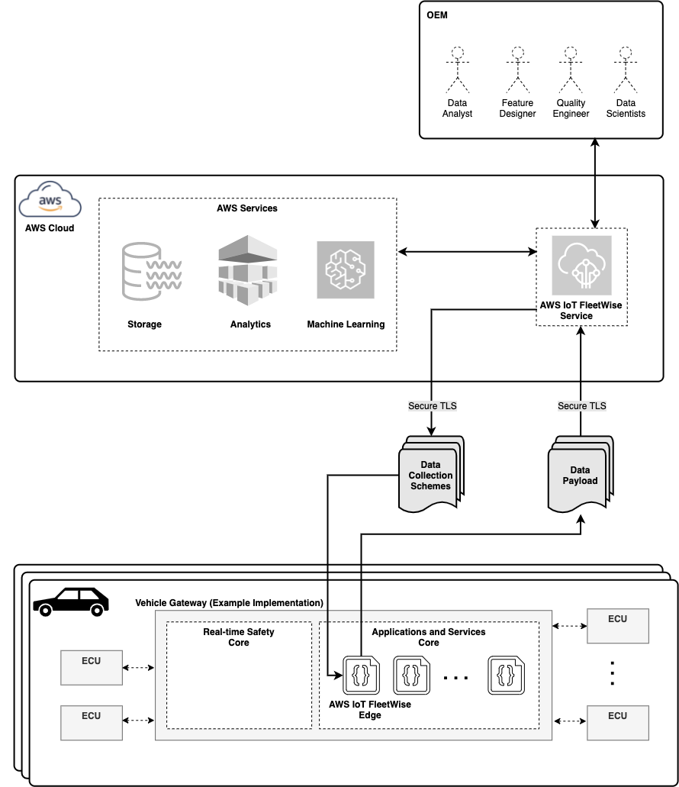

# Reference Implementation for AWS IoT FleetWise

> :information_source: To quickly get started, jump to the
> [Developer Guide](./docs/dev-guide/edge-agent-dev-guide.md), the
> [Android Guide](./tools/android-app/README.md), or the
> [Raspberry Pi Tutorial](./docs/rpi-tutorial/raspberry-pi-tutorial.md)

AWS IoT FleetWise is a service that makes it easy for Automotive OEMs, Fleet operators, Independent
Software vendors (ISVs) to collect, store, organize, and monitor data from vehicles at scale. Edge
Agent Reference Implementation for AWS IoT FleetWise (the “Reference Implementation”) provides C++
libraries that can be run with simulated vehicle data on certain supported vehicle hardware or that
can help you develop an Edge Agent to run an application on your vehicle that integrates with AWS
IoT FleetWise. You can then use AWS IoT FleetWise's to process the collected data, gain insights
about the vehicle's health and use the service's visual interface to help diagnose and troubleshoot
potential issues with your vehicles. Furthermore, AWS IoT FleetWise's capability to collect ECU data
and store them on cloud databases enables you to utilize different AWS services (Analytics Services,
ML, etc.) to develop novel use-cases that augment your existing vehicle functionality. In
particular, AWS IoT FleetWise can leverage fleet data (Big Data) and enable you to develop use cases
that create business value, for example: improve electric vehicle range estimation, optimized
battery life charging, optimized vehicle routing, etc. AWS IoT FleetWise can be extended to utilize
cloud computing capabilities for use-cases such as helping to improve pet/child detection, Driver
Monitoring System applications, Predictive Diagnostics, electric vehicle's battery cells outlier
detection, etc. You can use the included sample C++ application to learn more about the Reference
Implementation, develop an Edge Agent for your use case and test interactions before integration.

> _**Important**_ As provided in the AWS IoT FleetWise
> [Service Terms](https://aws.amazon.com/service-terms/), you are solely responsible for your Edge
> Agent, including ensuring that your Edge Agent and any updates and modifications to it are
> deployed and maintained safely and securely in any vehicles

## AWS IoT FleetWise Architecture

AWS IoT FleetWise is an AWS service that enables automakers and fleet operators to collect, store,
organize, and monitor data from vehicles. Automakers need the ability to connect remotely to their
fleet of vehicles and collect vehicle ECU/sensor data. AWS IoT FleetWise can be used by OEM
engineers and data scientists to build vehicle models that can be used to build custom data
collection schemes. These data collection schemes enables the OEM to optimize the data collection
process by defining what signals to collect, how often to collect them, and most importantly the
trigger conditions ("events") that enable the collection process.

Customers can define the data collection schemes to trigger based on a schedule or on specific
conditions such as, but not limited to: 1. Ambient temperature dropping to below 0 degree or 2.
Vehicle crosses state lines or 3. Active diagnostic trouble codes. These conditions are sent to the
vehicle through a set of documents called data collection schemes. In summary, your Edge Agent
collects the data of interest according to the data collection schemes and decoding rules as
specified by the OEM on the [AWS IoT FleetWise Console](https://aws.amazon.com/iot-fleetwise/).

The following diagram illustrates a high-level architecture of the system.

**Edge Agent receives two documents:**

1. _Decoder Manifest_ - this document describes how signals are collected from the vehicle, and will
   include details such as, but not limited to: Bus ID, network name, decoding information, etc.

2. _Data Collection Schemes_ - this document describes what signals to collect. It also describes
   the condition logic that defines the enablement of the trigger logic that allows these signals to
   be collected, for example, when Vehicle Speed > 100 km/Hr and Driver Seatbelt is Off and Ambient
   Temperature < 0 degree C.

## Edge Agent Deployment & Supported Platforms

Edge Agent functional flexibility and its use of dynamic memory allocation means that it cannot
reside in the real-time safety vehicle ECUs. Edge Agent must also be connected to the internet and
preferably has access to a “good” portion of vehicle ECU data. OEMs have the flexibility to decide
where they can deploy their Edge Agent binary. Possible options include (if present):

1. Vehicle Gateway such as the
   [NXP S32G](https://www.nxp.com/products/processors-and-microcontrollers/arm-processors/s32g-vehicle-network-processors/s32g2-processors-for-vehicle-networking:S32G2)
   and
   [Renesas R-Car S4](https://www.renesas.com/jp/en/products/automotive-products/automotive-system-chips-socs/rtp8a779f0askb0sp2s-r-car-s4-reference-boardspider)
2. Vehicle Head-Unit
3. Vehicle's High Performance Computer
4. Telecommunication Control Unit

Edge Agent Reference Implementation for AWS IoT FleetWise was built and tested on 64-bit
architectures. It has been tested on both ARM and X86 multicore based machines, with a Linux Kernel
version of 5.4 and above. The kernel module for ISO-TP (can-isotp ) would need to be installed in
addition for Kernels below 5.10 if you use the Reference Implementation.

Edge Agent Reference Implementation for AWS IoT FleetWise was also tested on an EC2 Instance with
the following details:

- **Platform**: Ubuntu
- **Platform Details**: Linux/UNIX
- **Server**: AmazonEC2
- **InstanceType**: c4.8xlarge
- **AvailabilityZone**: us-east-1
- **Architecture**: x86_64
- **CpuOptions**: {'CoreCount': 18, 'ThreadsPerCore': 2}
- **AMI name**: ubuntu-focal-20.04-amd64-server-20230112

## AWS IoT FleetWise Client-Server Communication

Edge Agent Reference Implementation for AWS IoT FleetWise relies on
[AWS SDK for C++](https://github.com/aws/aws-sdk-cpp) to send and receive data from and to AWS IoT
FleetWise Server. All data sent to AWS IoT FleetWise Server using the Reference Implementation is
sent over an encrypted
[TLS connection](https://docs.aws.amazon.com/iot/latest/developerguide/data-encryption.html) using
MQTT, HTTPS, and WebSocket protocols, which is designed to make it secure by default while in
transit. AWS IoT FleetWise uses MQTT quality of service zero (QoS = 0).

## Security

See [SECURITY](./SECURITY.md) for more information

## License Summary and Build Dependencies

Edge Agent Reference Implementation for AWS IoT FleetWise depends on the following open source
libraries. Refer to the corresponding links for more information.

- [AWS SDK for C++: v1.11.94](https://github.com/aws/aws-sdk-cpp)
  - [Curl: v7.58.0](https://github.com/curl/curl)
  - [OpenSSL: v1.1.1](https://github.com/openssl/openssl)
  - [zlib: v1.2.11](https://github.com/madler/zlib)
- [GoogleTest: v1.10.0](https://github.com/google/googletest)
- [Google Benchmark: v1.6.1](https://github.com/google/benchmark)
- [Protobuf: v3.21.12](https://github.com/protocolbuffers/protobuf)
- [Boost: v1.71.1](https://github.com/boostorg/boost)
- [JsonCpp: v1.9.5](https://github.com/open-source-parsers/jsoncpp)
- [Snappy: v1.1.8](https://github.com/google/snappy)

Optional: The following dependencies are only required when the experimental option
`FWE_FEATURE_CAMERA` is enabled.

- [Fast-DDS: v2.3.3](https://github.com/eProsima/Fast-DDS)
  - [Fast-CDR: v1.0.21](https://github.com/eProsima/Fast-CDR)
  - [Foonathan Memory Vendor: v1.1.0](https://github.com/eProsima/foonathan_memory_vendor)
  - [Foonathan Memory: v0.7](https://github.com/foonathan/memory)
  - [TinyXML-2: v6.0.0](https://github.com/leethomason/tinyxml2)

See [LICENSE](./LICENSE) for more information.

## Getting Help

[Contact AWS Support](https://aws.amazon.com/contact-us/) if you have any technical questions about
Edge Agent Reference Implementation for AWS IoT FleetWise.

## Metrics

See [Metrics](./docs/metrics.md) for details, which Edge specific metrics exist and how they can be
accessed.

## Resources

The following documents provide more information about AWS IoT FleetWise Edge.

1. [Change Log](./CHANGELOG.md) provides a summary of feature enhancements, updates, and resolved
   and known issues.
2. [AWS IoT FleetWise Edge Offboarding](./docs/AWS-IoTFleetWiseOffboarding.md) provides a summary of
   the steps needed on the Client side to off board from the service.
3. [AWS IoT FleetWise Edge Agent Developer Guide](./docs/dev-guide/edge-agent-dev-guide.md) provides
   step-by-step instructions for building and running Edge Agent Reference Implementation for AWS
   IoT FleetWise.

The following documents provide more information about the cloud component of AWS IoT FleetWise.

1. [AWS IoT FleetWise API Reference](https://docs.aws.amazon.com/iot-fleetwise/latest/APIReference/Welcome.html)
   describes all the API operations for FleetWise
