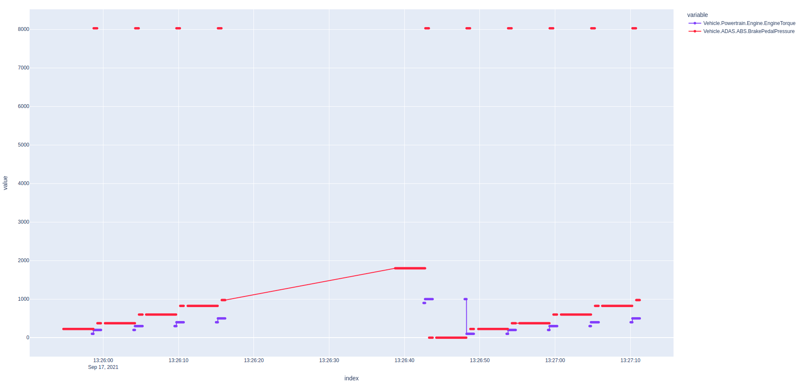

# Demo of AWS IoT FleetWise for CAN over SOME/IP

This guide demonstrates how to use AWS IoT FleetWise to collect CAN data that is sent over a SOME/IP
network. This network configuration is common in automotive systems that contain both CAN and
Ethernet physical layers, where CAN data is bridged to the SOME/IP network to make the CAN data
available to nodes on the Ethernet network.

This demo generates CAN data on a virtual CAN bus, and bridges this data onto SOME/IP. The Reference
Implementation for AWS IoT FleetWise (FWE) is then provisioned and run to collect the CAN data from
SOME/IP and upload it to the cloud. The data is then downloaded from the specified data destination
and plotted in an HTML graph format.

The following diagram illustrates the dataflow and artifacts consumed and produced by this demo:


### SOME/IP Payload format

In this demonstration, the following payload format is used to encapsulate each CAN frame within a
single SOME/IP message (PDU). Note that FIDL files and the 'CommonAPI' library are not used to model
or serialize this payload format.

```
___________________________________________________________
|   CAN ID  |  Timestamp (in us)  |       CAN data        |
|___________|_____________________|_______________________|
   4 bytes         8 bytes             variable length
```

The CAN ID and Timestamp are unsigned integers encoded in network byte order (big endian). The CAN
ID is in the
[SocketCAN format](https://github.com/linux-can/can-utils/blob/88f0c753343bd863dd3110812d6b4698c4700b26/include/linux/can.h#L66-L78)

## Prerequisites

- Access to an AWS Account with administrator privileges.
- Logged in to the AWS Console in the `us-east-1` region using the account with administrator
  privileges.
  - Note: if you would like to use a different region you will need to change `us-east-1` to your
    desired region in each place that it is mentioned below.
  - Note: AWS IoT FleetWise is currently available in
    [these](https://docs.aws.amazon.com/general/latest/gr/iotfleetwise.html) regions.
- A local Linux or MacOS machine.

## Launch your development machine

An Ubuntu 22.04 development machine with 200GB free disk space will be required. A local Intel
x86_64 (amd64) machine can be used, however it is recommended to use the following instructions to
launch an AWS EC2 Graviton (arm64) instance. Pricing for EC2 can be found,
[here](https://aws.amazon.com/ec2/pricing/on-demand/).

1. Launch an EC2 Graviton instance with administrator permissions:
   [**Launch CloudFormation Template**](https://us-east-1.console.aws.amazon.com/cloudformation/home?region=us-east-1#/stacks/quickcreate?templateUrl=https%3A%2F%2Faws-iot-fleetwise.s3.us-west-2.amazonaws.com%2Flatest%2Fcfn-templates%2Ffwdev.yml&stackName=fwdev).
1. Enter the **Name** of an existing SSH key pair in your account from
   [here](https://us-east-1.console.aws.amazon.com/ec2/v2/home?region=us-east-1#KeyPairs:).
   1. Do not include the file suffix `.pem`.
   1. If you do not have an SSH key pair, you will need to create one and download the corresponding
      `.pem` file. Be sure to update the file permissions: `chmod 400 <PATH_TO_PEM>`
1. **Select the checkbox** next to _'I acknowledge that AWS CloudFormation might create IAM
   resources with custom names.'_
1. Choose **Create stack**.
1. Wait until the status of the Stack is **CREATE_COMPLETE**; this can take up to five minutes.
1. Select the **Outputs** tab, copy the EC2 IP address, and connect via SSH from your local machine
   to the development machine.

   ```bash
   ssh -i <PATH_TO_PEM> ubuntu@<EC2_IP_ADDRESS>
   ```

## Obtain the FWE code

1. Run the following _on the development machine_ to clone the latest FWE source code from GitHub.

   ```bash
   git clone https://github.com/aws/aws-iot-fleetwise-edge.git ~/aws-iot-fleetwise-edge
   ```

## Download or build the FWE binary

**To quickly run the demo,** download the pre-built FWE binary, and install the CAN simulator:

- If your development machine is ARM64 (the default if you launched an EC2 instance using the
  CloudFormation template above):

  ```bash
  cd ~/aws-iot-fleetwise-edge \
  && mkdir -p build \
  && curl -L -o build/aws-iot-fleetwise-edge.tar.gz \
      https://github.com/aws/aws-iot-fleetwise-edge/releases/latest/download/aws-iot-fleetwise-edge-arm64.tar.gz  \
  && tar -zxf build/aws-iot-fleetwise-edge.tar.gz -C build aws-iot-fleetwise-edge \
  && tar -zxf build/aws-iot-fleetwise-edge.tar.gz tools/can-to-someip/can-to-someip \
  && sudo -H ./tools/install-socketcan.sh \
  && sudo -H ./tools/install-cansim.sh
  ```

- If your development machine is x86_64:

  ```bash
  cd ~/aws-iot-fleetwise-edge \
  && mkdir -p build \
  && curl -L -o build/aws-iot-fleetwise-edge.tar.gz \
      https://github.com/aws/aws-iot-fleetwise-edge/releases/latest/download/aws-iot-fleetwise-edge-amd64.tar.gz  \
  && tar -zxf build/aws-iot-fleetwise-edge.tar.gz -C build aws-iot-fleetwise-edge \
  && tar -zxf build/aws-iot-fleetwise-edge.tar.gz tools/can-to-someip/can-to-someip \
  && sudo -H ./tools/install-socketcan.sh \
  && sudo -H ./tools/install-cansim.sh
  ```

**Alternatively if you would like to build the FWE binary from source,** follow these instructions.
If you already downloaded the binary above, skip to the next section.

1. Install the dependencies for FWE with SOME/IP support and the CAN simulator:

   ```bash
   cd ~/aws-iot-fleetwise-edge \
   && sudo -H ./tools/install-deps-native.sh --with-someip-support \
   && sudo -H ./tools/install-socketcan.sh \
   && sudo -H ./tools/install-cansim.sh \
   && sudo ldconfig
   ```

1. Compile FWE with SOME/IP support:

   ```bash
   ./tools/build-fwe-native.sh --with-someip-support
   ```

## Start the CAN to SOME/IP bridge

At this point the CAN simulator is running and is generating data on the virtual CAN bus `vcan0`.
You can check that data is being generated by running `candump vcan0`.

1. Start the `can-to-someip` tool to bridge this data onto the SOME/IP network from the `vcan0` CAN
   interface to the SOME/IP network using Service ID 0x7777, Instance ID 0x5678, publishing Event ID
   0x8778 in Event Group ID 0x5555.

   ```bash
   ./tools/can-to-someip/can-to-someip \
      --can-interface vcan0 \
      --service-id 0x7777 \
      --instance-id 0x5678 \
      --event-id 0x8778 \
      --event-group-id 0x5555
   ```

   These identifiers match the service that FWE subscribes to, as defined in the
   `tools/cloud/network-interface-someip-to-can-bridge.json` file used below.

   **Note:** When the `can-to-someip` tool and FWE run on the same machine, `vsomeip` uses a UNIX
   domain socket for communication rather than IP communication. If you are interested in SOME/IP
   communication over IP, see [Running over IP](#running-over-ip).

## Provision and run FWE

1. Open a new terminal _on the development machine_, and run the following to provision credentials
   for the vehicle and configure the network interface as SOME/IP to CAN:

   ```bash
   cd ~/aws-iot-fleetwise-edge \
   && mkdir -p build_config \
   && ./tools/provision.sh \
       --region us-east-1 \
       --vehicle-name fwdemo-can-to-someip \
       --certificate-pem-outfile build_config/certificate.pem \
       --private-key-outfile build_config/private-key.key \
       --endpoint-url-outfile build_config/endpoint.txt \
       --vehicle-name-outfile build_config/vehicle-name.txt \
   && ./tools/configure-fwe.sh \
       --input-config-file configuration/static-config.json \
       --output-config-file build_config/config-0.json \
       --log-color Yes \
       --log-level Trace \
       --vehicle-name `cat build_config/vehicle-name.txt` \
       --endpoint-url `cat build_config/endpoint.txt` \
       --certificate-file `realpath build_config/certificate.pem` \
       --private-key-file `realpath build_config/private-key.key` \
       --persistency-path `realpath build_config` \
       --enable-can-to-someip-bridge-interface
   ```

1. Run FWE:

   ```bash
   ./build/aws-iot-fleetwise-edge build_config/config-0.json
   ```

   You should see the following message in the log indicating that FWE has successfully subscribed
   to the `can-to-someip` service:

   ```
   [INFO ] [SomeipToCanBridge.cpp:68] [operator()()]: [Service [7777.5678] is available]
   ```

## Run the AWS IoT FleetWise demo script

The instructions below will register your AWS account for AWS IoT FleetWise, create a demonstration
vehicle model, register the virtual vehicle created in the previous section and run a campaign to
collect data from it.

1. Open a new terminal _on the development machine_ and run the following to install the
   dependencies of the demo script:

   ```bash
   cd ~/aws-iot-fleetwise-edge/tools/cloud \
   && sudo -H ./install-deps.sh
   ```

1. Run the following command to generate 'node' and 'decoder' JSON files from the input DBC file:

   ```bash
   python3 dbc-to-nodes.py hscan.dbc can-nodes.json \
   && python3 dbc-to-decoders.py hscan.dbc can-decoders.json
   ```

1. Run the demo script:

   ```bash
   ./demo.sh \
      --region us-east-1 \
      --vehicle-name fwdemo-can-to-someip \
      --node-file can-nodes.json \
      --decoder-file can-decoders.json \
      --network-interface-file network-interface-can.json \
      --campaign-file campaign-brake-event.json
   ```

   The demo script:

   1. Registers your AWS account with AWS IoT FleetWise, if not already registered.
   1. Creates an S3 bucket with a bucket policy that allows AWS IoT FleetWise to write data to the
      bucket.
   1. Creates a signal catalog based on `can-nodes.json`.
   1. Creates a model manifest that references the signal catalog with all of the CAN signals.
   1. Activates the model manifest.
   1. Creates a decoder manifest linked to the model manifest using `can-decoders.json` for decoding
      signals from the network interfaces defined in `network-interfaces-can.json`.
   1. Updates the decoder manifest to set the status as `ACTIVE`.
   1. Creates a vehicle with a name equal to `fwdemo-can-to-someip`, the same as the name passed to
      `provision.sh`.
   1. Creates a fleet.
   1. Associates the vehicle with the fleet.
   1. Creates a campaign from `campaign-brake-event.json` that contains a condition-based collection
      scheme to capture the engine torque and the brake pressure when the brake pressure is above
      7000, and targets the campaign at the fleet.
   1. The data uploaded to S3 would be in JSON format, or Parquet format if the
      `--s3-format PARQUET` option is passed.
   1. Approves the campaign.
   1. Waits until the campaign status is `HEALTHY`, which means the campaign has been deployed to
      the fleet.
   1. Wait 20 minutes for the data to propagate to S3 and then download it.
   1. Saves the data to an HTML file.

   If `TIMESTREAM` upload is enabled (**Note**: Amazon Timestream for Live Analytics is only
   available to customers who have already been onboarded in that region. See
   [the availability change documentation](https://docs.aws.amazon.com/timestream/latest/developerguide/AmazonTimestreamForLiveAnalytics-availability-change.html)),
   the demo script will instead:

   1. Creates an Amazon Timestream database and table.
   1. Creates IAM role and policy required for the service to write data to Amazon Timestream.
   1. Creates a campaign from `campaign-brake-event.json` that contains a condition-based collection
      scheme to capture the engine torque and the brake pressure when the brake pressure is above
      7000, and targets the campaign at the fleet.
   1. Waits 30 seconds and then downloads the collected data from Amazon Timestream.
   1. Save the data to an HTML file.

   This script will not delete Amazon Timestream or S3 resources.

1. When the script completes, a path to an HTML file is given. _On your local machine_, use `scp` to
   download it, then open it in your web browser:

   ```bash
   scp -i <PATH_TO_PEM> ubuntu@<EC2_IP_ADDRESS>:<PATH_TO_HTML_FILE> .
   ```

1. To explore the collected data, you can click and drag to zoom in. The red line shows the
   simulated brake pressure signal. As you can see that when hard braking events occur (value above
   7000), collection is triggered and the engine torque signal data is collected.

   Alternatively, if your upload destination was set to `TIMESTREAM` and AWS account is enrolled
   with Amazon QuickSight or Amazon Managed Grafana, you may use them to browse the data from Amazon
   Timestream directly. **Note**: Amazon Timestream for Live Analytics is only available to
   customers who have already been onboarded in that region. See
   [the availability change documentation](https://docs.aws.amazon.com/timestream/latest/developerguide/AmazonTimestreamForLiveAnalytics-availability-change.html).

   

## Clean up

1. Run the following _on the development machine_ to clean up resources created by the
   `provision.sh` and `demo.sh` scripts. **Note:** The S3 resources are not deleted.

   ```bash
   cd ~/aws-iot-fleetwise-edge/tools/cloud \
   && ./clean-up.sh \
   && ../provision.sh \
      --vehicle-name fwdemo-can-to-someip \
      --region us-east-1 \
      --only-clean-up
   ```

1. Delete the CloudFormation stack for your development machine, which by default is called `fwdev`:
   https://us-east-1.console.aws.amazon.com/cloudformation/home

## Running over IP

In the above example both FWE and the `can-to-someip` program were both running on the same
development machine. In this scenario the [vsomeip](https://github.com/COVESA/vsomeip) library uses
a local UNIX domain socket for service discovery and communication between the processes.

If you would like to run the example over IP, with the `can-to-someip` program running on one
machine and FWE running on a different machine on the same local network, then it is necessary to
configure `vsomeip` using JSON configuration files to setup the IP addresses, ports and protocols
for the service to use.

The example below details how to configure `vsomeip` for UDP over IP communication. If you are
interested in using TCP over IP communication refer to the `vsomeip` documentation.

1. Create a JSON configuration file called `vsomeip-can-to-someip.json` for the `can-to-someip`
   program, replacing `<IP_ADDRESS>` with the IPv4 address of the machine running the program:

   ```json
   {
     "unicast": "<IP_ADDRESS>",
     "netmask": "255.255.0.0",
     "logging": {
       "level": "trace",
       "console": "true",
       "dlt": "false"
     },
     "applications": [
       {
         "name": "can-to-someip",
         "id": "0x1212"
       }
     ],
     "services": [
       {
         "service": "0x7777",
         "instance": "0x5678",
         "unreliable": "30509"
       }
     ],
     "service-discovery": {
       "enable": "true",
       "multicast": "224.224.224.245",
       "port": "30490",
       "protocol": "udp",
       "initial_delay_min": "10",
       "initial_delay_max": "100",
       "repetitions_base_delay": "200",
       "repetitions_max": "3",
       "ttl": "3",
       "cyclic_offer_delay": "2000",
       "request_response_delay": "1500"
     }
   }
   ```

1. Run the `can-to-someip` program with the configuration file as follows. If you are running this
   program on a machine connected to a real CAN network adapter, you can also modify the `vcan0`
   value for the `--can-interface` argument to `can0` (for example).

   ```bash
   VSOMEIP_CONFIGURATION=vsomeip-can-to-some-ip.json ./can-to-someip \
      --can-interface vcan0 \
      --service-id 0x7777 \
      --instance-id 0x5678 \
      --event-id 0x8778 \
      --event-group-id 0x5555
   ```

1. Create a JSON configuration file called `vsomeip-fwe.json` for FWE, replacing `<IP_ADDRESS>` with
   the IPv4 address of the machine running FWE:

   ```json
   {
     "unicast": "<IP_ADDRESS>",
     "netmask": "255.255.0.0",
     "logging": {
       "level": "trace",
       "console": "true",
       "dlt": "false"
     },
     "applications": [
       {
         "name": "someipToCanBridgeInterface",
         "id": "0x1313"
       }
     ],
     "service-discovery": {
       "enable": "true",
       "multicast": "224.224.224.245",
       "port": "30490",
       "protocol": "udp",
       "initial_delay_min": "10",
       "initial_delay_max": "100",
       "repetitions_base_delay": "200",
       "repetitions_max": "3",
       "ttl": "3",
       "cyclic_offer_delay": "2000",
       "request_response_delay": "1500"
     }
   }
   ```

1. Run FWE with the configuration file as follows:

   ```bash
   VSOMEIP_CONFIGURATION=vsomeip-fwe.json ./aws-iot-fleetwise-edge config-0.json
   ```

   If successfully configured, you should see the following in the FWE log:

   ```
   [debug] Joining to multicast group 224.224.224.245 from <IP_ADDRESS>
   [info] SOME/IP routing ready.
   ```

1. You can now [run the cloud demo script](#run-the-aws-iot-fleetwise-demo-script).

### Troubleshooting

Common issues encountered when trying to establish a SOME/IP connection over UDP include:

- **Trying to use a local loopback address.** It is not possible to use the local loopback IP
  address `127.0.0.1` to run the demo over UDP on one machine, as the local loopback interface does
  not support UDP multicast, which is required by SOME/IP service discovery.

- **A firewall blocking open UDP ports.** To open the two UDP ports used in the above example, run
  the following on the machine running `can-to-someip`:

  ```bash
  sudo iptables -A INPUT -p udp -m udp --dport 30490 -j ACCEPT
  sudo iptables -A INPUT -p udp -m udp --dport 30509 -j ACCEPT
  ```

- **A bug in the `vsomeip` library that causes service discovery to fail** in versions >=3.3.0
  <3.5.0. This bug was fixed with this GitHub PR: https://github.com/COVESA/vsomeip/pull/591.
