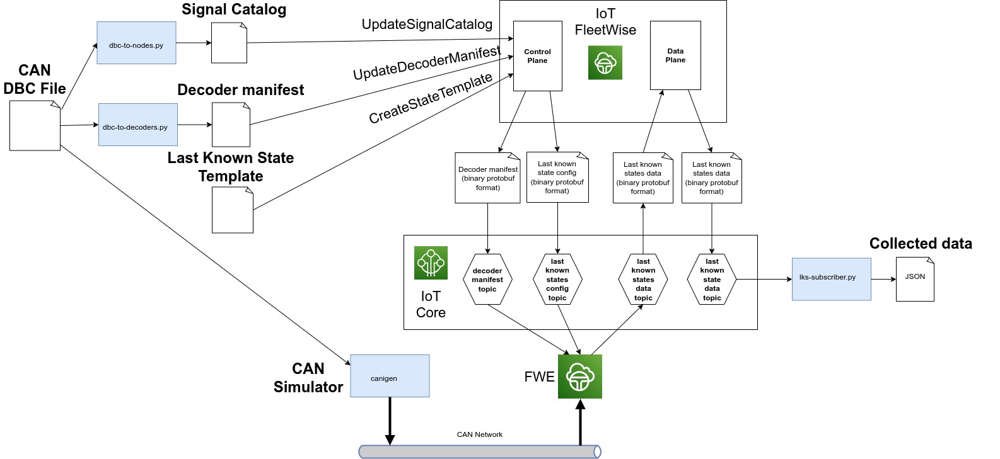

# "Last Known State" demo for AWS IoT FleetWise

<!-- prettier-ignore -->
> [!NOTE]
> This is a "gated" feature of AWS IoT FleetWise for which you will need to request access. See
> [here](https://docs.aws.amazon.com/iot-fleetwise/latest/developerguide/fleetwise-regions.html)
> for more information, or contact the
> [AWS Support Center](https://console.aws.amazon.com/support/home#/).

The "Last Known State" (LKS) feature of AWS IoT FleetWise provides a lightweight method to collect
signal data from vehicles and forward it to downstream consumers via IoT topic. The AWS IoT
FleetWise signal catalog, vehicle model, and decoder manifest are created as normal (for detailed
information regarding these resource types, refer to the
[AWS IoT FleetWise Developer Guide](https://docs.aws.amazon.com/iot-fleetwise/latest/developerguide/)).
Instead of using a campaign to collect data, a state template is created to specify which signals to
collect - either periodically or on-change of signal value. These signals are then collected by the
Reference Implementation for AWS IoT FleetWise (FWE), and sent to the AWS IoT FleetWise cloud via
MQTT in Protobuf format. The AWS IoT FleetWise cloud then decodes and forwards the data again via
IoT topic in Protobuf format to the customer's application. This is illustrated in the following
diagram.



## Prerequisites

- Access to an AWS Account with administrator privileges.
- Your AWS account has access to AWS IoT FleetWise "gated" features. See
  [here](https://docs.aws.amazon.com/iot-fleetwise/latest/developerguide/fleetwise-regions.html) for
  more information, or contact the
  [AWS Support Center](https://console.aws.amazon.com/support/home#/).
- Logged in to the AWS Console in the `us-east-1` region using the account with administrator
  privileges.
  - Note: if you would like to use a different region you will need to change `us-east-1` to your
    desired region in each place that it is mentioned below.
  - Note: AWS IoT FleetWise is currently available in
    [these](https://docs.aws.amazon.com/general/latest/gr/iotfleetwise.html) regions.
- A local Windows, Linux or MacOS machine.

## Launch your development machine

An Ubuntu 20.04 development machine with 200GB free disk space will be required. A local Intel
x86_64 (amd64) machine can be used, however it is recommended to use the following instructions to
launch an AWS EC2 Graviton (arm64) instance. Pricing for EC2 can be found,
[here](https://aws.amazon.com/ec2/pricing/on-demand/).

1. Launch an EC2 Graviton instance with administrator permissions:
   [**Launch CloudFormation Template**](https://us-east-1.console.aws.amazon.com/cloudformation/home?region=us-east-1#/stacks/quickcreate?templateUrl=https%3A%2F%2Faws-iot-fleetwise.s3.us-west-2.amazonaws.com%2Flatest%2Fcfn-templates%2Ffwdev.yml&stackName=fwdev).
1. Enter the **Name** of an existing SSH key pair in your account from
   [here](https://us-east-1.console.aws.amazon.com/ec2/v2/home?region=us-east-1#KeyPairs:).
   1. Do not include the file suffix `.pem`.
   1. If you do not have an SSH key pair, you will need to create one and download the corresponding
      `.pem` file. Be sure to update the file permissions: `chmod 400 <PATH_TO_PEM>`
1. **Select the checkbox** next to _'I acknowledge that AWS CloudFormation might create IAM
   resources with custom names.'_
1. Choose **Create stack**.
1. Wait until the status of the Stack is **CREATE_COMPLETE**; this can take up to five minutes.
1. Select the **Outputs** tab, copy the EC2 IP address, and connect via SSH from your local machine
   to the development machine.

   ```bash
   ssh -i <PATH_TO_PEM> ubuntu@<EC2_IP_ADDRESS>
   ```

## Obtain the FWE code

1. Run the following _on the development machine_ to clone the latest FWE source code from GitHub.

   ```bash
   git clone https://github.com/aws/aws-iot-fleetwise-edge.git ~/aws-iot-fleetwise-edge
   ```

## Download or build the FWE binary

**To quickly run the demo**, download the pre-built FWE binary:

- If your development machine is ARM64 (the default if you launched an EC2 instance using the
  CloudFormation template above):

  ```bash
  cd ~/aws-iot-fleetwise-edge \
  && mkdir -p build \
  && curl -L -o build/aws-iot-fleetwise-edge.tar.gz \
      https://github.com/aws/aws-iot-fleetwise-edge/releases/latest/download/aws-iot-fleetwise-edge-arm64.tar.gz  \
  && tar -zxf build/aws-iot-fleetwise-edge.tar.gz -C build aws-iot-fleetwise-edge
  ```

- If your development machine is x86_64:

  ```bash
  cd ~/aws-iot-fleetwise-edge \
  && mkdir -p build \
  && curl -L -o build/aws-iot-fleetwise-edge.tar.gz \
      https://github.com/aws/aws-iot-fleetwise-edge/releases/latest/download/aws-iot-fleetwise-edge-amd64.tar.gz  \
  && tar -zxf build/aws-iot-fleetwise-edge.tar.gz -C build aws-iot-fleetwise-edge
  ```

**Alternatively if you would like to build the FWE binary from source,** follow these instructions.
If you already downloaded the binary above, skip to the next section.

1. Install the dependencies for FWE :

   ```bash
   cd ~/aws-iot-fleetwise-edge \
   && sudo -H ./tools/install-deps-native.sh \
   && sudo ldconfig
   ```

1. Compile FWE with Last Known State support:

   ```bash
   ./tools/build-fwe-native.sh --with-lks-support
   ```

## Install the CAN simulator

```bash
cd ~/aws-iot-fleetwise-edge \
&& sudo -H ./tools/install-socketcan.sh \
&& sudo -H ./tools/install-cansim.sh
```

## Provision and run FWE

1. Run the following _on the development machine_ to provision an AWS IoT Thing with credentials:

   ```bash
   cd ~/aws-iot-fleetwise-edge \
   && mkdir -p build_config \
   && ./tools/provision.sh \
       --region us-east-1 \
       --vehicle-name fwdemo-lks \
       --certificate-pem-outfile build_config/certificate.pem \
       --private-key-outfile build_config/private-key.key \
       --endpoint-url-outfile build_config/endpoint.txt \
       --vehicle-name-outfile build_config/vehicle-name.txt \
   && ./tools/configure-fwe.sh \
       --input-config-file configuration/static-config.json \
       --output-config-file build_config/config-0.json \
       --log-color Yes \
       --log-level Trace \
       --vehicle-name `cat build_config/vehicle-name.txt` \
       --endpoint-url `cat build_config/endpoint.txt` \
       --can-bus0 vcan0 \
       --certificate-file `realpath build_config/certificate.pem` \
       --private-key-file `realpath build_config/private-key.key` \
       --persistency-path `realpath build_config`
   ```

1. Run FWE:

   ```bash
   ./build/aws-iot-fleetwise-edge build_config/config-0.json
   ```

   You should see a message similar to the following in the log, indicating that Last Known State is
   enabled:

   ```
   [LastKnownStateWorkerThread.cpp:60] [start()]: [Last Known State Inspection Thread started]
   ```

## Run the AWS IoT FleetWise demo script

The instructions below will register your AWS account for AWS IoT FleetWise, create a demonstration
vehicle model and register the virtual vehicle created in the previous section:

1. Open a new terminal _on the development machine_ and run the following to install the
   dependencies of the demo script:

   ```bash
   cd ~/aws-iot-fleetwise-edge/tools/cloud \
   && sudo -H ./install-deps.sh
   ```

1. Run the following command to generate 'node' and 'decoder' JSON files from the input DBC file:

   ```bash
   python3 dbc-to-nodes.py hscan.dbc can-nodes.json \
   && python3 dbc-to-decoders.py hscan.dbc can-decoders.json
   ```

1. Run the demo script:

   ```bash
   ./demo.sh \
      --region us-east-1 \
      --vehicle-name fwdemo-lks \
      --node-file can-nodes.json \
      --decoder-file can-decoders.json \
      --network-interface-file network-interface-can.json
   ```

1. When the script completes, you should see messages in FWE log indicating that it received a
   decoder manifest. You should also see a periodic `CHECKIN: ` message showing the decoder
   manifest.

## Create LKS Template

1. Run the following command to create a state template to collect the brake pedal pressure and
   engine torque:

   ```bash
   MODEL_MANIFEST_ARN=`aws iotfleetwise get-vehicle \
      --region us-east-1 \
      --vehicle-name fwdemo-lks | jq -r .modelManifestArn` \
   && SIGNAL_CATALOG_ARN=`aws iotfleetwise get-model-manifest \
      --region us-east-1 \
      --name ${MODEL_MANIFEST_ARN##*/} | jq -r .signalCatalogArn` \
   && aws iotfleetwise create-state-template \
      --region us-east-1 \
      --signal-catalog-arn ${SIGNAL_CATALOG_ARN} \
      --name fwdemo-lks-template \
      --state-template-properties '
         [
            "Vehicle.ABS.DemoBrakePedalPressure",
            "Vehicle.ECM.DemoEngineTorque"
         ]'
   ```

1. Run the following command to deploy the state template to the vehicle with the update strategy of
   `onChange` to cause FWE to send data when the signal value changes:

   ```bash
   aws iotfleetwise update-vehicle \
      --region us-east-1 \
      --vehicle-name fwdemo-lks \
      --state-templates-to-add '
         [
            {
               "identifier": "fwdemo-lks-template",
               "stateTemplateUpdateStrategy": {
                  "onChange": {}
               }
            }
         ]'
   ```

## Subscribe to MQTT topic to access collected data

At this point the state template has been deployed to the vehicle and the vehicle is sending the
collected data to AWS IoT FleetWise cloud. In the next step a Python script is used to subscribe to
the LKS data topic to receive the collected data for the given state template.

1. Since the data is serialized in Protobuf format, it is necessary to firstly generate the Python
   bindings for the message file
   [last_known_state_message.proto](../../interfaces/protobuf/schemas/cloudToCustomer/last_known_state_message.proto)
   as follows:

   ```bash
   source ../install-deps-versions.sh \
   && if [ "$(uname -m)" == "aarch64" ]; then PROTOBUF_ARCH="aarch_64"; else PROTOBUF_ARCH="$(uname -m)"; fi \
   && PROTOC_PACKAGE="protoc-${VERSION_PROTOBUF_RELEASE/v/}-linux-${PROTOBUF_ARCH}" \
   && wget https://github.com/protocolbuffers/protobuf/releases/download/${VERSION_PROTOBUF_RELEASE}/${PROTOC_PACKAGE}.zip -O ~/${PROTOC_PACKAGE}.zip \
   && unzip ~/${PROTOC_PACKAGE}.zip -d ~/${PROTOC_PACKAGE} \
   && ~/${PROTOC_PACKAGE}/bin/protoc \
      -I=../../interfaces/protobuf/schemas/cloudToCustomer \
      --python_out . \
      ../../interfaces/protobuf/schemas/cloudToCustomer/last_known_state_message.proto
   ```

1. Finally run the following Python script to subscribe to the collected data:

   ```bash
   python3 lks-subscribe.py \
      --region us-east-1 \
      --vehicle-name fwdemo-lks \
      --template-name fwdemo-lks-template
   ```

   When a state template is deployed to a vehicle, it doesn't start collecting data right away. We
   need to send commands to Activate the state templates.

   1. Open a new terminal _on the development machine_ and run the following to create an IAM role
      to create the command payloads:

      ```bash
      SERVICE_ROLE_ARN=`./manage-service-role.sh \
         --service-role IoTCreateCommandPayloadServiceRole \
         --service-principal iot.amazonaws.com \
         --actions iotfleetwise:GenerateCommandPayload \
         --resources '*'`
      ```

   1. Run the following to create a command:

      ```bash
      aws iot create-command \
         --region us-east-1 \
         --role-arn ${SERVICE_ROLE_ARN} \
         --command-id fwdemo-lks-command \
         --namespace "AWS-IoT-FleetWise" \
         --mandatory-parameters '[
             {"name":"$stateTemplate.name"},
             {"name":"$stateTemplate.operation"}
         ]'
      ```

   1. Send a command to FWE:

      ```bash
      JOBS_ENDPOINT_URL=`aws iot describe-endpoint --region us-east-1 --endpoint-type iot:Jobs | jq -j .endpointAddress` \
      && ACCOUNT_ID=`aws sts get-caller-identity | jq -r .Account` \
      && aws iot-jobs-data start-command-execution \
          --region us-east-1 \
          --command-arn arn:aws:iot:us-east-1:${ACCOUNT_ID}:command/fwdemo-lks-command \
          --target-arn arn:aws:iot:us-east-1:${ACCOUNT_ID}:thing/fwdemo-lks \
          --parameters '{
                  "$stateTemplate.name": { "S": "fwdemo-lks-template" },
                  "$stateTemplate.operation": { "S": "fetchSnapshot" }
              }' \
          --endpoint-url https://${JOBS_ENDPOINT_URL}
      ```

   1. You can then try different commands by repeating the command above but passing `activate` or
      `deactivate` as `$stateTemplate.operation`.

   1. Since the `activate` operation takes additional parameters, you have to create a separate
      command if you want to set those parameters:

      ```bash
      aws iot create-command \
         --region us-east-1 \
         --role-arn ${SERVICE_ROLE_ARN} \
         --command-id fwdemo-lks-command-activate \
         --namespace "AWS-IoT-FleetWise" \
         --mandatory-parameters '[
             {"name":"$stateTemplate.name"},
             {"name":"$stateTemplate.operation"},
             {"name":"$stateTemplate.deactivateAfterSeconds","defaultValue":{"L":60}}
         ]'
      ```

   1. Then send an `activate` command that will automatically deactivate the state template after a
      few seconds:

      ```bash
      JOBS_ENDPOINT_URL=`aws iot describe-endpoint --region us-east-1 --endpoint-type iot:Jobs | jq -j .endpointAddress` \
      && ACCOUNT_ID=`aws sts get-caller-identity | jq -r .Account` \
      && aws iot-jobs-data start-command-execution \
          --region us-east-1 \
          --command-arn arn:aws:iot:us-east-1:${ACCOUNT_ID}:command/fwdemo-lks-command-activate \
          --target-arn arn:aws:iot:us-east-1:${ACCOUNT_ID}:thing/fwdemo-lks \
          --parameters '{
                  "$stateTemplate.name": { "S": "fwdemo-lks-template" },
                  "$stateTemplate.operation": { "S": "activate" },
                  "$stateTemplate.deactivateAfterSeconds": { "L": 20 }
              }' \
          --endpoint-url https://${JOBS_ENDPOINT_URL}
      ```

   The collected data should be similar to the following:

   ```
   Established mqtt subscription to $aws/iotfleetwise/vehicles/fwdemo-lks/last_known_state/fwdemo-lks-template/data with [<SubackReasonCode.GRANTED_QOS_1: 1>]
   Received message on topic: $aws/iotfleetwise/vehicles/fwdemo-lks/last_known_state/fwdemo-lks-template/data
   Received message: {
      "timeMs": "1712670086473",
      "signals": [
         {
            "name": "Vehicle.ABS.DemoBrakePedalPressure",
            "doubleValue": 375.0
         }
      ]
   }
   Received message on topic: $aws/iotfleetwise/vehicles/fwdemo-lks/last_known_state/fwdemo-lks-template/data
   Received message: {
      "timeMs": "1712670091473",
      "signals": [
         {
            "name": "Vehicle.ECM.DemoEngineTorque",
            "doubleValue": 100.0
         },
         {
            "name": "Vehicle.ABS.DemoBrakePedalPressure",
            "doubleValue": 225.0
         }
      ]
   }
   ```

## Clean up

1. Run the following to clean up resources created by the `provision.sh` and `demo.sh` scripts, and
   the calls to create and add the state template:

   ```bash
   cd ~/aws-iot-fleetwise-edge/tools/cloud \
   && aws iotfleetwise update-vehicle \
      --region us-east-1 \
      --vehicle-name fwdemo-lks \
      --state-templates-to-remove fwdemo-lks-template \
   && aws iotfleetwise delete-state-template \
      --identifier fwdemo-lks-template \
      --region us-east-1 \
   && ./clean-up.sh
   ```

1. Delete the CloudFormation stack created earlier, which by default is called `fwdemo-lks`:
   https://us-east-1.console.aws.amazon.com/cloudformation/home
