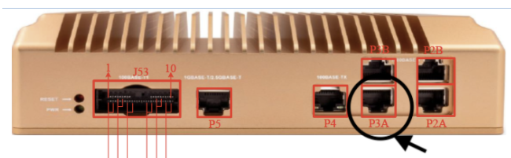

# Getting started with AWS IoT FleetWise Edge Agent on NXP S32G

This section describes how to deploy AWS IoT FleetWise Edge Agent onto an NXP S32G-VNP-RDB2 board.

## Prerequisites

- **NXP Semiconductors S32G Reference Design 2** — Part number: S32G-VNP-RDB2
- **AWS IoT FleetWise Edge Agent Compiled for ARM64** — If you are using an EC2 Graviton instance as
  your development machine, you will have completed this already in
  [previous step](./edge-agent-dev-guide.md#compile-aws-iot-fleetwise-edge-agent-software).

  - _If you are using a local Intel x86_64 (amd64) development machine_, you will need to run the
    following to cross-compile AWS IoT FleetWise Edge Agent:

    ```bash
    cd ~/aws-iot-fleetwise-edge \
        && sudo -H ./tools/install-deps-cross-arm64.sh \
        && rm -rf build \
        && ./tools/build-fwe-cross-arm64.sh
    ```

- **Internet Router with Ethernet** — The S32G-VNP-RDB2 must be connected to an internet router via
  an Ethernet cable for internet connectivity. It is beyond the scope of this document to describe
  how this is achieved, but one possibility is to use a WiFi to Ethernet bridge and a smartphone
  acting as an internet hotspot.

## Build an SD-Card Image

The following instructions use the development machine to build an SD-card image based on the Ubuntu
variant of the NXP Linux BSP version 35.0, with the addition of the `can-isotp` kernel module
required by AWS IoT FleetWise Edge Agent, an updated version of the `canutils` package and a
`systemd` service called `setup-socketcan` for bringing up the CAN interfaces at startup.

1. Run the following _on the development machine_ to install the dependencies of the `bitbake` tool
   of the Yocto / OpenEmbedded project.

   ```bash
   cd ~/aws-iot-fleetwise-edge \
       && sudo ./tools/install-deps-yocto.sh
   ```

1. Run the following to create a build folder and setup the Yocto project:

   ```bash
   mkdir -p ~/yocto-build && cd ~/yocto-build \
       && ~/aws-iot-fleetwise-edge/tools/setup-yocto-s32g.sh
   ```

1. Run the following to run `bitbake` to create the SD-card image and compress it. This can take
   several hours to complete depending on the performance of the development machine and the speed
   of the internet connection.

   ```bash
   source sources/poky/oe-init-build-env build_s32g274ardb2ubuntu \
       && bitbake fsl-image-ubuntu \
       && gzip -fk tmp/deploy/images/s32g274ardb2/fsl-image-ubuntu-s32g274ardb2.sdcard
   ```

1. Run the following _on your local machine_ to download the compressed SD-card image:

   ```bash
   scp -i <PATH_TO_PEM> ubuntu@<EC2_IP_ADDRESS>:yocto-build/build_s32g274ardb2ubuntu/tmp/deploy/images/s32g274ardb2/fsl-image-ubuntu-s32g274ardb2.sdcard.gz .
   ```

## Flash the SD-Card Image

1. Download and install Balena Etcher _on your local machine_: https://www.balena.io/etcher/
1. Run Balena Etcher, choose 'Select image' and select the compressed SD-card image
   `fsl-image-ubuntu-s32g274ardb2.sdcard.gz`
1. Insert the SD-card supplied with the S32G-VNP-RDB2 into your local machine's SD-card reader
1. Choose 'Select target' and select the SD-card
1. Choose 'Flash!'

## Specify Initial Board Configuration

1. Insert the SD-card into the S32G-VNP-RDB2's SD-card slot.
1. Connect the S32G-VNP-RDB2's power supply.
1. Connect an Ethernet cable from port P3A of the S32G-VNP-RDB2 to the internet router.

   

1. Connect your local machine to the internet router, for example via WiFi or via Ethernet.
1. Connect to the S32G-VNP-RDB2 via SSH, entering password `bluebox`:
   `ssh bluebox@ubuntu-s32g274ardb2`
   1. If you can't connect using the hostname `ubuntu-s32g274ardb2`, you will need to connect to the
      administration webpage of the internet router to obtain the IP address assigned to the
      S32G-VNP-RDB2. Use this IP address in place of `ubuntu-s32g274ardb2` used throughout this
      guide.
1. Once connected via SSH, check the board's internet connection by running: `ping amazon.com`.
   There should be 0% packet loss.

## Provision AWS IoT Credentials

Run the following commands _on the development machine_ (after compiling AWS IoT FleetWise Edge
Agent for ARM64 as explained above), to create an IoT Thing and provision credentials for it. The
AWS IoT FleetWise Edge Agent binary and its configuration files will be packaged into a ZIP file
ready to be deployed to the board.

```bash
mkdir -p ~/aws-iot-fleetwise-deploy && cd ~/aws-iot-fleetwise-deploy \
&& cp -r ~/aws-iot-fleetwise-edge/tools . \
&& mkdir -p build/src/executionmanagement \
&& cp ~/aws-iot-fleetwise-edge/build/src/executionmanagement/aws-iot-fleetwise-edge \
  build/src/executionmanagement/ \
&& mkdir -p config && cd config \
&& ../tools/provision.sh \
  --vehicle-name fwdemo-s32g \
  --certificate-pem-outfile certificate.pem \
  --private-key-outfile private-key.key \
  --endpoint-url-outfile endpoint.txt \
  --vehicle-name-outfile vehicle-name.txt \
&& ../tools/configure-fwe.sh \
  --input-config-file ~/aws-iot-fleetwise-edge/configuration/static-config.json \
  --output-config-file config-0.json \
  --log-color Yes \
  --vehicle-name `cat vehicle-name.txt` \
  --endpoint-url `cat endpoint.txt` \
  --can-bus0 can0 \
&& cd .. && zip -r aws-iot-fleetwise-deploy.zip .
```

## Deploy AWS IoT FleetWise Edge Agent on NXP S32G

1. Run the following _on your local machine_ to copy the deployment ZIP file from the EC2 machine to
   your local machine:

   ```bash
   scp -i <PATH_TO_PEM> ubuntu@<EC2_IP_ADDRESS>:aws-iot-fleetwise-deploy/aws-iot-fleetwise-deploy.zip .
   ```

1. Run the following _on your local machine_ to copy the deployment ZIP file from your local machine
   to the S32G (replacing `ubuntu-s32g274ardb2` with the IP address of the S32G if using the
   hostname is not supported):

   ```bash
   scp aws-iot-fleetwise-deploy.zip bluebox@ubuntu-s32g274ardb2:
   ```

1. SSH to the S32G board, as described above, then run the following **_on the S32G_** to install
   AWS IoT FleetWise Edge Agent as a service:

   ```bash
   mkdir -p ~/aws-iot-fleetwise-deploy && cd ~/aws-iot-fleetwise-deploy \
       && unzip -o ~/aws-iot-fleetwise-deploy.zip \
       && sudo mkdir -p /etc/aws-iot-fleetwise \
       && sudo cp config/* /etc/aws-iot-fleetwise \
       && sudo ./tools/install-fwe.sh
   ```

1. Run the following **_on the S32G_** to view and follow the AWS IoT FleetWise Edge Agent log
   (press CTRL+C to exit):

   ```bash
   sudo journalctl -fu fwe@0 --output=cat
   ```

## Collect OBD Data

1. Run the following _on the development machine_ to deploy a 'heartbeat' campaign that periodically
   collects OBD data:

   ```bash
   cd ~/aws-iot-fleetwise-edge/tools/cloud \
       && ./demo.sh --vehicle-name fwdemo-s32g --campaign-file campaign-obd-heartbeat.json
   ```
