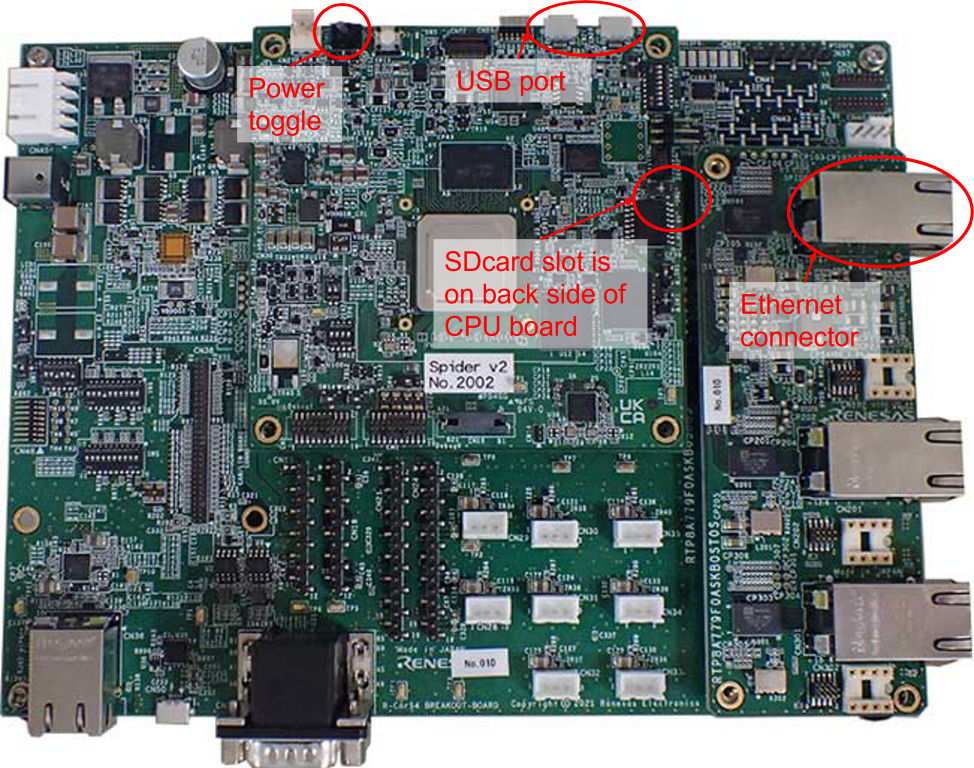

# Getting started with AWS IoT FleetWise Edge Agent on Renesas R-Car S4

This section describes how to deploy AWS IoT FleetWise Edge Agent onto an Renesas
[R-Car S4 Reference Board/Spider](https://www.renesas.com/jp/en/products/automotive-products/automotive-system-chips-socs/rtp8a779f0askb0sp2s-r-car-s4-reference-boardspider).

## Prerequisites

- **Renesas Electronics Corporation R-Car S4 Reference Board/Spider**
  - Spider board has eMMC and micro SD-card slot but the can't use simalutaneously.
  - For using sdcard, please execute following two steps. The detail files can find in
    [R-Car S4 SDK Start Up Guide PKG](https://www.renesas.com/us/en/products/automotive-products/automotive-system-chips-socs/r-car-s4-automotive-system-chip-soc-car-servercommunication-gateway#design_development).
  1.  Please flash IPL which support booting from sdcard.
      - It requires to build IPL with CA_LOAD_TYPE=1 option.
      - For more details about building IPL, please refer to section 6.2.3 "How to build" in
        "RENESAS_ICUMX_IPL_for_R-Car_Gen4_Users_Manual_E.pdf"
  1.  Please change SW3 and SW6 on the CPU board.
      - For more details, please refer to section 3.7.8.1 "Enable SD Card" in "R-Car
        S4_StartupGuide_x_x_x.pdf"
- **AWS IoT FleetWise Edge Agent Compiled for ARM64** — If you are using an EC2 Graviton instance as
  your development machine, you will have completed this already above.

  - _If you are using a local Intel x86_64 development machine running ubuntu 20.04_, you will need
    to run the following to cross-compile AWS IoT FleetWise Edge Agent:

    ```bash
    cd ~/aws-iot-fleetwise-edge
    sudo -H ./tools/install-deps-cross-arm64.sh \
        && rm -rf build \
        && ./tools/build-fwe-cross-arm64.sh
    ```

- **Internet Router with Ethernet** — The R-Car S4 Spider board must be connected to an internet
  router via an Ethernet cable for internet connectivity. It is beyond the scope of this document to
  describe how this is achieved, but one possibility is to use a WiFi to Ethernet bridge and a
  smartphone acting as an internet hotspot.

## Build an SD-Card Image

The following instructions use the development machine(Ubuntu 20.04) to build an SD-card image based
on the Ubuntu variant of the Renesas Linux BSP version 5.10.41.

1. Run the following _on the development machine_ to install the dependencies:

   ```bash
   sudo apt install qemu-user-static flex bison build-essential crossbuild-essential-arm64 libssl-dev
   ```

1. Run the following to build SD-card image:

   ```bash
    cd ~/aws-iot-fleetwise-edge \
       && sudo ./tools/renesas-rcar-s4/make-rootfs.sh 20.04.5 spider -sd
   ```

## Flash the SD-Card Image

1. Run the following to write the image to micro SD-card:

   ```bash
    sudo dd if=./Ubuntu-20.04.5-rootfs-image-rcar-spider-sdcard.ext4 of=/dev/sdc bs=1M status=progress
   ```

## Specify Initial Board Configuration

1. Insert the micro SD-card into the R-Car S4 Spider board's micro SD-card slot.
1. Connect an Ethernet cable.
1. Connect develop machine to R-Car S4 Spider board USB port.

   - USB port is depending on board revision(until B0-1st or since B0-2nd).
   - For more detail, please refer to the section 2.1 "Linux BSP" in "R-Car
     S4_StartupGuide_x_x_x.pdf".

   

1. Use screen command on your develop machine terminal to veiw serial output.(Modify the device path
   `/dev/xxxxx` to the correct path)

   ```bash
   screen /dev/xxxxx 1843200
   ```

1. Power on S4 Spider board. You can see the count down during U-Boot. Hit enter key to stop U-Boot.
1. Enter following settings to flash the micro SD-card data to board

   ```bash
     setenv _booti 'booti 0x48080000 - 0x48000000'
     setenv sd1 'setenv bootargs rw root=/dev/mmcblk0p1 rootwait ip=dhcp maxcpus=1'
     setenv sd2 ext4load mmc 0:1 0x48080000 /boot/Image
     setenv sd3 ext4load mmc 0:1 0x48000000 /boot/r8a779f0-spider.dtb
     setenv sd 'run sd1; run sd2; run sd3; run _booti'
     setenv bootcmd 'run sd'
     saveenv
     boot
   ```

1. Connect to the R-Car S4 Spider board via SSH, entering password `rcar`:
   `ssh rcar@<R-Car Ip address>`
1. Once connected via SSH, check the board's internet connection by running: `ping amazon.com`.
   There should be 0% packet loss.

## Provision AWS IoT Credentials

Run the following commands _on the development machine_ (after compiling AWS IoT FleetWise Edge
Agent for ARM64 as explained [above](#prerequisites)), to create an IoT Thing and provision
credentials for it. The AWS IoT FleetWise Edge Agent binary and its configuration files will be
packaged into a ZIP file ready to be deployed to the board.

```bash
mkdir -p ~/aws-iot-fleetwise-deploy && cd ~/aws-iot-fleetwise-deploy \
&& cp -r ~/aws-iot-fleetwise-edge/tools . \
&& mkdir -p build/src/executionmanagement \
&& cp ~/aws-iot-fleetwise-edge/build/src/executionmanagement/aws-iot-fleetwise-edge \
  build/src/executionmanagement/ \
&& mkdir -p config && cd config \
&& ../tools/provision.sh \
  --vehicle-name fwdemo-rcars4 \
  --certificate-pem-outfile certificate.pem \
  --private-key-outfile private-key.key \
  --endpoint-url-outfile endpoint.txt \
  --vehicle-name-outfile vehicle-name.txt \
&& ../tools/configure-fwe.sh \
  --input-config-file ~/aws-iot-fleetwise-edge/configuration/static-config.json \
  --output-config-file config-0.json \
  --log-color Yes \
  --vehicle-name `cat vehicle-name.txt` \
  --endpoint-url `cat endpoint.txt` \
  --can-bus0 vcan0 \
&& cd .. && zip -r aws-iot-fleetwise-deploy.zip .
```

## Deploy AWS IoT FleetWise Edge Agent software on R-Car S4 Spider board

1. Run the following _on your local machine_ to copy the deployment ZIP file from the EC2 machine to
   your local machine:

   ```bash
   scp -i <PATH_TO_PEM> ubuntu@<EC2_IP_ADDRESS>:aws-iot-fleetwise-deploy/aws-iot-fleetwise-deploy.zip .
   ```

1. Run the following _on your local machine_ to copy the deployment ZIP file from your local machine
   to the R-Car S4 Spider board (replace `<R-Car Ip address>` with the IP address of the R-Car S4
   Spider board):

   ```bash
   scp aws-iot-fleetwise-deploy.zip rcar@<R-Car Ip address>:
   ```

1. SSH to the R-Car S4 Spider board, as described above, then run the following **_on the R-Car S4
   Spider board_** to install AWS IoT FleetWise Edge Agent as a service:

   ```bash
    mkdir -p ~/aws-iot-fleetwise-deploy && cd ~/aws-iot-fleetwise-deploy \
       && unzip -o ~/aws-iot-fleetwise-deploy.zip \
       && sudo mkdir -p /etc/aws-iot-fleetwise \
       && sudo cp config/* /etc/aws-iot-fleetwise

    sudo ./tools/install-socketcan.sh
    sed -i -e 's/^After/# After/' -e 's/^Wants/#Wants/' ./tools/cansim/cansim@.service
    sudo -H ./tools/install-cansim.sh
   ```

1. Run the following **_on the R-Car S4 Spider board_** to view and follow the AWS IoT FleetWise
   Edge Agent log (press CTRL+C to exit):

   ```bash
   sudo journalctl -fu fwe@0 --output=cat
   ```

## Collect OBD Data

1. Run the following _on the development machine_ to deploy a 'heartbeat' campaign that periodically
   collects OBD data:

   ```bash
   cd ~/aws-iot-fleetwise-edge/tools/cloud
   sudo -H ./install-deps.sh
   ./demo.sh --vehicle-name fwdemo-rcars4 --campaign-file campaign-obd-heartbeat.json
   ```
