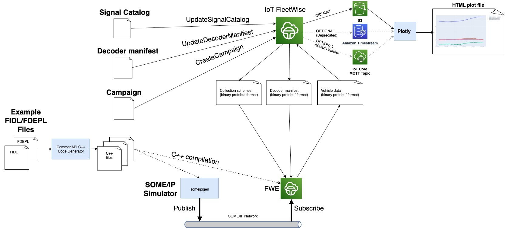

# Demo of AWS IoT FleetWise for SOME/IP

<!-- prettier-ignore -->
> [!NOTE]
> This guide makes use of "gated" features of AWS IoT FleetWise for which you will need to request
> access. See
> [here](https://docs.aws.amazon.com/iot-fleetwise/latest/developerguide/fleetwise-regions.html) for
> more information, or contact the
> [AWS Support Center](https://console.aws.amazon.com/support/home#/).

This guide demonstrates how to use AWS IoT FleetWise to collect SOME/IP data and execute SOME/IP
methods.

[Franca IDL](https://github.com/franca/franca) is the industry standard schema format for specifying
SOME/IP messages, and [CommonAPI](https://covesa.github.io/capicxx-core-tools/) is the industry
standard serialization format for SOME/IP. Franca IDL files are called 'FIDL' files, which are
transport-layer-independent, and their 'deployment' on SOME/IP is specified in 'FDEPL' files that
specify which SOME/IP service transports each message. The CommonAPI library provides a code
generator that takes the FIDL and FDEPL files and generates C++ code to implement the Franca
interfaces for both the client and server.

In this demonstration an example FIDL file
[ExampleSomeipInterface.fidl](../../interfaces/someip/fidl/ExampleSomeipInterface.fidl) and an
example FDEPL file
[ExampleSomeipInterface.fdepl](../../interfaces/someip/fidl/ExampleSomeipInterface.fdepl) are
provided. The Reference Implementation for AWS IoT FleetWise (FWE) is compiled to support these
example interfaces. A SOME/IP simulator called `someipigen` is provided in order to simulate another
node in the system that publishes the SOME/IP data and offers SOME/IP methods that FWE will execute.
`someipigen` is also compiled with support for these example interfaces.

**Note:** Since the generated code and the corresponding glue code in FWE is all specific to the
FIDL and FDEPL files, changing FWE to support different FIDL/FDEPL files will require code changes.
For more information in adapting the FWE code to support your FIDL/FDEPL files, refer to
[adding-custom-fidl-file-dev-guide](./adding-custom-fidl-file-dev-guide.md).

In this demo, firstly FWE is provisioned and run to collect SOME/IP data and upload it to the cloud.
The data is received from the IoT topic and plotted in an HTML graph format. Secondly a 'remote
command' is triggered from the cloud which causes FWE to execute a SOME/IP method. The result of the
command execution is then retrieved from the cloud.

### Overview of SOME/IP data collection

The following diagram illustrates the dataflow and artifacts consumed and produced by this demo in
the context of SOME/IP data collection:



### Overview of SOME/IP remote commands

The following diagram illustrates the dataflow and artifacts consumed and produced by this demo in
the context of SOME/IP method execution via the 'remote commands' feature:


## Prerequisites

- Access to an AWS Account with administrator privileges.
- Your AWS account has access to AWS IoT FleetWise "gated" features. See
  [here](https://docs.aws.amazon.com/iot-fleetwise/latest/developerguide/fleetwise-regions.html) for
  more information, or contact the
  [AWS Support Center](https://console.aws.amazon.com/support/home#/).
- Logged in to the AWS Console in the `us-east-1` region using the account with administrator
  privileges.
  - Note: if you would like to use a different region you will need to change `us-east-1` to your
    desired region in each place that it is mentioned below.
  - Note: AWS IoT FleetWise is currently available in
    [these](https://docs.aws.amazon.com/general/latest/gr/iotfleetwise.html) regions.
- A local Linux or MacOS machine.

## Launch your development machine

An Ubuntu 20.04 development machine with 200GB free disk space will be required. A local Intel
x86_64 (amd64) machine can be used, however it is recommended to use the following instructions to
launch an AWS EC2 Graviton (arm64) instance. Pricing for EC2 can be found,
[here](https://aws.amazon.com/ec2/pricing/on-demand/).

1. Launch an EC2 Graviton instance with administrator permissions:
   [**Launch CloudFormation Template**](https://us-east-1.console.aws.amazon.com/cloudformation/home?region=us-east-1#/stacks/quickcreate?templateUrl=https%3A%2F%2Faws-iot-fleetwise.s3.us-west-2.amazonaws.com%2Flatest%2Fcfn-templates%2Ffwdev.yml&stackName=fwdev).
1. Enter the **Name** of an existing SSH key pair in your account from
   [here](https://us-east-1.console.aws.amazon.com/ec2/v2/home?region=us-east-1#KeyPairs:).
   1. Do not include the file suffix `.pem`.
   1. If you do not have an SSH key pair, you will need to create one and download the corresponding
      `.pem` file. Be sure to update the file permissions: `chmod 400 <PATH_TO_PEM>`
1. **Select the checkbox** next to _'I acknowledge that AWS CloudFormation might create IAM
   resources with custom names.'_
1. Choose **Create stack**.
1. Wait until the status of the Stack is **CREATE_COMPLETE**; this can take up to five minutes.
1. Select the **Outputs** tab, copy the EC2 IP address, and connect via SSH from your local machine
   to the development machine.

   ```bash
   ssh -i <PATH_TO_PEM> ubuntu@<EC2_IP_ADDRESS>
   ```

## Obtain the FWE code

1. Run the following _on the development machine_ to clone the latest FWE source code from GitHub.

   ```bash
   git clone https://github.com/aws/aws-iot-fleetwise-edge.git ~/aws-iot-fleetwise-edge
   ```

## Download or build the FWE binary

**To quickly run the demo**, download the pre-built FWE binary:

- If your development machine is ARM64 (the default if you launched an EC2 instance using the
  CloudFormation template above):

  ```bash
  cd ~/aws-iot-fleetwise-edge \
  && mkdir -p build \
  && curl -L -o build/aws-iot-fleetwise-edge.tar.gz \
      https://github.com/aws/aws-iot-fleetwise-edge/releases/latest/download/aws-iot-fleetwise-edge-arm64.tar.gz  \
  && tar -zxf build/aws-iot-fleetwise-edge.tar.gz -C build aws-iot-fleetwise-edge \
  && tar -zxf build/aws-iot-fleetwise-edge.tar.gz tools/someipigen/someipigen.so
  ```

- If your development machine is x86_64:

  ```bash
  cd ~/aws-iot-fleetwise-edge \
  && mkdir -p build \
  && curl -L -o build/aws-iot-fleetwise-edge.tar.gz \
      https://github.com/aws/aws-iot-fleetwise-edge/releases/latest/download/aws-iot-fleetwise-edge-amd64.tar.gz  \
  && tar -zxf build/aws-iot-fleetwise-edge.tar.gz -C build aws-iot-fleetwise-edge \
  && tar -zxf build/aws-iot-fleetwise-edge.tar.gz tools/someipigen/someipigen.so
  ```

**Alternatively if you would like to build the FWE binary from source,** follow these instructions.
If you already downloaded the binary above, skip to the next section.

1. Install the dependencies for FWE with SOME/IP support:

   ```bash
   cd ~/aws-iot-fleetwise-edge \
   && sudo -H ./tools/install-deps-native.sh --with-someip-support \
   && sudo ldconfig
   ```

1. Compile FWE with SOME/IP support and the SOME/IP simulator:

   ```bash
   ./tools/build-fwe-native.sh --with-someip-support
   ```

## Start the SOME/IP simulator

A simulator is used to model another node in the vehicle network that publishes SOME/IP data and
offers SOME/IP methods that can be executed.

1. Start the SOME/IP simulator:

   ```bash
   cd tools/someipigen \
   && python3 someipsim.py
   ```

   **Note:** When the SOME/IP simulator and FWE run on the same machine, `vsomeip` uses a UNIX
   domain socket for communication rather than IP communication. If you are interested in SOME/IP
   communication over IP, see [Running over IP](#running-over-ip).

## Provision and run FWE

1. Open a new terminal _on the development machine_, and run the following to provision credentials
   for the vehicle and configure the network interface for SOME/IP collection:

   ```bash
   cd ~/aws-iot-fleetwise-edge \
   && mkdir -p build_config \
   && ./tools/provision.sh \
       --region us-east-1 \
       --vehicle-name fwdemo-someip \
       --certificate-pem-outfile build_config/certificate.pem \
       --private-key-outfile build_config/private-key.key \
       --endpoint-url-outfile build_config/endpoint.txt \
       --vehicle-name-outfile build_config/vehicle-name.txt \
   && ./tools/configure-fwe.sh \
       --input-config-file configuration/static-config.json \
       --output-config-file build_config/config-0.json \
       --log-color Yes \
       --log-level Trace \
       --vehicle-name `cat build_config/vehicle-name.txt` \
       --endpoint-url `cat build_config/endpoint.txt` \
       --certificate-file `realpath build_config/certificate.pem` \
       --private-key-file `realpath build_config/private-key.key` \
       --persistency-path `realpath build_config` \
       --enable-someip-interface \
       --session-expiry-interval-seconds 3600
   ```

1. Run FWE:

   ```bash
   ./build/aws-iot-fleetwise-edge build_config/config-0.json
   ```

   You should see the following messages in the log indicating that FWE has successfully subscribed
   to the SOME/IP service:

   ```
   [info] ON_AVAILABLE(0101): [1234.5678:1.0]
   [info] SUBSCRIBE ACK(0102): [1234.5678.80f2.80f2]
   [info] SUBSCRIBE ACK(0102): [1234.5678.80f3.80f3]
   ```

## Run the AWS IoT FleetWise demo script

The instructions below will register your AWS account for AWS IoT FleetWise, create a demonstration
vehicle model, register the virtual vehicle created in the previous section and run a campaign to
collect data from it.

1. Open a new terminal _on the development machine_ and run the following to install the
   dependencies of the demo script:

   ```bash
   cd ~/aws-iot-fleetwise-edge/tools/cloud \
   && sudo -H ./install-deps.sh
   ```

1. Run the demo script:

   ```bash
   ./demo.sh \
       --region us-east-1 \
       --vehicle-name fwdemo-someip \
       --node-file custom-nodes-someip.json \
       --decoder-file custom-decoders-someip.json \
       --network-interface-file network-interface-custom-someip.json \
       --campaign-file campaign-someip-heartbeat.json \
       --data-destination IOT_TOPIC
   ```

   The demo script:

   1. Registers your AWS account with AWS IoT FleetWise, if not already registered.
   1. Creates IAM role and policy required for the service to write data to the IoT topic.
   1. Creates a signal catalog, containing `custom-nodes-someip.json` which includes the SOME/IP
      sensor and actuator signals.
   1. Creates a model manifest that references the signal catalog with all of the signals.
   1. Activates the model manifest.
   1. Creates a decoder manifest linked to the model manifest using `custom-decoders-someip.json`
      for decoding the SOME/IP signals from the network interface
      `network-interface-custom-someip.json`.
   1. Updates the decoder manifest to set the status as `ACTIVE`.
   1. Creates a vehicle with a name equal to `fwdemo-someip`, the same as the name passed to
      `provision.sh`.
   1. Creates a fleet.
   1. Associates the vehicle with the fleet.
   1. Creates a campaign from `campaign-someip-heartbeat.json` that contains a time-based collection
      scheme to capture the SOME/IP signals every 10s.
   1. Approves the campaign.
   1. Waits until the campaign status is `HEALTHY`, which means the campaign has been deployed to
      the fleet.
   1. Waits 30 seconds receiving data from the IoT topic.
   1. Saves the data to an HTML file.

1. When the script completes, a path to an HTML file is given. _On your local machine_, use `scp` to
   download it, then open it in your web browser:

   ```bash
   scp -i <PATH_TO_PEM> ubuntu@<EC2_IP_ADDRESS>:<PATH_TO_HTML_FILE> .
   ```

1. To explore the collected data, you can click and drag to zoom in.

   

### Remote Command Execution

The following steps will execute a SOME/IP method via the AWS IoT FleetWise 'remote commands'
feature.

1. Run the following command _on the development machine_ to create an IAM role to generate the
   command payload:

   ```bash
   SERVICE_ROLE_ARN=`./manage-service-role.sh \
      --service-role IoTCreateCommandPayloadServiceRole \
      --service-principal iot.amazonaws.com \
      --actions iotfleetwise:GenerateCommandPayload \
      --resources '*'`
   ```

1. Next create a remote command to execute the SOME/IP method `setInt32`. This SOME/IP method is
   mapped via the decoder manifest to the 'actuator' node `Vehicle.actuator1` in the signal catalog.

   ```bash
   aws iot create-command --command-id actuator1-command --namespace "AWS-IoTFleetWise" \
      --region us-east-1 \
      --role-arn ${SERVICE_ROLE_ARN} \
      --mandatory-parameters '[{
         "name": "$actuatorPath.Vehicle.actuator1",
         "defaultValue": { "S": "0" }
      }]'
   ```

1. Run the following command to start the execution of the command defined above with the value to
   set for the actuator.

   ```bash
   JOBS_ENDPOINT_URL=`aws iot describe-endpoint --region us-east-1 --endpoint-type iot:Jobs | jq -j .endpointAddress` \
   && ACCOUNT_ID=`aws sts get-caller-identity | jq -r .Account` \
   && COMMAND_EXECUTION_ID=`aws iot-jobs-data start-command-execution \
      --region us-east-1 \
      --command-arn arn:aws:iot:us-east-1:${ACCOUNT_ID}:command/actuator1-command \
      --target-arn arn:aws:iot:us-east-1:${ACCOUNT_ID}:thing/fwdemo-someip \
      --parameters '{
        "$actuatorPath.Vehicle.actuator1":
            { "S": "10" }
      }' \
      --endpoint-url https://${JOBS_ENDPOINT_URL} | jq -r .executionId` \
   && echo "Command execution id: ${COMMAND_EXECUTION_ID}"
   ```

1. Run the following command to get the command execution status.

   ```bash
   aws iot get-command-execution \
      --region us-east-1 \
      --target-arn arn:aws:iot:us-east-1:${ACCOUNT_ID}:thing/fwdemo-someip \
      --execution-id ${COMMAND_EXECUTION_ID}
   ```

1. You should see the following output indicating the command was successfully executed. Note that
   the `reasonCode` (uint32) and `reasonDescription` (string) are extensible result information
   fields. Refer to [ICommandDispatcher.h](../../src/ICommandDispatcher.h) for the reason codes
   defined by FWE. The OEM range of reason codes begins at 65536. In this example implementation the
   `reasonCode` is set to 65536 plus the CommonAPI `CallStatus` code, and `reasonDescription` is set
   to the string representation of the CommonAPI `CallStatus` code. In this case the `reasonCode` is
   65536, meaning `65536 + 0` or `CommonAPI::CallStatus::SUCCESS`.

   ```json
   {
     "executionId": "<COMMAND_EXECUTION_ID>",
     "commandArn": "arn:aws:iot:us-east-1:<ACCOUNT_ID>:command/actuator1-command",
     "targetArn": "arn:aws:iot:us-east-1:<ACCOUNT_ID>:thing/fwdemo-someip",
     "status": "SUCCEEDED",
     "statusReason": {
       "reasonCode": "65536",
       "reasonDescription": "SUCCESS"
     },
     "parameters": {
       "$actuatorPath.Vehicle.actuator1": {
         "S": "10"
       }
     },
     "executionTimeoutSeconds": 10,
     "createdAt": "<CREATION_TIME>",
     "lastUpdatedAt": "<LAST_UPDATE_TIME>",
     "completedAt": "<COMPLETED_TIME>"
   }
   ```

   In the FWE log you should see the following indicating that the command was successfully
   executed:

   ```
   [TRACE] [ActuatorCommandManager.cpp:104] [processCommandRequest()]: [Processing Command Request with ID: <COMMAND_ID>]
   [TRACE] [ExampleSomeipInterfaceWrapper.h:85] [referenceMethodWrapper1()]: [set actuator value to 123 for command ID <COMMAND_ID>]
   [INFO ] [SomeipCommandDispatcher.cpp:128] [setActuatorValue()]: [Actuator Vehicle.actuator1 executed successfully for command ID <COMMAND_ID>]
   ```

### Long-running commands

It is possible for commands to take an extended time to complete. In this case the vehicle can
report the command status as `IN_PROGRESS` to indicate that the command has been received and is
being run, before the final status of `SUCCEEDED` etc. is reported.

In the example SOME/IP interfaces provided, `Vehicle.actuator20` is configured as such a
"long-running command". After running of this command is started the `someipigen` simulator will
notify FWE of the percentage completion on the broadcast message `notifyLRCStatus`. The intermediate
status is sent to the cloud and can also be obtained by calling the `aws iot get-command-execution`
API.

1. Run the following to create the long-running command:

   ```bash
   aws iot create-command --command-id actuator20-command --namespace "AWS-IoTFleetWise" \
      --region us-east-1 \
      --role-arn ${SERVICE_ROLE_ARN} \
      --mandatory-parameters '[{
         "name": "$actuatorPath.Vehicle.actuator20",
         "defaultValue": { "S": "0" }
      }]'
   ```

1. Then start the command:

   ```bash
   COMMAND_EXECUTION_ID=`aws iot-jobs-data start-command-execution \
      --region us-east-1 \
      --command-arn arn:aws:iot:us-east-1:${ACCOUNT_ID}:command/actuator20-command \
      --target-arn arn:aws:iot:us-east-1:${ACCOUNT_ID}:thing/fwdemo-someip \
      --parameters '{
        "$actuatorPath.Vehicle.actuator20":
            { "S": "10" }
      }' \
      --endpoint-url https://${JOBS_ENDPOINT_URL} \
      --execution-timeout 20 | jq -r .executionId` \
   && echo "Command execution id: ${COMMAND_EXECUTION_ID}"
   ```

1. Now repeatedly run this command to get the command status:

   ```bash
   aws iot get-command-execution \
      --region us-east-1 \
      --target-arn arn:aws:iot:us-east-1:${ACCOUNT_ID}:thing/fwdemo-someip \
      --execution-id ${COMMAND_EXECUTION_ID}
   ```

   The command takes 10 seconds to complete. In this time you will see that the status is
   `IN_PROGRESS` with the `reasonDescription` being the percentage completion of the command as sent
   by the `someipigen` tool. (Note: sending the percentage completion is just an example, the
   `reasonDescription` string field is a free-form string to be defined by the customer.) After the
   command completes the status changes to `SUCCEEDED`.

### Concurrent commands

It is possible for commands to be executed concurrently, even for the same actuator. Each execution
is uniquely identified by the execution ID. In the following example, 3 executions of the
`Vehicle.actuator20` command are started spaced by 1 second. Since each execution takes 10 seconds
to complete, all 3 will run in parallel.

1. Run the following to begin 3 executions of the `Vehicle.actuator20` command:

   ```bash
   COMMAND_EXECUTION_IDS=() \
   && for ((i=0; i<3; i++)); do
      if ((i>0)); then sleep 1; fi
      COMMAND_EXECUTION_ID=`aws iot-jobs-data start-command-execution \
         --region us-east-1 \
         --command-arn arn:aws:iot:us-east-1:${ACCOUNT_ID}:command/actuator20-command \
         --target-arn arn:aws:iot:us-east-1:${ACCOUNT_ID}:thing/fwdemo-someip \
         --parameters '{
         "$actuatorPath.Vehicle.actuator20":
               { "S": "10" }
         }' \
         --endpoint-url https://${JOBS_ENDPOINT_URL} \
         --execution-timeout 20 | jq -r .executionId`
      echo "Command execution ${i} id: ${COMMAND_EXECUTION_ID}"
      COMMAND_EXECUTION_IDS+=("${COMMAND_EXECUTION_ID}")
   done
   ```

1. Now repeatedly run the following to get the status of the 3 commands as they run in parallel:

   ```bash
   for ((i=0; i<3; i++)); do
      echo "---------------------------"
      echo "Command execution ${i} status:"
      aws iot get-command-execution \
         --region us-east-1 \
         --target-arn arn:aws:iot:us-east-1:${ACCOUNT_ID}:thing/fwdemo-someip \
         --execution-id ${COMMAND_EXECUTION_IDS[i]}
   done
   ```

### Offline commands

It is possible for a command execution to be started while FWE is offline, then FWE will begin
execution of the command when it comes online so long as the following prerequisites are met:

- FWE has successfully connected via MQTT at least once, with persistent session enabled and the
  MQTT session timeout has not elapsed. To enable persistent session, set
  `.staticConfig.mqttConnection.sessionExpiryIntervalSeconds` in the config file or
  `--session-expiry-interval-seconds` when running `configure-fwe.sh` to a non-zero value
  sufficiently large.
- Persistency is enabled for FWE (so that the decoder manifest is available immediately when FWE
  starts).
- The command timeout has not been exceeded.
- The SOME/IP service is available when FWE is started (in this case the `someipigen` simulator).

The following steps demonstrate offline commands:

1. Switch to the terminal running FWE, and stop it using `CTRL-C`.

1. Switch to the terminal used to run the AWS CLI commands, and start execution of a command with a
   30 second timeout:

   ```bash
   COMMAND_EXECUTION_ID=`aws iot-jobs-data start-command-execution \
      --region us-east-1 \
      --command-arn arn:aws:iot:us-east-1:${ACCOUNT_ID}:command/actuator1-command \
      --target-arn arn:aws:iot:us-east-1:${ACCOUNT_ID}:thing/fwdemo-someip \
      --parameters '{
        "$actuatorPath.Vehicle.actuator1":
            { "S": "456" }
      }' \
      --endpoint-url https://${JOBS_ENDPOINT_URL} \
      --execution-timeout 30 | jq -r .executionId` \
   && echo "Command execution id: ${COMMAND_EXECUTION_ID}"
   ```

1. Get the current status of the command, which will remain as `CREATED` since FWE is not running:

   ```bash
   aws iot get-command-execution \
      --region us-east-1 \
      --target-arn arn:aws:iot:us-east-1:${ACCOUNT_ID}:thing/fwdemo-someip \
      --execution-id ${COMMAND_EXECUTION_ID}
   ```

1. Switch to the FWE terminal, and restart it by running:

   ```bash
   ./build/aws-iot-fleetwise-edge build_config/config-0.json
   ```

1. Switch to the AWS CLI terminal, and run the following to get the new status of the command, which
   should be `SUCCEEDED`. Since FWE rejoined an existing MQTT session and the command was published
   with QoS 1 (at least once), the MQTT broker sends the command to FWE as soon as it connects to
   the cloud. FWE is able to execute the command, since it has not timed out, the decoder manifest
   is available (as persistency for FWE is enabled), and the SOME/IP service is available.

   ```bash
   aws iot get-command-execution \
      --region us-east-1 \
      --target-arn arn:aws:iot:us-east-1:${ACCOUNT_ID}:thing/fwdemo-someip \
      --execution-id ${COMMAND_EXECUTION_ID}
   ```

1. Repeat the above, but this time wait longer than 30s before restarting FWE. In this case FWE will
   still receive the command request from cloud, but since the timeout has expired it will not be
   executed and the returned status will be `TIMED_OUT`.

## Clean up

1. Run the following _on the development machine_ to clean up resources created by the
   `provision.sh` and `demo.sh` scripts.

   ```bash
   cd ~/aws-iot-fleetwise-edge/tools/cloud \
   && ./clean-up.sh \
   && ../provision.sh \
      --vehicle-name fwdemo-someip \
      --region us-east-1 \
      --only-clean-up \
   && ./manage-service-role.sh \
      --service-role IoTCreateCommandPayloadServiceRole \
      --clean-up
   ```

1. Delete the CloudFormation stack for your development machine, which by default is called `fwdev`:
   https://us-east-1.console.aws.amazon.com/cloudformation/home

## Running over IP

In the above example both FWE and the `someipigen` program were both running on the same development
machine. In this scenario the [vsomeip](https://github.com/COVESA/vsomeip) library uses a local UNIX
domain socket for service discovery and communication between the processes.

If you would like to run the example over IP, with the `someipigen` program running on one machine
and FWE running on a different machine on the same local network, then it is necessary to configure
`vsomeip` using JSON configuration files to setup the IP addresses, ports and protocols for the
service to use.

The example below details how to configure `vsomeip` for UDP over IP communication. If you are
interested in using TCP over IP communication refer to the `vsomeip` documentation.

1. Create a JSON configuration file called `tools/someipigen/vsomeip-someipigen.json` for the
   `someipigen` program, replacing `<IP_ADDRESS>` with the IPv4 address of the machine running the
   program:

   ```json
   {
     "unicast": "<IP_ADDRESS>",
     "netmask": "255.255.0.0",
     "logging": {
       "level": "trace",
       "console": "true",
       "dlt": "false"
     },
     "applications": [
       {
         "name": "someipigen",
         "id": "0x1414"
       }
     ],
     "services": [
       {
         "service": "0x1234",
         "instance": "0x5678",
         "unreliable": "30510"
       }
     ],
     "service-discovery": {
       "enable": "true",
       "multicast": "224.224.224.245",
       "port": "30490",
       "protocol": "udp",
       "initial_delay_min": "10",
       "initial_delay_max": "100",
       "repetitions_base_delay": "200",
       "repetitions_max": "3",
       "ttl": "3",
       "cyclic_offer_delay": "2000",
       "request_response_delay": "1500"
     }
   }
   ```

1. Run the `someipigen` program with the configuration file as follows:

   ```bash
   cd tools/someipigen \
   && VSOMEIP_CONFIGURATION=vsomeip-someipigen.json python3 someipsim.py
   ```

1. Create a JSON configuration file called `vsomeip-fwe.json` for FWE, replacing `<IP_ADDRESS>` with
   the IPv4 address of the machine running FWE:

   ```json
   {
     "unicast": "<IP_ADDRESS>",
     "netmask": "255.255.0.0",
     "logging": {
       "level": "trace",
       "console": "true",
       "dlt": "false"
     },
     "applications": [
       {
         "name": "someipCommandInterface",
         "id": "0x1314"
       },
       {
         "name": "someipCollectionInterface",
         "id": "0x1315"
       }
     ],
     "service-discovery": {
       "enable": "true",
       "multicast": "224.224.224.245",
       "port": "30490",
       "protocol": "udp",
       "initial_delay_min": "10",
       "initial_delay_max": "100",
       "repetitions_base_delay": "200",
       "repetitions_max": "3",
       "ttl": "3",
       "cyclic_offer_delay": "2000",
       "request_response_delay": "1500"
     }
   }
   ```

1. Run FWE with the configuration file as follows:

   ```bash
   VSOMEIP_CONFIGURATION=vsomeip-fwe.json ./aws-iot-fleetwise-edge config-0.json
   ```

   If successfully configured, you should see the following in the FWE log:

   ```
   [debug] Joining to multicast group 224.224.224.245 from <IP_ADDRESS>
   [info] SOME/IP routing ready.
   ```

1. You can now [run the cloud demo script](#run-the-aws-iot-fleetwise-demo-script).

### Troubleshooting

Common issues encountered when trying to establish a SOME/IP connection over UDP include:

- **Trying to use a local loopback address.** It is not possible to use the local loopback IP
  address `127.0.0.1` to run the demo over UDP on one machine, as the local loopback interface does
  not support UDP multicast, which is required by SOME/IP service discovery.

- **A firewall blocking open UDP ports.** To open the two UDP ports used in the above example, run
  the following on the machine running `someipigen`:

  ```bash
  sudo iptables -A INPUT -p udp -m udp --dport 30490 -j ACCEPT
  sudo iptables -A INPUT -p udp -m udp --dport 30510 -j ACCEPT
  ```

- **A bug in the `vsomeip` library that causes service discovery to fail** in versions >=3.3.0
  <3.5.0. This bug was fixed with this GitHub PR: https://github.com/COVESA/vsomeip/pull/591.
