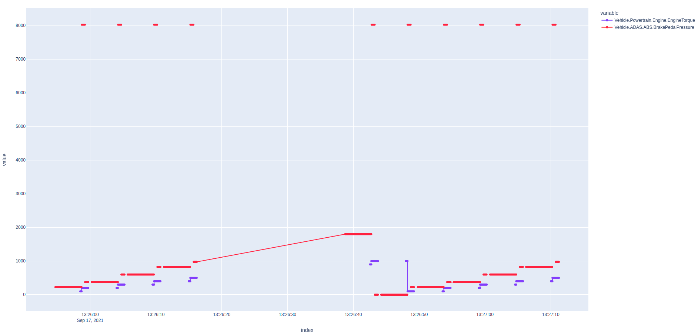
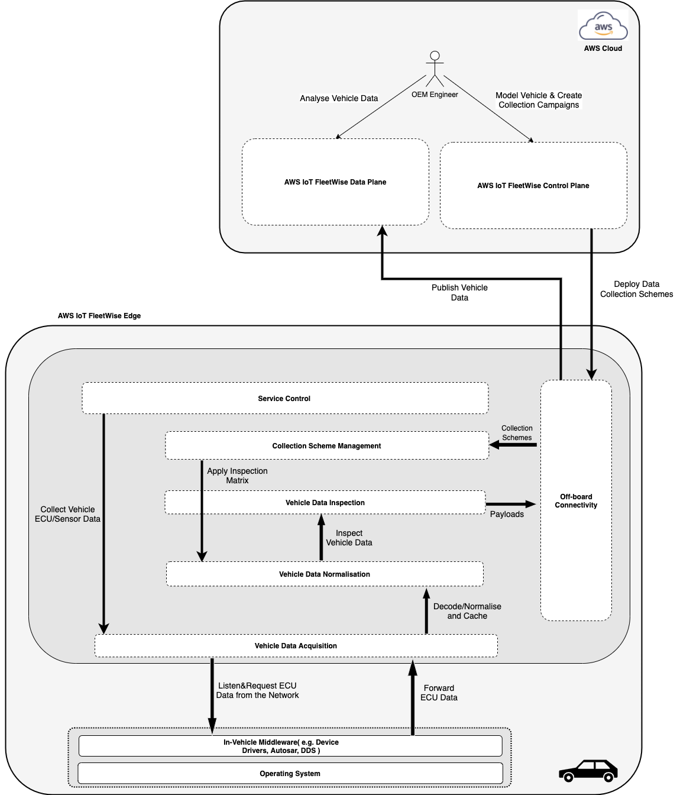
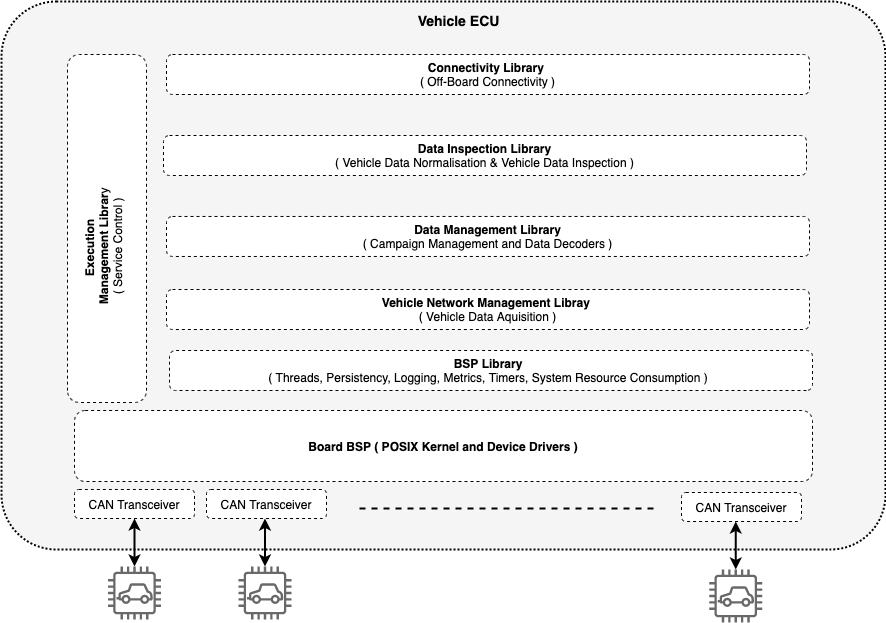

# AWS IoT FleetWise Edge Agent Developer Guide

**Copyright © Amazon Web Services, Inc. and/or its affiliates. All rights reserved.**

Amazon's trademarks and trade dress may not be used in connection with any product or service that
is not Amazon's, in any manner that is likely to cause confusion among customers, or in any manner
that disparages or discredits Amazon. All other trademarks not owned by Amazon are the property of
their respective owners, who may or may not be affiliated with, connected to, or sponsored by
Amazon.

**Note**

- AWS IoT FleetWise is currently available in US East (N. Virginia) and Europe (Frankfurt).

**AWS IoT FleetWise** provides a set of tools that enable automakers to collect, transform, and
transfer vehicle data to the cloud at scale. With AWS IoT FleetWise you can build virtual
representations of vehicle networks and define data collection rules to transfer only high-value
data from your vehicles to AWS Cloud.

**AWS IoT FleetWise Edge Agent** software provides C++ libraries that enable you to run the
application on your vehicle. You can use AWS IoT FleetWise pre-configured analytic capabilities to
process collected data, gain insights about vehicle health, and use the service’s visual interface
to help diagnose and troubleshoot potential issues with the vehicle.

AWS IoT FleetWise's capability to collect ECU data and store them on cloud databases enables you to
utilize different AWS services, such as Analytics Services, and ML, to develop novel use-cases that
augment and/or supplement your existing vehicle functionality. In particular, AWS IoT FleetWise can
help utilize fleet data (Big Data) to create value. For example, you can develop use cases that
optimize vehicle routing, improve electric vehicle range estimation, and optimize battery life
charging. You can extend AWS IoT FleetWise other use cases such as for pet or child detection,
Driver Monitoring System applications, predictive diagnostics, and for outlier detection with an
electric vehicle's battery cells.

You can use the included sample C++ application to learn more about AWS IoT FleetWise Edge Agent
interfaces and to test interactions before integration.

**_The AWS IoT FleetWise in-vehicle software component is licensed to you under the
[Apache License, Version 2.0](http://www.apache.org/licenses/LICENSE-2.0). You are solely
responsible for ensuring such software and any updates and modifications thereto are deployed and
maintained safely and securely in any vehicles and do not otherwise impact vehicle safety._**

**Topics**

- [AWS IoT FleetWise quick start demo](#aws-iot-fleetwise-quick-start-demo)
- [Getting started with AWS IoT FleetWise Edge Agent](#getting-started-with-aws-iot-fleetwise-edge-agent)
- [AWS IoT FleetWise Edge Agent Architecture](#aws-iot-fleetwise-edge-agent-architecture)

# AWS IoT FleetWise quick start demo

This guide is intended to quickly demonstrate the basic features of AWS IoT FleetWise by firstly
deploying the AWS IoT FleetWise Edge Agent to an AWS EC2 instance representing one or more simulated
vehicles. A script is then run using the AWS CLI to control AWS IoT FleetWise Cloud in order collect
data from the vehicle.

This guide showcases AWS IoT FleetWise at a high level. If you are interested in exploring AWS IoT
FleetWise at a more detailed technical level, see
[Getting started with AWS IoT FleetWise Edge Agent](#getting-started-with-aws-iot-fleetwise-edge-agent).

**Topics:**

- [Prerequisites for quick start demo](#prerequisites-for-quick-start-demo)
- [Deploy the AWS IoT FleetWise Edge Agent software](#deploy-the-aws-iot-fleetwise-edge-agent-software)
- [Use the AWS IoT FleetWise cloud demo](#use-the-aws-iot-fleetwise-cloud-demo)
- [Explore collected data](#explore-collected-data)

## Prerequisites for quick start demo

This guide assumes you have already logged in to the AWS console in your desired region using an
account with administrator rights.

- Note: AWS IoT FleetWise is currently available in US East (N. Virginia) and Europe (Frankfurt).

## Deploy the AWS IoT FleetWise Edge Agent software

An AWS CloudFormation template is used to deploy the AWS IoT FleetWise Edge Agent to a new AWS EC2
instance.

1. Click here to
   [**Launch CloudFormation Template**](https://us-east-1.console.aws.amazon.com/cloudformation/home?region=us-east-1#/stacks/quickcreate?templateUrl=https%3A%2F%2Faws-iot-fleetwise.s3.us-west-2.amazonaws.com%2Flatest%2Fcfn-templates%2Ffwdemo.yml&stackName=fwdemo).
1. (Optional) You can increase the number of simulated vehicles by updating the `FleetSize`
   parameter. You can also specify the region IoT Things are created in by updating the
   `IoTCoreRegion` parameter.
1. Select the checkbox next to _‘I acknowledge that AWS CloudFormation might create IAM resources
   with custom names.’_
1. Choose **Create stack**.
1. Wait until the status of the Stack is ‘CREATE_COMPLETE’, this will take approximately 10 minutes.

AWS IoT FleetWise Edge Agent software has been deployed to an AWS EC2 Graviton (ARM64) Instance
along with credentials that allow it to connect to AWS IoT Core. CAN data is also being generated on
the EC2 instance to simulate periodic hard-braking events. The AWS IoT FleetWise Cloud demo script
in the following section will deploy a campaign to the simulated fleet of vehicles to capture the
engine torque when a hard braking-event occurs.

## Use the AWS IoT FleetWise cloud demo

The instructions below will register your AWS account for AWS IoT FleetWise, create a demonstration
vehicle model, register the virtual vehicle created in the previous section and run a campaign to
collect data from it.

1. Open the AWS CloudShell: [Launch CloudShell](https://console.aws.amazon.com/cloudshell/home)
1. Copy and paste the following commands to clone the latest AWS IoT FleetWise Edge Agent software
   from GitHub and install the dependencies of the cloud demo script.

   ```bash
   git clone https://github.com/aws/aws-iot-fleetwise-edge.git ~/aws-iot-fleetwise-edge \
       && cd ~/aws-iot-fleetwise-edge/tools/cloud \
       && pip3 install wrapt==1.10.0 plotly==5.3.1 pandas==1.3.4 cantools==36.4.0
   ```

   The AWS IoT FleetWise Cloud demo script performs the following:

   - Registers your AWS account with AWS IoT FleetWise, if not already registered
   - Creates a signal catalog, firstly based on `obd-nodes.json` to add standard OBD signals, and
     secondly based on the DBC file `hscan.dbc` to add CAN signals in a flat signal list
   - Creates a model manifest that references the signal catalog with all of the OBD and DBC signals
   - Activates the model manifest
   - Creates a decoder manifest linked to the model manifest using `obd-decoders.json` for decoding
     OBD signals from the network interfaces defined in `network-interfaces.json`
   - Imports the CAN signal decoding information from `hscan.dbc` to the decoder manifest
   - Updates the decoder manifest to set the status as `ACTIVE`
   - Creates a vehicle with an ID equal to `fwdemo` which is the same as the name given to the
     CloudFormation Stack name in the previous section
   - Creates a fleet
   - Associates the vehicle with the fleet
   - Creates a campaign from `campaign-brake-event.json` that contains a condition-based collection
     scheme to capture the engine torque and the brake pressure when the brake pressure is above
     7000, and targets the campaign at the fleet
   - Approves the campaign
   - Waits until the campaign status is `HEALTHY`, which means the campaign has been deployed to the
     fleet
   - Waits 30 seconds and then downloads the collected data from Timestream
   - Saves the data to an HTML file

1. Run the demo script:

   ```bash
   ./demo.sh --vehicle-name fwdemo
   ```

   1. (Optional) If you selected a `FleetSize` of greater than one above, append the option
      `--fleet-size <SIZE>`, where `<SIZE>` is the number selected.
   1. (Optional) If you changed `IoTCoreRegion` above, append the option `--region <REGION>`, where
      `<REGION>` is the selected region.
   1. (Optional) If you changed `Stack name` when creating the stack above, pass the new stack name
      to the `--vehicle-name` option.

   For example, if you chose to create two AWS IoT things in Europe (Frankfurt) with a stack named
   `myfwdemo`, you must pass those values when calling `demo.sh`:

   ```bash
   ./demo.sh --vehicle-name myfwdemo --fleet-size 2 --region eu-central-1
   ```

1. When the script completes, a path to an HTML file is given in the format
   `/home/cloudshell-user/aws-iot-fleetwise-cloud/fwdemo-<TIMESTAMP>.html`. Copy the path, then
   click on the Actions drop down menu in the top-right corner of the CloudShell window and choose
   **Download file**. Paste the path to the file, choose **Download**, and open the downloaded file
   in your browser.

## Explore collected data

1. To explore the collected data, you can click and drag to zoom in. The red line shows the
   simulated brake pressure signal. As you can see that when hard braking events occur (value above
   7000), collection is triggered and the engine torque signal data is collected.
   1. Alternatively, if your AWS account is enrolled with Amazon QuickSight or Grafana, you may use
      them to browse the data from Amazon Timestream directly.



# Getting started with AWS IoT FleetWise Edge Agent

This guide is intended to demonstrate the basic features of AWS IoT FleetWise by firstly building
AWS IoT FleetWise Edge and running it on a development machine (locally or on AWS EC2) in order to
represent a simulated vehicle. A script is then run to interact with AWS IoT FleetWise Cloud in
order collect data from the simulated vehicle. Instructions are also provided for running AWS IoT
FleetWise Edge Agent on an NXP S32G-VNP-RDB2 development board or Renesas R-Car S4 Spider board and
deploying a campaign to collect OBD data.

This guide covers building AWS IoT FleetWise at a detailed technical level, using a development
machine to build and run the Edge Agent executable. If you would prefer to learn about AWS IoT
FleetWise at a higher level that does not require use of a development machine, see
[AWS IoT FleetWise quick start demo](#aws-iot-fleetwise-quick-start-demo).

#### Topics:

- [Getting started with AWS IoT FleetWise on a development machine](#getting-started-with-aws-iot-fleetwise-on-a-development-machine)
  - [Prerequisites for development machine](#prerequisites-for-development-machine)
  - [Launch your development machine](#launch-your-development-machine)
  - [Compile AWS IoT FleetWise Edge Agent software](#compile-aws-iot-fleetwise-edge-agent-software)
  - [Deploy AWS IoT FleetWise Edge Agent software](#deploy-aws-iot-fleetwise-edge-agent-software)
  - [Run the AWS IoT FleetWise demo script](#run-the-aws-iot-fleetwise-demo-script)
- [Getting started with AWS IoT FleetWise Edge Agent on a NXP S32G board](./edge-agent-dev-guide-nxp-s32g.md)
  - [Prerequisites for NXP S32G](./edge-agent-dev-guide-nxp-s32g.md#prerequisites)
  - [Build an SD-Card Image](./edge-agent-dev-guide-nxp-s32g.md#build-an-sd-card-image)
  - [Flash the SD-Card Image](./edge-agent-dev-guide-nxp-s32g.md#flash-the-sd-card-image)
  - [Specify initial board configuration](./edge-agent-dev-guide-nxp-s32g.md#specify-initial-board-configuration)
  - [Provision AWS IoT Credentials](./edge-agent-dev-guide-nxp-s32g.md#provision-aws-iot-credentials)
  - [Deploy AWS IoT FleetWise Edge Agent on NXP S32G](./edge-agent-dev-guide-nxp-s32g.md#deploy-aws-iot-fleetwise-edge-agent-on-nxp-s32g)
  - [Collect OBD Data](./edge-agent-dev-guide-nxp-s32g.md#collect-obd-data)
- [Getting started with AWS IoT FleetWise Edge Agent on a Renesas R-Car S4 board](./edge-agent-dev-guide-renesas-rcar-s4.md)
  - [Prerequisites](./edge-agent-dev-guide-renesas-rcar-s4.md#prerequisites)
  - [Build an SD-Card Image](./edge-agent-dev-guide-renesas-rcar-s4.md#build-an-sd-card-image)
  - [Flash the SD-Card Image](./edge-agent-dev-guide-renesas-rcar-s4.md#flash-the-sd-card-image)
  - [Specify initial board configuration](./edge-agent-dev-guide-renesas-rcar-s4.md#specify-initial-board-configuration)
  - [Provision AWS IoT Credentials](./edge-agent-dev-guide-renesas-rcar-s4.md#provision-aws-iot-credentials)
  - [Deploy and run AWS IoT FleetWise Edge Agent software on R-Car S4 Spider board](./edge-agent-dev-guide-renesas-rcar-s4.md#deploy-aws-iot-fleetwise-edge-agent-software-on-r-car-s4-spider-board)
  - [Collect OBD Data](./edge-agent-dev-guide-renesas-rcar-s4.md#collect-obd-data)

## Getting started with AWS IoT FleetWise on a development machine

This section describes how to get started with AWS IoT FleetWise Edge Agent on a development
machine.

### Prerequisites for development machine

- Access to an AWS Account with administrator privileges.
- Logged in to the AWS Console in your desired region using the account with administrator
  privileges.
  - Note: AWS IoT FleetWise is currently available in US East (N. Virginia) and Europe (Frankfurt).
- A local Linux or MacOS machine.

### Launch your development machine

An Ubuntu 20.04 development machine with 200GB free disk space will be required. A local Intel
x86_64 (amd64) machine can be used, however it is recommended to use the following instructions to
launch an AWS EC2 Graviton (arm64) instance. Pricing for EC2 can be found,
[here](https://aws.amazon.com/ec2/pricing/on-demand/).

1. Launch an EC2 Graviton instance with administrator permissions:
   [**Launch CloudFormation Template**](https://us-east-1.console.aws.amazon.com/cloudformation/home?region=us-east-1#/stacks/quickcreate?templateUrl=https%3A%2F%2Faws-iot-fleetwise.s3.us-west-2.amazonaws.com%2Flatest%2Fcfn-templates%2Ffwdev.yml&stackName=fwdev).
1. Enter the **Name** of an existing SSH key pair in your account from
   [here](https://us-east-1.console.aws.amazon.com/ec2/v2/home?region=us-east-1#KeyPairs:).
   1. Do not include the file suffix `.pem`.
   1. If you do not have an SSH key pair, you will need to create one and download the corresponding
      `.pem` file. Be sure to update the file permissions: `chmod 400 <PATH_TO_PEM>`
1. **Select the checkbox** next to _‘I acknowledge that AWS CloudFormation might create IAM
   resources with custom names.’_
1. Choose **Create stack**.
1. Wait until the status of the Stack is **CREATE_COMPLETE**; this can take up to five minutes.
1. Select the **Outputs** tab, copy the EC2 IP address, and connect via SSH from your local machine
   to the development machine.

   ```bash
   ssh -i <PATH_TO_PEM> ubuntu@<EC2_IP_ADDRESS>
   ```

### Compile AWS IoT FleetWise Edge Agent software

1. Run the following _on the development machine_ to clone the latest AWS IoT FleetWise Edge Agent
   software from GitHub.

   ```bash
   git clone https://github.com/aws/aws-iot-fleetwise-edge.git ~/aws-iot-fleetwise-edge \
       && cd ~/aws-iot-fleetwise-edge
   ```

   You can browse the [README.md](../../README.md) and source code while referring to this guide.

1. Install the AWS IoT FleetWise Edge Agent dependencies

   Commands below will:

   1. Install the following Ubuntu packages:
      `libssl-dev libboost-system-dev libboost-log-dev libboost-thread-dev build-essential cmake unzip git wget curl zlib1g-dev libcurl4-openssl-dev libsnappy-dev default-jre libasio-dev`.
      Additionally it installs the following: `jsoncpp protobuf aws-sdk-cpp`
   1. Install the following Ubuntu packages:
      `build-essential dkms can-utils git linux-modules-extra-aws`. Additionally it installs the
      following: `can-isotp`. It also installs a systemd service called `setup-socketcan` that
      brings up the virtual SocketCAN interface `vcan0` at startup.
   1. Install the following Ubuntu packages: `python3 python3-pip`. It then installs the following
      PIP packages: `wrapt cantools prompt_toolkit python-can can-isotp matplotlib`. It also
      installs a systemd service called `cansim` that periodically transmits data on the virtual
      SocketCAN bus `vcan0` to simulate vehicle data.

   ```bash
   sudo -H ./tools/install-deps-native.sh \
       && sudo -H ./tools/install-socketcan.sh \
       && sudo -H ./tools/install-cansim.sh
   ```

1. Run the following to compile AWS IoT FleetWise Edge Agent software:

   ```bash
   ./tools/build-fwe-native.sh
   ```

### Deploy AWS IoT FleetWise Edge Agent software

1. Run the following _on the development machine_ to provision an AWS IoT Thing with credentials and
   install AWS IoT FleetWise Edge Agent as a service.

   **Note** To create AWS IoT things in Europe (Frankfurt), configure `--region` to `eu-central-1`
   in the call to `provision.sh`

   ```bash
   sudo mkdir -p /etc/aws-iot-fleetwise \
       && sudo ./tools/provision.sh \
           --vehicle-name fwdemo-ec2 \
           --certificate-pem-outfile /etc/aws-iot-fleetwise/certificate.pem \
           --private-key-outfile /etc/aws-iot-fleetwise/private-key.key \
           --endpoint-url-outfile /etc/aws-iot-fleetwise/endpoint.txt \
           --vehicle-name-outfile /etc/aws-iot-fleetwise/vehicle-name.txt \
       && sudo ./tools/configure-fwe.sh \
           --input-config-file configuration/static-config.json \
           --output-config-file /etc/aws-iot-fleetwise/config-0.json \
           --log-color Yes \
           --vehicle-name `cat /etc/aws-iot-fleetwise/vehicle-name.txt` \
           --endpoint-url `cat /etc/aws-iot-fleetwise/endpoint.txt` \
           --can-bus0 vcan0 \
       && sudo ./tools/install-fwe.sh
   ```

   1. At this point AWS IoT FleetWise Edge Agent is running and periodically sending ‘checkins’ to
      AWS IoT FleetWise, in order to announce its current list of campaigns (which at this stage
      will be an empty list). CAN data is also being generated on the development machine to
      simulate periodic hard-braking events. The AWS IoT FleetWise Cloud demo script in the
      following section will deploy a campaign to the simulated vehicle to capture the engine torque
      when a hard braking-event occurs.

1. Run the following to view and follow the AWS IoT FleetWise Edge Agent log. You can open a new SSH
   session with the development machine and run this command to follow the log in real time as the
   campaign is deployed in the next section. To exit the logs, use CTRL + C.

   ```bash
   sudo journalctl -fu fwe@0 --output=cat
   ```

### Run the AWS IoT FleetWise demo script

The instructions below will register your AWS account for AWS IoT FleetWise, create a demonstration
vehicle model, register the virtual vehicle created in the previous section, and run a campaign to
collect data from it.

1. Run the following _on the development machine_ to install the dependencies of the AWS IoT
   FleetWise Cloud demo script:

   1. Following command installs the following Ubuntu packages: `python3 python3-pip`. It then
      installs the following PIP packages: `wrapt plotly pandas cantools`

   ```bash
   cd ~/aws-iot-fleetwise-edge/tools/cloud \
       && sudo -H ./install-deps.sh
   ```

1. Run the following to explore the AWS IoT FleetWise CLI:

   ```bash
   aws iotfleetwise help
   ```

1. Run the demo script:

   ```bash
   ./demo.sh --vehicle-name fwdemo-ec2
   ```

   1. (Optional) If you changed the `--region` option to `provision.sh` above, append the option
      `--region <REGION>`, where `<REGION>` is the selected region. For example, if you chose to
      create the AWS IoT thing in Europe (Frankfurt), you must configure `--region` to
      `eu-central-1` in the demo.sh file.

      ```bash
      ./demo.sh --vehicle-name fwdemo-ec2 --region eu-central-1
      ```

   1. The demo script:
      1. Registers your AWS account with AWS IoT FleetWise, if not already registered
      1. Creates a signal catalog, firstly based on `obd-nodes.json` to add standard OBD signals,
         and secondly based on the DBC file `hscan.dbc` to add CAN signals in a flat signal list
      1. Creates a vehicle model (model manifest) that references the signal catalog with all of the
         OBD and DBC signals
      1. Activates the vehicle model
      1. Creates a decoder manifest linked to the vehicle model using `obd-decoders.json` for
         decoding OBD signals from the network interfaces defined in `network-interfaces.json`
      1. Imports the CAN signal decoding information from `hscan.dbc` to the decoder manifest
      1. Updates the decoder manifest to set the status as `ACTIVE`
      1. Creates a vehicle with an ID equal to `fwdemo-ec2` which is the same as the name passed to
         `provision.sh` above
      1. Creates a fleet
      1. Associates the vehicle with the fleet
      1. Creates a campaign from `campaign-brake-event.json` that contains a condition-based
         collection scheme to capture the engine torque and the brake pressure when the brake
         pressure is above 7000, and targets the campaign at the fleet
      1. Approves the campaign
      1. Waits until the campaign status is `HEALTHY`, which means the campaign has been deployed to
         the fleet
      1. Waits 30 seconds and then downloads the collected data from Amazon Timestream
      1. Saves the data to an HTML file

1. When the script completes, the path to the output HTML file is given. _On your local machine_,
   use `scp` to download it, then open it in your web browser:

   ```bash
   scp -i <PATH_TO_PEM> ubuntu@<EC2_IP_ADDRESS>:<PATH_TO_HTML_FILE> .
   ```

   To explore the collected data, you can click and drag on the graph to zoom in. The red line shows
   the simulated brake pressure signal. As you can see that when hard braking events occur (value
   above 7000), collection is triggered and the engine torque signal data is collected.

   Alternatively, if your AWS account is enrolled with QuickSight or Grafana, you may use them to
   browse the data from Amazon Timestream directly.

   

1. Run the following _on the development machine_ to deploy a ‘heartbeat’ campaign that collects OBD
   data from the vehicle. Repeat the process above to view the collected data.

   ```bash
   ./demo.sh --vehicle-name fwdemo-ec2 --campaign-file campaign-obd-heartbeat.json
   ```

   Similarly, if you chose to deploy the ‘heartbeat’ campaign that collects OBD data from an AWS IoT
   thing created in in Europe (Frankfurt), you must configure `--region`:

   ```bash
   ./demo.sh --vehicle-name fwdemo-ec2 --campaign-file campaign-obd-heartbeat.json --region eu-central-1
   ```

1. Run the following _on the development machine_ to import your custom DBC file. You also have to
   provide your custom campaign file. There is no support of simulation of custom signals so you
   have to test data collection with the real vehicle or custom simulator.

   ```bash
   ./demo.sh --vehicle-name fwdemo-ec2 --dbc-file <DBC_FILE> --campaign-file <CAMPAIGN_FILE>
   ```

   Similarly, if you chose to deploy the ‘heartbeat’ campaign that collects OBD data from an AWS IoT
   thing created in in Europe (Frankfurt), you must configure `--region`:

   ```bash
   ./demo.sh --vehicle-name fwdemo-ec2 --dbc-file <DBC_FILE> --campaign-file <CAMPAIGN_FILE> --region eu-central-1
   ```

## Getting started with AWS IoT FleetWise Edge Agent on NXP S32G

[Getting started with AWS IoT FleetWise Edge Agent on NXP S32G](./edge-agent-dev-guide-nxp-s32g.md)

## Getting started with AWS IoT FleetWise Edge Agent on Renesas S4

[Getting started with AWS IoT FleetWise Edge Agent on Renesas R-Car S4](./edge-agent-dev-guide-renesas-rcar-s4.md)

# AWS IoT FleetWise Edge Agent Architecture

AWS IoT FleetWise is an AWS service that enables automakers to collect, store, organize, and monitor
data from vehicles. Automakers need the ability to connect remotely to their fleet of vehicles and
collect vehicle ECU and sensor data. The following diagram illustrates a high-level architecture of
the system. AWS IoT FleetWise can be used by OEM engineers and data scientists to build vehicle
models that can be used to create custom data collection schemes. These data collection schemes
enable OEMs to optimize the data collection process by defining what signals to collect, how often
to collect them, and most importantly the trigger conditions, or events, that enable the collection
process.

This document reviews the architecture, operation, and key features of the AWS IoT FleetWise Edge
Agent software.

**Topics**

- [Terminology](#terminology)
- [Audience](#audience)
- [Architecture Overview](#architecture-overview)
  - [User Flow](#user-flow)
  - [Software Layers](#software-layers)
  - [Overview of the software libraries](#overview-of-the-software-libraries)
- [Programming and execution model](#programming-and-execution-model)
- [Data models](#data-models)
  - [Device to cloud communication](#device-to-cloud-communication)
  - [Cloud to device communication](#cloud-to-device-communication)
- [Data persistency](#data-persistency)
- [Logging](#logging)
- [Configuration](#configuration)
- [Security](#security)
  - [Best practices and recommendation](#best-practices-and-recommendation)
- [Supported platforms](#supported-platforms)
- [Disclaimer](#disclaimer)
- [Appendix](#appendix)
  - [Decoder manifest example](#decoder-manifest-example)
  - [Campaign example](#campaign-example)

## Terminology

**Decoder Manifest:** A configuration used for decoding raw vehicle data into physical measurements.
For example, CAN DBC decodes raw data from CAN Bus frames into physical signals like EngineRPM,
EngineSpeed, and RadarAmplitude.

**Data Collection Scheme:** A document that defines the rules used to collect data from a vehicle.
It defines an event trigger, filters, duration and frequency of data collection. This document is
used by AWS IoT FleetWise Edge Agent for collecting and filtering only relevant data. A data
collection scheme can use multiple event triggers. It can be attached to a single vehicle or a fleet
of vehicles.

**Board Support Package (BSP):** A set of libraries that support running AWS IoT FleetWise Edge
Agent on a POSIX Operating System.

**Controller Area Network (CAN):** A serial networking technology that enables vehicle electronic
devices to interconnect.

**On Board Diagnostics (OBD):** A protocol used to retrieve vehicle diagnostics information.

**Message Queuing Telemetry Transport (MQTT)**

**Transport Layer Security (TLS)**

**Original Equipment Manufacturer (OEM)**

## Audience

This document is intended for System and Software Engineers at OEMs and System Integrators who are
developing or integrating in-vehicle software. Knowledge of C/C++, POSIX APIs, in-vehicle Networking
protocols (such as CAN) and external connectivity protocols (such as MQTT) are pre-requisites.

## Architecture Overview

The below figure outlines AWS IoT FleetWise system elements:



### User Flow

You can use the AWS IoT FleetWise Console to define a vehicle model, which consists of creating a
semantic digital twin of the vehicle. The semantic twin includes the vehicle attributes such as
model year, engine type, and the signal catalog of the vehicle. This vehicle description serves as a
foundation to define data collection schemes and specify what data to collect and which collection
triggers to inspect data.

AWS IoT FleetWise enables you to create campaigns that can be deployed to a fleet of vehicles. Once
a campaign is active, it is deployed from the cloud to the target vehicles via a push mechanism. AWS
IoT FleetWise Edge Agent software uses the underlying collection schemes to acquire sensor data from
the vehicle network. It applies the inspection rules and uploads the data back to AWS IoT FleetWise
data plane. The data plane persists collected data in the OEM’s AWS Account; the account can then be
used to analyse the data.

### Software Layers

AWS IoT FleetWise architecture allocates its functionalities into a set of software layers that are
interdependent. The software layers exchange over abstract APIs that implement a dependency
inversion design pattern. The below section describes each of the layers bottom up as outline in the
figure above.

**Vehicle Data Acquisition**

This layer binds the AWS IoT FleetWise Edge Agent software with the vehicle network, leveraging the
onboard device drivers and middle-wares the OEM uses in the target hardware. This layer listens
and/or requests data from the vehicle network and forwards it to the Normalization layer for further
decoding. It has a dependency on the host environment including the operating system, the peripheral
drivers and the vehicle architecture overall. It communicates with the Vehicle Data Normalization
layer via a message queue that implements a circular buffer, a FIFO, with a fixed size. Each network
interface e.g. a CAN Bus Interface gets allocated a message queue and can be activated/deactivated
separately.

**Vehicle Data Normalization**

This layer operates on the raw data received from the vehicle data acquisition layer, by applying
various signal decoding rules that are vehicle protocol specific e.g. CAN Signal database files. The
output of this layer is a set of transformed key/value pairs of signals and their corresponding
values. This layer has a dependency on the decoding rules the OEM has defined for the signals they
want to inspect, which are specified in the Cloud Control plane. This layer consumes the message
queues provided by the data acquisition layer, and stores the decoded values into a signal history
buffer. This signal history buffer has a maximum fixed size to not exhaust the system resources.

**Vehicle Data Inspection**

This layer of the software operates on the signal history buffer by applying the inspection rules.
An inspection rule ties one or more signal value to a set of conditions. If the condition is met, a
snapshot of the data at hand is shared with the Cloud data plane. More than one inspection rule can
be defined and applied to the signal data. This layer holds a set of data structures that allow fast
indexing of the data by identifier and time, so that the data collection can be achieved as a quick
as the conditions are met. Once a snapshot of the signal data is available, this layer passes over
the data to the Off-board connectivity layer for further processing. The mechanism of data
transmission between these two layers uses also a message queue with a predefined maximum size.

**Scheme Management**

The Cloud control plane serves the device software with data collection scheme and decoder
manifests. A decoder manifest is an artifact that defines the vehicle signal catalog and the way
each signal can get decoded from its raw format. A collection scheme describes the inspection rules
to be applied to the signal values. The Scheme Management module has the responsibility of managing
the life cycle e.g. activation/deactivation based on time and version of the collection schemes and
the decoder manifest delivered to the device software. The outcome of the scheme management are at
any given point in time, the inspection matrix needed by the Data Inspection Layer and the decoding
dictionary needed by by the Data Normalization layer.

**Off-board Connectivity**

This layer of the software owns the communication of the AWS IoT FleetWise vehicle software with the
outside world i.e. AWS Cloud. It implements a publish/subscribe pattern, with two communication
channels, one used for receiving collection schemes and decoder manifest from the Control Plane, and
one for publishing the collected data back to the Data Plane.

This layer ensures that the Device Software has valid credentials to communicate securely with the
Cloud APIs.

**Service Control**

This layer owns the execution context of the AWS IoT FleetWise Edge Agent software within the target
hardware in the vehicle. It manages the lifecycle of the vehicle software, including the
startup/shutdown sequences, along with acting as a local monitoring module to ensure smooth
execution of the service. The configuration of the service is validated and loaded into the system
in this layer of the software.

### Overview of the software libraries

The code base of the device software consists of 6 C++ libraries that implement the functionalities
of the layers described above. All these libraries are loaded in a POSIX user space application
running a single process.



These libraries are:

**BSP Library**

This library includes a set of APIs and utility functions that the rest of the system use to :

- Create and manage platform threads via a Thread and Signal APIs.
- Create and manage timers and clocks via a Timer and Clock APIs.
- Create loggers and metrics via Trace and logger APIs
- Monitor the CPU, IO and RAM usage of a module via CPU/IO/RAM utility functions.
- Persist data into a storage location via a Persistency API. This is used to persist and reload
  collection schemes and decoder manifest during shutdown and startup of the service.

This library is used uniformly by all the other libraries in the service.

**Vehicle Network Management Library**

This library implements a set of wrappers around the in vehicle network communication protocols, and
realizes the function of vehicle data acquisition. In this version of the software, this library
includes :

- An implementation of the Linux CAN APIs, to acquire standard CAN Traffic from the network using
  raw sockets.
- An implementation of the Linux ISO/TP over CAN APIs to acquire CAN Frames that are bigger than 8
  Bytes e.g. Diagnostic frames.

Each of the CAN Interfaces configured in the system will have a dedicated socket open. For the
Diagnostic session i.e. to request OBD II PIDs, a separate socket is open for writing and reading
CAN Frames. This library abstracts away all the Socket and Linux networking details from the rest of
the system, and exposes only a circular buffer for each network interface configured, exposing the
raw CAN Frames to be consumed by the Data Inspection Library.

**Data Management Library**

This library implements all raw data decoders. It offers a Raw CAN Data Decoder (Standard CAN), an
OBD II (according to J1979 specification) decoder. Additionally, it implements the decoders for the
Collection Schemes and Decoder manifests.

This library is used by the Data Inspection Library to normalize and decode the raw CAN Frames, and
by the Execution Management library to initiate the Collection Scheme and decoder Manifest decoding.

The library also implements a serialization module to serialize the data the device software wants
to send to the data plane. The serialization schema is described below in the data model.

**Data Inspection Library**

This library implements a software module for each of the following:

- Consume, decode and normalize of the CAN Raw Frames according to the Decoder Manifest available in
  the system.
- Consumer, decode and normalize of the ISO/TP CAN Frames (Diagnostic data) according to the Decoder
  Manifest available in the system.
- Filter and inspect the signals values decoded from the network according to the inspection rules
  provided in the Inspection Matrix.
- Cache of the needed signals in a signal history buffer.

Upon fulfillment of one or more trigger conditions, this library extracts from the signal history
buffer a data snapshot that’s shared with the Off-board connectivity library for further processing.
Again here a circular buffer is used as a transport mechanism of the data between the two libraries.

**Connectivity Library**

This library implements the communication routines between the device software and the Cloud Control
and Data Plane.

Since all the communication between the device and the cloud occurs over a secure MQTT connection,
this library uses the AWS IoT Device SDK for C++ v2 as an MQTT client. It creates exactly one
connection to the MQTT broker.

This library then publishes the data snapshot through that connection (through a dedicated MQTT
topic) and subscribes to the Scheme and decoder manifest topic (dedicated MQTT topic) for eventual
updates. On the subscribe side, this library notifies the rest of the system on the arrival of an
update of either the Scheme or the decoder manifests, which are enacted accordant in near real time.

**Execution Management Library**

This library implements the bootstrap sequence of the device software. It parses the provided
configuration and ensures that are the above libraries are provided with their corresponding
settings. During shutdown, it ensures that all the modules and corresponding system resources
(threads, loggers, and sockets) are stopped/closed properly.

If there is no connectivity, or during shutdown of the service , this library persists the data
snapshots that are queued for sending to the cloud. Upon re-connection, this library will attempt to
send the data to the cloud. The persistency module in the BSP library ensures that the disk space is
not exhausted, so this library just invokes the persistency module when it wants to read or write
data to disk.

The SystemD service communicates directly with this library as it runs the main thread of the
application.

## Programming and Execution model

The device software implements a concurrent and event-based multithreading system.

- **In the Vehicle Network Management library,** each CAN Network Interface spawns one thread to
  take care of opening a Socket to the network device. E.g. if the device has 4 CAN Networks
  configured, there will be one thread per network mainly doing message reception from the network
  and insertion into the corresponding circular buffer in a lock free fashion. Each of the threads
  raises a notification via a listener interface in case the underlying socket communication is
  interrupted. These threads operate in a polling mode i.e. wait on socket read in non blocking
  mode.
- **In the Data Management Library**, one thread is created that manages the life cycle of the
  collection Scheme and decode manifest. This thread is busy waiting and wakes up only during an
  arrival of new collection schemes/manifest from the cloud, or during the expiry of any of the
  collection schemes in the system.
- **In the Data Inspection Library**, each of the following modules spawn threads:
  - The inspection rule engine that does active inspection of the signals having one thread.
  - One thread for each CAN Network consuming the data and decoding/normalizing, working in polling
    mode, and using a lock free container to read and write CAN Messages.
    [A boost spsc](https://theboostcpplibraries.com/boost.lockfree) queue is used for this purpose.
  - One thread taking care of controlling the health of the Network Interfaces (event based) and
    shutting down the sockets if a CAN IF is interrupted.
  - One thread that does run a Diagnostic session at a given time frequency (running J1979 PID and
    DTC request)
- **In the Connectivity Library**, most of the execution runs in the context of the main application
  thread. Callbacks and notifications from the MQTT stack happen in the context of the AWS IoT
  Device SDK thread. This module intercepts the notifications and switches the thread context to one
  of the device software threads so that no real data processing happens in the MQTT connection
  thread.
- **In the Execution Management Library**, there are two threads
  - One thread which is managing all the bootstrap sequence and intercepting SystemD signals i.e.
    application main thread
  - One orchestration thread: This thread acts as a shadow for the MQTT thread i.e. swallows
    connectivity errors and invokes the persistency module. On each run cycle it retries to send the
    data in the persistency location.

## Data Models

The device software defines four schemas that describe the communication with the Cloud Control and
Data Plane services.

All the payloads exchanged between the device software and the cloud services are serialized in a
Protobuff format.

### Device to Cloud communication

The device software sends two artifacts with the Cloud services:

**Check-in Information**

This check-in information consists of data collection schemes and decoder manifest Amazon Resource
Name (ARN) that are active in the device software at a given time point. This check-in message is
send regularly at a configurable frequency to the cloud services.

```protobuf
syntax = "proto3";
message Checkin {
    /*
    * List of document ARNs the Edge Agent software currently
    * has enacted including collection schemes (both idle and active)
    * and decoder manifest.
    */
    repeated string document_arns = 1;
    /*
     * Timestamp of when check in was generated in milliseconds since
     * the Unix epoch
     */
    uint64 timestamp_ms_epoch = 2;
}
```

**Data Snapshot Information**

This message is send conditionally to the cloud data plane services once one or more inspection rule
is met. Depending on the configuration of the software, (e.g. send decoded and raw data), the device
software sends one or more instance of this message in an MQTT packet to the cloud:

```protobuf
syntax = "proto3";
message VehicleData {

    /*
     * Amazon Resource Name of the campaign that triggered the collection of the
     * data in this message
     */
    string campaign_arn = 1;

    /*
     * Amazon Resource Name of the decoder manifest used to decode the signals
     * in this message
     */
    string decoder_arn = 2;

    /*
     * A unique ID that FWE generates each time a Scheme condition is triggered.
     */
    uint32 collection_event_id = 3;

    /*
     * The absolute timestamp in milliseconds since Unix Epoch of when
     * the event happened.
     */
    uint64 collection_event_time_ms_epoch = 4;

    /*
     * Captured signals, which includes both OBD PIDs and signals decoded
     * from normal CAN traffic
     */
    repeated CapturedSignal captured_signals = 5;

    /*
     * Captured DTC Information if specified by the collection Scheme
     */
    DtcData dtc_data = 6;

    /*
     * Captured raw CAN frames if specified by the Scheme
     */
    repeated CanFrame can_frames = 7;

    /*
     * Captured Geohash which reflect which geohash tile the vehicle is currently
     * located.
     */
    Geohash geohash = 8;
}

/*
 * Represents all signals for CAN and OBDII signals
 */
message CapturedSignal {

    /*
     * Milliseconds relative to the event_time_ms_epoch of when the signal
     * arrived on the bus
     */
    sint64 relative_time_ms = 1;

    /*
     * The signal id of the physical value of a signal that was captured. This maps
     * directly to signal IDs provided in the collection schemes and decoder
     * manifest. Signals can come from normal CAN traffic or OBD-II PIDs. In the
     * case of OBD-II PIDs, Signal ID will only map to one of those signals, as per
     * the decoder manifest.
     */
    uint32 signal_id = 2;

    /*
     * Datatypes of physical signal values. This can be extended to add other
     * dataypes.
     */
    oneof SignalValue {

        /*
         * A double value of a decoded physical value. For Alpha, PID data will be
         * calculated using a PID formula and directly cast to a double.
         */
        double double_value = 3;
    }
}

/*
 * A raw CAN2.0 A or B frame
 */
message CanFrame {

   /*
    * Milliseconds relative to the event_time_ms_epoch. Can be negative or positive.
    */
   sint64 relative_time_ms = 1;

   /*
    * CAN Message Arbitration ID
    */
   uint32 message_id = 2;

   /*
    * VSS node_id of the CAN node as per the decoder manifest.
    */
   uint32 node_id = 3;

   /*
    * Array of bytes from the CAN Frame
    */
   bytes byte_values = 4;
}

message DtcData {

   /*
    * Milliseconds relative to the event_time_ms_epoch. Can be negative or positive.
    */
   sint64 relative_time_ms = 1;

   /*
    * Strings of active DTC codes
    */
   repeated string active_dtc_codes = 2;
}

message Geohash {

    /*
     * Geohash in string format. It's encoded in base 32 format.
     * Currently we always upload the maximum resolution of geohash.
     * The string is always 9 characters long.
     */
    string geohash_string = 1;
}
```

### Cloud to Device communication

The Cloud Control plane services publish to the Device Software dedicated MQTT Topic the following
two artifacts:

**Decoder Manifest** — This artifact describes the Vehicle Network Interfaces that the user defined.
The description includes the semantics of each of the Network interface traffic to be inspected
including the signal decoding rules:

```protobuf
syntax = "proto3";

message DecoderManifest {

  /*
   * Amazon Resource Name and version of the decoder manifest
   */
  string arn = 1;

  /*
   * List of signals that are sent and received on the CAN BUS in the vehicle
   */
  repeated CANSignal can_signals = 2;

  /*
   * List of OBDII-PID signals and corresponding decoding rules
   */
  repeated OBDPIDSignal obd_pid_signals = 3;
}

message CANSignal {

  /*
   * Unique integer identifier of the signal generated by Cloud Designer
   */
  uint32 signal_id = 1;

  /*
   * Interface ID for CAN network interface this signal is found on.
   * The CAN network interface details are provided as a part of the edge static
   * configuration file.
   */
  string interface_id = 2;

  /*
   * CAN Message Id
   */
  uint32 message_id = 3;

  /*
   * True when signal is encoded in Big Endian
   */
  bool is_big_endian = 4;

  /*
   * True when signal is signed
   */
  bool is_signed = 5;

  /*
   * Start bit position of the signal in the message
   */
  uint32 start_bit = 6;

  /*
   * physical_signal_value = raw_value * factor + offset
   */
  double offset = 7;

  /*
   * physical_signal_value = raw_value * factor + offset
   */
  double factor = 8;

  /*
   * Length of the CAN signal
   */
  uint32 length = 9;
}

/*
 * This is the OBDII-PID signal decoding rule. One OBDII-PID could contain
 * multiple signals. Below section is the decoder rule per signal, not per PID
 */
message OBDPIDSignal {

  /*
   * Unique numeric identifier for the OBDII-PID signal
   */
  uint32 signal_id = 1;

  /*
   * Interface ID for CAN network interface this signal is found on.
   * The CAN network interface details are provided as a part of the Edge Agent
   * static configuration file.
   */
  string interface_id = 2;

  /*
   * Length of the PID response. Note this is not the signal byte length as PID
   * might contain multiple signals
   */
  uint32 pid_response_length = 3;

  /*
   * OBDII-PID Service Mode for the signal in decimal
   */
  uint32 service_mode = 4;

  /*
   * OBD request PID in decimal
   */
  uint32 pid = 5;

  /*
   * scaling to decode OBD from raw bytes to double value
   * e.g. A * 0.0125 - 40. scaling is 0.01
   */
  double scaling = 6;

  /*
   * offset to decode OBD from raw bytes to double value
   * e.g. A * 0.0125 - 40. offset is -40.0
   */
  double offset = 7;

  /*
   * the start byte order (starting from 0th) for this signal in its PID query
   * response e.g. PID 0x14 contains two signals. SHRFT is the second byte. Its
   * startByte is 1
   */
  uint32 start_byte = 8;

  /*
   * number of bytes for this signal in its PID query response
   * e.g. PID 0x14 contains two signals. SHRFT is one byte. Its byteLength is 1
   */
  uint32 byte_length = 9;

  /*
   * Right shift on bits to decode this signal from raw bytes. Note the bit
   * manipulation is only performed when byteLength is 1. e.g. Boost Pressure B
   * Control Status is bit 2, 3 on byte J. The right shift shall be two For
   * non-bitmask signals, the right shift shall always be 0
   */
  uint32 bit_right_shift = 10;

  /*
   * bit Mask Length to be applied to decode this signal from raw byte. Note the
   * bit manipulation is only performed when byteLength is 1. e.g. Boost
   * Pressure B Control Status is bit 2, 3 on byte J. The bit Mask Length would
   * be 2 For non-bitmask signals, the bit Mask Length shall always be 8.
   */
  uint32 bit_mask_length = 11;
}
```

**Collection Scheme**

This artifact describes effectively the inspection rules, that the device software will apply on the
network traffic it receives. Using the decoder manifest, the Inspection module will apply the rules
defined in the collection schemes to generate data snapshots.

```protobuf
message CollectionSchemes {

    /*
     * List of collectionSchemes. On receipt of this, Edge Agent will discard
     * all collectionSchemes it currently has and enact these.
     */
    repeated CollectionScheme collection_schemes = 1;

    /*
     * Timestamp of when the collectionScheme list was created.
     */
    uint64 timestamp_ms_epoch = 2;
}

/*
 * A definition of an individual collectionScheme containing what/when/how
 * to send vehicle data to cloud. A collectionScheme can be condition based,
 * where data is sent whenever a condition evaluates to true, or it
 * can be time based, where data is sent up at periodic intervals.
 */
message CollectionScheme {

    /*
     * Amazon Resource Name of the campaign this collectionScheme is part of
     */
    string campaign_arn = 1;

    /*
     * Amazon Resource Name of the required decoder manifest for this
     * collectionScheme
     */
    string decoder_manifest_arn = 2;

    /*
     * When collectionScheme should start in milliseconds since the Unix epoch
     */
    uint64 start_time_ms_epoch = 3;

    /*
     * When collectionScheme should expire in milliseconds since the Unix epoch.
     * This collectionScheme expiration date is meant to serve as an end
     * date for a collectionScheme so it does not keep running forever in the case
     * that the vehicle permanently loses internet connection to the cloud
     */
    uint64 expiry_time_ms_epoch = 4;

    /*
     * A collectionScheme type containing attributes that are specific to that
     * collectionScheme type. Currently support time based (such as a heartbeat)
     *  and condition based collectionSchemes.
     */
    oneof collection_scheme_type {
        TimeBasedCollectionScheme time_based_collection_scheme = 5;
        ConditionBasedCollectionScheme condition_based_collection_scheme = 6;
    }

    /*
     * This specifies how much time to spend collecting data after a condition
     * evaluates to true. When after_duration_ms elapses whatever data
     * collected up to that point ( if any was present on the vehicle ) is sent
     * to the cloud.
     */
    uint32 after_duration_ms = 7;

    /*
     * All active DTCs including the time they were first seen active will
     * be sent when the collectionScheme triggers.
     */
    bool include_active_dtcs = 8;

    /*
     * List of signal ids to collect or have attribute(s) required by a condition
     * function node
     */
    repeated SignalInformation signal_information = 9;

    /*
     * List of Raw CAN Frame(s) to be collected and sent to cloud
     */
    repeated RawCanFrame raw_can_frames_to_collect = 10;

    /*
     * When true all data will be written to persistant storage when vehicle
     * doesn't not have an internet connection
     */
    bool persist_all_collected_data = 11;

    /*
     * When true, collected data will be compressed and then sent to cloud.
     */
    bool compress_collected_data = 12;

    /*
     * An integer between describing the priority for the data collection.
     * CollectionSchemes with low priority numbers will have higher priority
     * and will be processed first.
     */
    uint32 priority = 13;

    Probabilities probabilities = 14;

    /*
     * Image Data to collect as part of this collectionScheme.
     */
    repeated ImageData image_data = 15;
}

message Probabilities{
    /*
     * Double between 0 and 1 giving the probability after the condition is met
     * and the minimum interval is over that the message should be actually be
     * sent out 0 send never, 1: send always. A uniform random number (0-1) is
     * generated before sending the data to cloud and compared to this
     * probability. If lower then data will be sent out. The minimum interval will
     * start again even when the random number decides to not sent out the data.
     * It is both useable for condition and time based collectionSchemes.
     */
     double probability_to_send = 1;
}

/*
 * Contains time based specific parameters necessary for time based
 * collectionSchemes such as a heartbeat.
 */
message TimeBasedCollectionScheme {

    /*
     * Time in milliseconds that will be interval of a time based collectionScheme
     * if is_time_based_collection_scheme is set to true. This is not used if
     * is_time_based_collection_scheme is set false.
     */
    uint32 time_based_collection_scheme_period_ms = 1;
}

/*
 * Contains condition based specific attributes necessary for condition based
 * collectionSchemes
 */
message ConditionBasedCollectionScheme {

    /*
     * The minimum time in milliseconds required to elapse between conditions
     * that evaluate to truefor data to be sent to the cloud.
     */
    uint32 condition_minimum_interval_ms = 1;

    /*
     * The version number associated with the event condition language used in the
     * abstract syntax tree. We are starting at 0 for alpha and we will increment
     * as we add features
     */
    uint32 condition_language_version = 2;

    /*
     * Root condition node for the Abstract Syntax Tree.
     */
    ConditionNode condition_tree = 3;

    /*
     * Edge Agent can monitor the previous state of a condition and use this
     * information to allow the customer to set a trigger mode similar to an
     * oscillascope trigger.
     */
    enum ConditionTriggerMode {

        /*
         * Condition will evaluate to true regardless of previous state
         */
        TRIGGER_ALWAYS = 0;

        /*
         * Condition will evaluate to true only when it previously evaulated to false
         */
        TRIGGER_ONLY_ON_RISING_EDGE = 1;

    }

    /*
     * A triggering mode can be applied to the condition to take in account the
     * previous state of the condition.
     */
    ConditionTriggerMode condition_trigger_mode = 4;
}

/*
 * This message contains information of signals that are to be collected and sent to
 * cloud, or are part of the condition logic and require attribute information.
 */
message SignalInformation {

    /*
     * Unique identifier of a Signal. Maps directly to a signal defined in the
     * decoder manifest.
     * Signal can also be an OBD PID.
     */
    uint32 signal_id = 1;

    /*
     * The size of the ring buffer that will contain the data points for this signal
     */
    uint32 sample_buffer_size = 2;

    /*
     * Minimum time period in milliseconds that must elapse between collecting
     * samples. Samples arriving faster than this period will be dropped.
     * A value of 0 will collect samples as fast
     * as they arrive.
     */
    uint32 minimum_sample_period_ms = 3;

    /*
     * The size of a fixed window in milliseconds which will be used by aggregate
     * condition functions to calculate min/max/avg etc.
     */
    uint32 fixed_window_period_ms = 4;

    /*
     * When true, this signal will not be collected and sent to cloud. It will only
     * be used in the condition logic with its associated fixed_window_period_ms.
     * Default is false.
     */
    bool condition_only_signal = 5;
}

/*
 * A node of the condition Abstract Syntax Tree
 */
message ConditionNode {

    /*
     * Each Abstract Syntax Tree node can be one of the following types
     */
    oneof node {
        /*
         * An operator node can perform an operation or comparisons on its child
         * node(s)
         */
        NodeOperator node_operator = 1;

        /*
         * Function node is a self-contained module that accomplish a specific task.
         */
        NodeFunction node_function = 2;

        /*
         * A node containing a floating point constant which can be used as a
         * child node to operator nodes.
         */
        double node_double_value = 3;

        /*
         * A node containing a signal id, whose value will be evaluated every
         * time that signal is received on the vehicle network bus.
         */
        uint32 node_signal_id = 4;

        /*
         * A node containing a boolean constant which can be used as a child node
         * to an operator node.
         */
        bool node_boolean_value = 5;
    }

    /*
     * Operator node types contain one or two children. If they are unary operator
     * type nodes, only the left child will be used
     */
    message NodeOperator{

        /*
         * Left child node
         */
        ConditionNode left_child = 1;

        /*
         * Right child node
         */
        ConditionNode right_child = 2;

        /*
         * Operator type used in this node
         */
        Operator operator = 3;

        /*
         * Enum of an operator which can be an binary or unary operator
         */
        enum Operator {

            /*
             * COMPARE operators return a bool and their children must return a
             * double
             */
            COMPARE_SMALLER = 0;
            COMPARE_BIGGER = 1;
            COMPARE_SMALLER_EQUAL = 2;
            COMPARE_BIGGER_EQUAL = 3;
            COMPARE_EQUAL = 4;
            COMPARE_NOT_EQUAL = 5;

            /*
             * LOGICAL operators return a bool and their children must return a bool
             */
            LOGICAL_AND = 6;
            LOGICAL_OR = 7;
            LOGICAL_NOT = 8; // Unary operator that will only have a left child.

            /*
             * ARITHMETIC operators return a double and their children must return a
             * double
             *
             *
            ARITHMETIC_PLUS = 9;
            ARITHMETIC_MINUS = 10;
            ARITHMETIC_MULTIPLY = 11;
            ARITHMETIC_DIVIDE = 12;
        }
    }

    /*
     * Function node is a self-contained module that accomplish a specific task.
     * It takes inputs provided here and output based on specific logic
     */
    message NodeFunction{

        /*
         * The function node could be one of the following funtion types.
         */
        oneof functionType {

            /*
             * A Window function node will sample a signal for the duration specifed
             * by fixed_window_period_ms and then run an aggregation funcion over the
             * samples and evaluate to a double.
             */
            WindowFunction window_function = 1;

            /*
             * Geohash function Node that evaluates whether Edge Agent has changed
             * Geohash
             * It returns true if the Geohash has changed at given precision.
             * Otherwise return false
             */
            GeohashFunction geohash_function = 2;
        }

        /*
         * Geohash function evaluates whether Edge Agent has changed Geohash at given
         * precision. It will firstly calculate Geohash with latitude and longitude
         * It returns true if the Geohash has changed at given precision.
         * Otherwise return false
         */
        message GeohashFunction{

            /*
             * signal id for latitude
             */
            uint32 latitude_signal_id = 1;

            /*
             * signal id for longitude
             */
            uint32 longitude_signal_id = 2;

            /*
             * The geohash precision for dynamic data collection
             * Note geohash precision is defined as the length of hash characters
             * (base 32 encoding). Longer hash will have higher precision than
             * shorter hash.
             */
            uint32 geohash_precision = 3;

            /*
             * The unit for decoded latitude / longitude signal. GPS Signal might
             * be decoded into different unit according to the DBC file.
             */
            GPSUnitType gps_unit = 4;

            /*
             * The unit type for decoded latitude / longitude signal. This list
             * might be extended in future to accommodate different vehicle models.
             */
            enum GPSUnitType {
                DECIMAL_DEGREE = 0;
                MICROARCSECOND = 1;
                MILLIARCSECOND = 2;
                ARCSECOND = 3;
            }
        }

        /*
         * Function node that will evaluate a function on a signal_id within a
         * fixed window
         */
        message WindowFunction{

            /*
             * signal id of value to run a function on. The fixed_window_period_ms
             * associated signal Information will be used.
             */
            uint32 signal_id = 1;

            /*
             * Function used over fixed window to evaluate value of physical value
             * of signal_id
             */
             WindowType window_type = 2;

            /*
             * Function to be used to aggregate data in a fixed window
             */
            enum WindowType {

                /*
                 * LAST_WINDOW is the most recently evaluated fixed window
                 */
                LAST_WINDOW_MIN = 0;
                LAST_WINDOW_MAX = 1;
                LAST_WINDOW_AVG = 2;
                /*
                 * PREV_LAST_WINDOW is the fixed window previous to LAST_WINDOW
                 */
                PREV_LAST_WINDOW_MIN = 3;
                PREV_LAST_WINDOW_MAX = 4;
                PREV_LAST_WINDOW_AVG = 5;
            }
        }
    }
}

/*
 * A raw CAN frame specified to be collected and sent to the cloud.
 */
message RawCanFrame {

    /*
     * The interface ID speficied by the Decoder Manifest. This will contain the
     * physical channel id of the hardware CAN Bus the frame is present on.
     */

    string can_interface_id = 1;

    /*
     * CAN Message ID to collect. This Raw CAN message will be collected.
     * Whatever number of bytes present on the bus for this message ID will be
     * collected.
     */
    uint32 can_message_id = 2;

    /*
     * Ring buffer size used to store these sampled CAN frames. One CAN Frame
     * is a sample.
     */
    uint32 sample_buffer_size = 3;

    /*
     * Minimum time period in milliseconds that must elapse between collecting
     * samples. Samples arriving faster than this period will be dropped.
     * A value of 0 will collect samples as fast as they arrive.
     */
    uint32 minimum_sample_period_ms = 4;
}
```

## Data Persistency

The device software requires a temporary disk location in order to persist and reload the documents
it exchanges with the cloud services. The persistency operates on three types of documents:

- Collection Schemes data: This data set is persisted during shutdown of the device software, and
  re-loaded upon startup.
- Decoder Manifest Data: This data set is persisted during shutdown of the device software, and
  re-loaded upon startup.
- Data Snapshots: This data set is persisted when there is no connectivity in the system. Upon the
  next startup of the service, the data is reloaded and send if there is connectivity.

The persistency module operates on a fixed/configurable maximum partition size. If there is no space
left, the module does not persist the data.

All data exchanged between the device software and the cloud or persisted on the disk is compressed.

## Logging

The device software defines a Logger interface and implements a standard output logging backend. The
interface can be extended to support other logging backends if needed.

The logger interface defines the following severity levels :

```cpp
/**
 * @brief Severity levels
 */
enum class LogLevel
{
    Trace,
    Info,
    Warning,
    Error,
    Off
};
```

Customers can set the System level logging severity externally via the software configuration file
described below in the configuration section. Each log entry includes the following attributes:

```
[Thread: ID] [Time] [Level] [Filename:LineNumber] [Function()]: [Message]
```

- Thread — the thread ID triggering the log entry.
- Time — the timestamp in milliseconds since Epoch.
- Level — the severity of the log entry.
- Filename - the file name that invoked the log entry.
- LineNumber - the line in the file that invoked the log entry.
- Function — the function name that invoked the log entry.
- Message — the actual log message.

## Configuration

| Category                 | Attributes                                  | Description                                                                                                                                                                                                                                                                                                                                                                     | DataType |
| ------------------------ | ------------------------------------------- | ------------------------------------------------------------------------------------------------------------------------------------------------------------------------------------------------------------------------------------------------------------------------------------------------------------------------------------------------------------------------------- | -------- |
| canInterface             | interfaceName                               | Interface name for CAN network                                                                                                                                                                                                                                                                                                                                                  | string   |
|                          | protocolName                                | Protocol used- CAN or CAN-FD                                                                                                                                                                                                                                                                                                                                                    | string   |
|                          | protocolVersion                             | Protocol version used- 2.0A, 2.0B.                                                                                                                                                                                                                                                                                                                                              | string   |
|                          | interfaceId                                 | Every CAN signal decoder is associated with a CAN network interface using a unique Id                                                                                                                                                                                                                                                                                           | string   |
|                          | type                                        | Specifies if the interface carries CAN or OBD signals over this channel, this will be CAN for a CAN network interface                                                                                                                                                                                                                                                           | string   |
|                          | timestampType                               | Defines which timestamp type should be used: Software, Hardware or Polling. Default is Software.                                                                                                                                                                                                                                                                                | string   |
| obdInterface             | interfaceName                               | CAN Interface connected to OBD bus                                                                                                                                                                                                                                                                                                                                              | string   |
|                          | obdStandard                                 | OBD Standard (eg. J1979 or Enhanced (for advanced standards))                                                                                                                                                                                                                                                                                                                   | string   |
|                          | pidRequestIntervalSeconds                   | Interval used to schedule PID requests (in seconds)                                                                                                                                                                                                                                                                                                                             | integer  |
|                          | dtcRequestIntervalSeconds                   | Interval used to schedule DTC requests (in seconds)                                                                                                                                                                                                                                                                                                                             | integer  |
|                          | interfaceId                                 | Every OBD signal decoder is associated with a OBD network interface using a unique Id                                                                                                                                                                                                                                                                                           | string   |
|                          | type                                        | Specifies if the interface carries CAN or OBD signals over this channel, this will be OBD for a OBD network interface                                                                                                                                                                                                                                                           | string   |
| bufferSizes              | dtcBufferSize                               | Max size of the buffer shared between data collection module (Collection Engine) and Vehicle Data Consumer. This is a single producer single consumer buffer.                                                                                                                                                                                                                   | integer  |
|                          | socketCANBufferSize                         | Max size of the circular buffer associated with a network channel (CAN Bus) for data consumption from that channel. This is a single producer-single consumer buffer.                                                                                                                                                                                                           | integer  |
|                          | decodedSignalsBufferSize                    | Max size of the buffer shared between data collection module (Collection Engine) and Vehicle Data Consumer for OBD and CAN signals. This buffer receives the raw packets from the Vehicle Data e.g. CAN bus and stores the decoded/filtered data according to the signal decoding information provided in decoder manifest. This is a multiple producer single consumer buffer. | integer  |
|                          | rawCANFrameBufferSize                       | Max size of the buffer shared between Vehicle Data Consumer and data collection module (Collection Engine). This buffer stores raw CAN frames coming in from the CAN Bus. This is a lock-free multi-producer single consumer buffer.                                                                                                                                            | integer  |
| threadIdleTimes          | inspectionThreadIdleTimeMs                  | Sleep time for inspection engine thread if no new data is available (in milliseconds)                                                                                                                                                                                                                                                                                           | integer  |
|                          | socketCANThreadIdleTimeMs                   | Sleep time for CAN interface if no new data is available (in milliseconds)                                                                                                                                                                                                                                                                                                      | integer  |
|                          | canDecoderThreadIdleTimeMs                  | Sleep time for CAN decoder thread if no new data is available (in milliseconds)                                                                                                                                                                                                                                                                                                 | integer  |
| persistency              | persistencyPath                             | Local storage path to persist Collection Scheme, decoder manifest and data snapshot                                                                                                                                                                                                                                                                                             | string   |
|                          | persistencyPartitionMaxSize                 | Maximum size allocated for persistency (Bytes)                                                                                                                                                                                                                                                                                                                                  | integer  |
|                          | persistencyUploadRetryIntervalMs            | Interval to wait before retrying to upload persisted signal data (in milliseconds). After successfully uploading, the persisted signal data will be cleared. Only signal data that could not be uploaded will be persisted. (in milliseconds)                                                                                                                                   | integer  |
| internalParameters       | readyToPublishDataBufferSize                | Size of the buffer used for storing ready to publish, filtered data                                                                                                                                                                                                                                                                                                             | integer  |
|                          | systemWideLogLevel                          | Sets logging level severity: `Trace`, `Info`, `Warning`, `Error`                                                                                                                                                                                                                                                                                                                | string   |
|                          | logColor                                    | Whether logs should be colored: `Auto`, `Yes`, `No`. Default to `Auto`, meaning the agent will try to detect whether colored output is supported (for example when connected to a tty)                                                                                                                                                                                          | string   |
|                          | dataReductionProbabilityDisabled            | Disables probability-based DDC (only for debug purpose)                                                                                                                                                                                                                                                                                                                         | boolean  |
|                          | metricsCyclicPrintIntervalMs                | Sets the interval in milliseconds how often the application metrics should be printed to stdout. Default 0 means never                                                                                                                                                                                                                                                          | string   |
| publishToCloudParameters | maxPublishMessageCount                      | Maximum messages that can be published to the cloud in one payload                                                                                                                                                                                                                                                                                                              | integer  |
|                          | collectionSchemeManagementCheckinIntervalMs | Time interval between collection schemes checkins(in milliseconds)                                                                                                                                                                                                                                                                                                              | integer  |
| mqttConnection           | endpointUrl                                 | AWS account’s IoT device endpoint                                                                                                                                                                                                                                                                                                                                               | string   |
|                          | clientId                                    | The ID that uniquely identifies this device in the AWS Region                                                                                                                                                                                                                                                                                                                   | string   |
|                          | collectionSchemeListTopic                   | Topic for subscribing to Collection Scheme                                                                                                                                                                                                                                                                                                                                      | string   |
|                          | decoderManifestTopic                        | Topic for subscribing to Decoder Manifest                                                                                                                                                                                                                                                                                                                                       | string   |
|                          | canDataTopic                                | Topic for sending collected data to cloud                                                                                                                                                                                                                                                                                                                                       | string   |
|                          | checkinTopic                                | Topic for sending checkins to the cloud                                                                                                                                                                                                                                                                                                                                         | string   |
|                          | certificateFilename                         | The path to the device’s certificate file                                                                                                                                                                                                                                                                                                                                       | string   |
|                          | privateKeyFilename                          | The path to the device’s private key file.                                                                                                                                                                                                                                                                                                                                      | string   |

## Security

The device software has been designed with security principles in mind. Security has been
incorporated into four main domains:

- Device Authentication: the device software uses Client Certificates (x.509) to communicate with
  AWS IoT services. All the communications from and to the device software are over a secure TLS
  Connection. Refer to the
  [AWS IoT Security documentation](https://docs.aws.amazon.com/iot/latest/developerguide/x509-client-certs.html)
  for further details.
- Data in transit: All the data exchanged with the AWS IoT services is encrypted in transit.
- Data at rest: the current version of the software does not encrypt the data at rest i.e. during
  persistency. It’s assumed that the software operates in a secure partition that the OEM puts in
  place and rely on the OEM secure storage infrastructure that is applied for all IO operations
  happening in the gateway e.g. via HSM, OEM crypto stack.
- Access to vehicle CAN data: the device software assumes that the software operates in a secure
  execution partition, that guarantees that if needed, the CAN traffic is encrypted/decrypted by the
  OEM Crypto stack (either on chip/HSM or via separate core running the crypto stack).

The device software can be extended to invoke cryptography APIs to encrypt and decrypt the data as
per the need.

The device software has been designed to be deployed in a non safety relevant in-vehicle
domain/partition. Due to its use of dynamic memory allocation, this software is not suited for
deployment on real time/lock step/safety cores.

### Best Practices and recommendation

You can use the cmake build option, `FWE_SECURITY_COMPILE_FLAGS`, to enable security-related compile
options when building the binary. Consult the compiler manual for the effect of each option in
`./cmake/compiler_gcc.cmake`. This flag is already enabled in the default
[native compilation script](./tools/build-fwe-native.sh) and
[cross compilation script for ARM64](./tools/build-fwe-cross-arm64.sh)

Customers are encouraged to store key materials on hardware modules, such as hardware security
module (HSM), Trusted Platform Modules (TPM), or other cryptographic elements. A HSM is a removable
or external device that can generate, store, and manage RSA keys used in asymmetric encryption. A
TPM is a cryptographic processor present on most commercial PCs and servers.

Please refer to
[AWS IoT Security Best Practices](https://docs.aws.amazon.com/iot/latest/developerguide/security-best-practices.html)
for recommended security best practices.

Please refer to
[Device Manufacturing and Provisioning with X.509 Certificates in AWS IoT Core](https://d1.awsstatic.com/whitepapers/device-manufacturing-provisioning.pdf)
for security recommendations on device manufacturing and provisioning.

Note: This is **only** a recommendation. Your system must be protected with proper security
measures.

## Supported Platforms

The AWS IoT FleetWise Edge Agent software has been developed for 64 bit architecture. It has been
tested on both ARM and X86 multicore based machines, with a Linux Kernel version of 5.4 and above.
The kernel module for ISO-TP (can-isotp) would need to be installed in addition for Kernels below
5.10.

## Disclaimer

The device software code base includes modules that are still in development an are disabled by
default. These modules are not intended for use in a production environment. This includes the Data
Distribution Service Support (DDS) that is used to communicate with any sensor node connected over a
DDS bus and a Remote Profiler module that helps sending traces from the device to AWS Cloud Watch.
The device software has been checked for any memory leaks and runtime errors such as type overflows
using Valgrind. No issues have been detected during the load tests.

## Getting Help

Contact [AWS Support](https://aws.amazon.com/contact-us/) if you have any technical questions about
AWS IoT FleetWise Edge Agent.

## Resources

The following documents or websites provide more information about AWS IoT FleetWise Edge Agent.

1. [Change Log](../../CHANGELOG.md) provides a summary of feature enhancements, updates, and
   resolved and known issues.
2. [AWS IoT FleetWise Edge Agent Offboarding](../AWS-IoTFleetWiseOffboarding.md) provides a summary
   of the steps needed on the Client side to off board from the service.

## Appendix

### Decoder Manifest Example

```json
{
  "modelManifestArn": "arn:aws:iotfleetwise:us-east-1:111111111111:model-manifest/my-model-manifest",
  "name": "my-decoder-manifest",
  "networkInterfaces": [
    {
      "interfaceId": "0",
      "type": "OBD_INTERFACE",
      "obdInterface": {
        "name": "can0",
        "requestMessageId": 2015,
        "obdStandard": "J1979",
        "pidRequestIntervalSeconds": 5,
        "dtcRequestIntervalSeconds": 5
      }
    },
    {
      "interfaceId": "1",
      "type": "CAN_INTERFACE",
      "canInterface": {
        "name": "can0",
        "protocolName": "CAN",
        "protocolVersion": "2.0B"
      }
    }
  ],
  "signalDecoders": [
    {
      "fullyQualifiedName": "Vehicle.myCanSignal",
      "interfaceId": "1",
      "type": "CAN_SIGNAL",
      "canSignal": {
        "name": "myCanSignal",
        "factor": 1.0,
        "isBigEndian": true,
        "isSigned": true,
        "length": 8,
        "messageId": 1024,
        "offset": 0,
        "startBit": 0
      }
    },
    {
      "fullyQualifiedName": "Vehicle.OBD.CoolantTemperature",
      "interfaceId": "0",
      "type": "OBD_SIGNAL",
      "obdSignal": {
        "byteLength": 1,
        "offset": -40,
        "pid": 5,
        "pidResponseLength": 1,
        "scaling": 1,
        "serviceMode": 1,
        "startByte": 0,
        "bitMaskLength": 8,
        "bitRightShift": 0
      }
    }
  ]
}
```

### Campaign Example

```json
{
  "name": "my-campaign",
  "signalCatalogArn": "arn:aws:iotfleetwise:us-east-1:111111111111:signal-catalog/my-signal-catalog",
  "targetArn": "arn:aws:iotfleetwise:us-east-1:111111111111:fleet/my-fleet",
  "compression": "SNAPPY",
  "diagnosticsMode": "OFF",
  "spoolingMode": "TO_DISK",
  "collectionScheme": {
    "conditionBasedCollectionScheme": {
      "conditionLanguageVersion": 1,
      "expression": "$variable.`Vehicle.DemoBrakePedalPressure` > 7000",
      "minimumTriggerIntervalMs": 1000,
      "triggerMode": "ALWAYS"
    }
  },
  "postTriggerCollectionDuration": 1000,
  "signalsToCollect": [
    {
      "name": "Vehicle.DemoEngineTorque"
    },
    {
      "name": "Vehicle.DemoBrakePedalPressure"
    }
  ]
}
```

---

**Edge Configuration Example**

```json
{
  "version": "1.0",
  "networkInterfaces": [
    {
      "canInterface": {
        "interfaceName": "vcan0",
        "protocolName": "CAN",
        "protocolVersion": "2.0B"
      },
      "interfaceId": "1",
      "type": "canInterface"
    },
    {
      "obdInterface": {
        "interfaceName": "vcan0",
        "obdStandard": "J1979",
        "pidRequestIntervalSeconds": 0,
        "dtcRequestIntervalSeconds": 0
      },
      "interfaceId": "2",
      "type": "obdInterface"
    }
  ],
  "staticConfig": {
    "bufferSizes": {
      "dtcBufferSize": 100,
      "socketCANBufferSize": 10000,
      "decodedSignalsBufferSize": 10000,
      "rawCANFrameBufferSize": 10000
    },
    "threadIdleTimes": {
      "inspectionThreadIdleTimeMs": 50,
      "socketCANThreadIdleTimeMs": 50,
      "canDecoderThreadIdleTimeMs": 50
    },
    "persistency": {
      "persistencyPath": "/path/to/collection-scheme-and-data-persistency",
      "persistencyPartitionMaxSize": 524288
    },
    "internalParameters": {
      "readyToPublishDataBufferSize": 10000,
      "systemWideLogLevel": "Trace",
      "dataReductionProbabilityDisabled": false
    },
    "publishToCloudParameters": {
      "maxPublishMessageCount": 1000,
      "collectionSchemeManagementCheckinIntervalMs": 5000
    },
    "mqttConnection": {
      "endpointUrl": "my-endpoint.my-region.amazonaws.com",
      "clientId": "ClientId",
      "collectionSchemeListTopic": "collection-scheme-list-topic",
      "decoderManifestTopic": "decoder-manifest-topic",
      "canDataTopic": "can-data",
      "checkinTopic": "checkin",
      "certificateFilename": "path/to/my-certificate.pem.crt",
      "privateKeyFilename": "path/to/my-private.pem.key"
    }
  }
}
```
