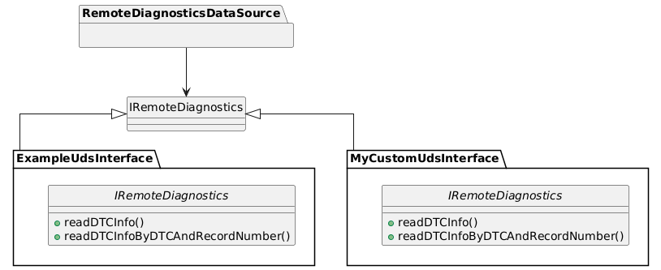

# Diagnostic trouble code (DTC) Developer Guide

<!-- prettier-ignore -->
> [!NOTE]
> This guide makes use of "gated" features of AWS IoT FleetWise for which you will need to request
> access. See
> [here](https://docs.aws.amazon.com/iot-fleetwise/latest/developerguide/fleetwise-regions.html) for
> more information, or contact the
> [AWS Support Center](https://console.aws.amazon.com/support/home#/).

## Table of Contents

- [Overview](#overview)
  - [Adding a new diagnostic interface](#adding-a-new-diagnostic-interface)
  - [`DTC_QUERY()` function implementation](#dtc_query-function-implementation)
  - [Parameters for `DTC_QUERY()`](#parameters-for-dtc_query)
  - [Examples of DTC queries](#examples-of-dtc-queries)
  - [Combining multiple status masks](#combining-multiple-status-masks)
  - [Serializing and sending JSON messages](#serializing-and-sending-json-messages)
- [Example UDS Interface](#example-uds-interface)
  - [Static configuration](#static-configuration)
- [Adding your own UDS interface](#adding-your-own-uds-interface)
- [Demo](#demo)
  - [Prerequisites for the demo](#prerequisites-for-the-demo)
  - [Launch your development machine](#launch-your-development-machine)
  - [Obtain the FWE code](#obtain-the-fwe-code)
  - [Download or build the FWE binary](#download-or-build-the-fwe-binary)
  - [Install the CAN simulator](#install-the-can-simulator)
  - [Provision and run FWE](#provision-and-run-fwe)
  - [Run the AWS IoT FleetWise demo script](#run-the-aws-iot-fleetwise-demo-script)
  - [Time based fetch demo](#time-based-fetch-demo)
  - [Condition based fetch demo](#condition-based-fetch-demo)
  - [Clean up](#clean-up)

## Overview

The [`IRemoteDiagnostics`](../../include/aws/iotfleetwise/IRemoteDiagnostics.h) interface
facilitates the retrieval of active DTCs, snapshot records, and extended data from ECUs. AWS IoT
FleetWise utilizes this diagnostics interface to collect DTCs and related information.



To enable UDS DTC information collection `FWE_FEATURE_UDS_DTC` option needs to be enabled in CMake.
This option enables `RemoteDiagnosticDataSource` module to process DTC queries from the available
UDS interfaces.

### Adding a new diagnostic interface

Fetch manager leverages the `DTC_QUERY()` function from `RemoteDiagnosticDataSource.h` to gather
DTCs based on specific conditions or timeframes. `RemoteDiagnosticDataSource` will then call a UDS
interface to get the DTC data from the canbus. In the reference implementation, it is
`ExampleUDSInterface.cpp`.

### `DTC_QUERY()` function implementation

The `DTC_QUERY()` function is defined as follows:

```cpp
using CustomFunction = std::function<FetchErrorCode(SignalID signalID,
   FetchRequestID fetchRequestID, std::vector<InspectionValue> params)>;
```

#### Parameters for `DTC_QUERY()`

- **`signalID`**: Identifier for the signal.
- **`fetchRequestID`**: Identifier for the fetch request.
- **`params`**: Request parameters, including:

1. `targetAddress` (the address of the ECU to be queried).
   - If the target address is -1, FWE will query DTC signal collection for all the ECUs available in
     the configuration file.
1. `udsSubFunction` UDS DTC Sub Function, refer to ISO 14229-1 for more information.
   - For DTC and its snapshot collection following sub functions can be used:
     1. `UDS_REPORT_DTC_BY_STATUS_MASK` = 0x02, Retrieving the list of DTCs that match a client
        defined status mask.
     1. `UDS_REPORT_DTC_SNAPSHOT_IDENTIFICATION` = 0x03, Retrieving DTCSnapshot record
        identification.
     1. `UDS_REPORT_DTC_SNAPSHOT_RECORD_BY_DTC_NUMBER` = 0x04, Retrieving DTCSnapshot record data
        for a client defined DTC mask.
     1. `UDS_REPORT_DTC_EXT_DATA_RECORD_BY_DTC_NUMBER` = 0x06, Retrieving DTCExtendedData record
        data for a client defined DTC mask and a client defined DTCExtendedData record number.
1. `udsStatusMask` UDS DTC Status Mask, refer to ISO 14229-1 for more information.
   - The `udsStatusMask` value can be any of the following:
     1. `UDS_STATUS_MASK_TEST_FAILED` = 0x01, indicate the result of the most recently performed
        test.
     1. `UDS_STATUS_MASK_TEST_FAILED_THIS_OP_CYCLE` = 0x02, indicate whether or not a diagnostic
        test has reported a testFailed result at any time during the current operation cycle.
     1. `UDS_STATUS_MASK_PENDING_DTC` = 0x04, indicate whether or not a diagnostic test has reported
        a testFailed result at any time during the current or last completed operation cycle.
     1. `UDS_STATUS_MASK_CONFIRMED_DTC` = 0x08, indicate whether a malfunction was detected enough
        times to warrant that the DTC is desired to be stored in long-term memory.
     1. `UDS_STATUS_MASK_TEST_NOT_COMPLETED_SINCE_LAST_CLEAR` = 0x10 indicate whether a DTC test has
        ever run and completed since the last time a call was made to ClearDiagnosticInformation.
     1. `UDS_STATUS_MASK_TEST_FAILED_SINCE_LAST_CLEAR` = 0x20, indicate whether a DTC test has
        completed with a failed result since the last time a call was made to
        ClearDiagnosticInformation.
     1. `UDS_STATUS_MASK_TEST_NOT_COMPLETED_THIS_OP_CYCLE` = 0x40, indicate whether a DTC test has
        ever run and completed during the current operation cycle.
     1. `UDS_STATUS_MASK_WARNING_INDICATOR_REQUESTED` = 0x80, report the status of any warning
        indicators associated with a particular DTC.
1. (optional) `dtcCode` specific dtc code to query a snapshot, refer to ISO 14229-1 for more
   information.
1. (optional) `recordNumber` record number to query a snapshot, refer to ISO 14229-1 for more
   information.

**Note:** For `statusMasks` or `udsSubFunction` parameters:

- A value of `-1` for `statusMasks` translates to `0xFF`, representing "all."
- A value of `-1` for `udsSubFunction` triggers appropriate UDS DTC queries based on other
  parameters.

#### Examples of DTC queries

1. Query all DTCs with status mask for all ECUs:

   ```cpp
   DTC_QUERY(-1, 2, -1);
   ```

1. Query a specific `confirmed` DTC ("0xAAA123") with status mask for all ECUs:

   ```cpp
   DTC_QUERY(-1, 2, 8, "0xAAA123");
   ```

1. Check if the `confirmed` DTC ("0xAAA123") is present for `ECU-1`:

   ```cpp
   DTC_QUERY(1, 2, 8, "0xAAA123");
   ```

1. Query all DTCs with any status mask and their snapshot records for all ECUs:

   ```cpp
   DTC_QUERY(-1, 4, -1);
   ```

1. Query all DTCs and their snapshot records for `ECU-1`:

   ```cpp
   DTC_QUERY(1, 4, -1);
   ```

1. Query all DTCs with any status mask and their snapshot records for `ECU-1`, with `recordNumber`
   `0`:

   ```cpp
   DTC_QUERY(1, 4, -1, 0);
   ```

1. Query if the DTC ("0xAAA123") is `pending` with `recordNumber` `1` for `ECU-1`:

   ```cpp
   DTC_QUERY(1, 4, -1, "0xAAA123", 1);
   ```

1. Query all DTCs and their respective snapshot records for all ECUs:

   ```cpp
   DTC_QUERY(-1, 4, -1);
   ```

1. Query all DTCs and DTC extended data for all ECUs:

   ```cpp
   DTC_QUERY(-1, 6, -1);
   ```

1. Query if the DTC ("0xAAA123") is `pending` and collect extended data with `recordNumber` `1` for
   `ECU-1`:

   ```cpp
   DTC_QUERY(1, 6, -1, "0xAAA123", 1);
   ```

#### Combining multiple status masks

1. Query for all `pending` (4) or `confirmed` (8) DTCs with status masks and respective snapshots
   for all ECUs:

   ```cpp
   DTC_QUERY(-1, 2, 12);
   ```

1. Check if the DTC ("0xAAA123") is a `warningIndicator` (8) DTC or `failedTestSinceLastClear` (1)
   for `ECU-1` with `recordNumber` `0`:

   ```cpp
   DTC_QUERY(1, 4, 144, "0xAAA123", 0);
   ```

### Serializing and sending JSON messages

After completing the `DTC_QUERY()` function, the diagnostic module should serialize the results into
a JSON message. This is done in the `convertDataToJson` function defined in
`RemoteDiagnosticDataSource.cpp`.

Once serialized, the JSON message is sent to the `rawDataBufferManager` for further processing
with`pushSnapshotJsonToRawDataBufferManager` function from `RemoteDiagnosticDataSource.cpp`. The
`rawDataBufferManager` will then forward the data to the cloud through other modules.

## Example UDS Interface

For reference, an example implementation is available [here](../../src/ExampleUDSInterface.cpp).
When building with this example, ensure the `FWE_FEATURE_UDS_DTC_EXAMPLE` option is enabled in
CMake.

**Note:** If no interface is specified, the default interface will be employed to gather DTCs. Be
aware that the default interface (`FWE_FEATURE_UDS_DTC_EXAMPLE`) is a reference implementation
limited to retrieving available DTCs and snapshot data based on the DTC number and record number.
Other DTC-related functions are not supported.

### Static configuration

Include the following configuration in `networkInterfaces` of the FWE static config file:

```json
{
  "exampleUDSInterface": {
    "configs": [
      {
        "targetAddress": "<ecu-target-address>",
        "name": "<ecu-name>",
        "can": {
          "interfaceName": "<can-interface-id>",
          "functionalAddress": "<functional-address-for-uds-request>",
          "physicalRequestID": "<physical-request-id-for-uds-request>",
          "physicalResponseID": "<physical-response-id-uds-response>"
        }
      }
    ]
  },
  "interfaceId": "UDS_DTC",
  "type": "exampleUDSInterface"
}
```

Condition based fetch trigger frequency is limited by `minFetchTriggerIntervalMs` field in static
config file. This frequency limits repeated fetch requests while fetch condition is evaluated to
TRUE. The limitation is set to 1s by default if not specified in the config.

The maximum size of the fetch queue for executing requests when condition evaluates to true is set
by `maxFetchQueueSize` field in static config file. This limits the number of fetch requests being
processed, any new fetch requests will be discarded if the queue reaches the defined size.

## Adding your own UDS interface

If you want to add your custom interface:

1. Add a new source file and implement request functions declared in `IRemoteDiagnostics.h` file.
2. You can use `FWE_FEATURE_UDS_DTC` option (make sure `FWE_FEATURE_UDS_DTC_EXAMPLE` is disabled) to
   compile `RemoteDiagnosticDataSource` module without the provided example interface.
3. The newly created custom interfaces can be bootstrapped as follows in the IoTFleetWiseEngine.cpp
   similar to `ExampleUDSInterface`:
   1. Initialise and start the custom interface:
      - ```cpp
           auto customDiagnosticInterface = std::make_shared<CustomDiagnosticInterface>();
           customDiagnosticInterface->init();
           customDiagnosticInterface->start();
        ```
   2. Register the custom interface handle (`customDiagnosticInterface`) with
      `RemoteDiagnosticDataSource`:
      - ```cpp
           mDiagnosticDataSource = std::make_shared<RemoteDiagnosticDataSource>( mDiagnosticNamedSignalDataSource,
                                                                             mRawDataBufferManager,
                                                                             customDiagnosticInterface);
        ```

## Demo

### Prerequisites for the demo

- Access to an AWS Account with administrator privileges.
- Your AWS account has access to AWS IoT FleetWise "gated" features. See
  [here](https://docs.aws.amazon.com/iot-fleetwise/latest/developerguide/fleetwise-regions.html) for
  more information, or contact the
  [AWS Support Center](https://console.aws.amazon.com/support/home#/).
- Logged in to the AWS Console in the `us-east-1` region using the account with administrator
  privileges.
  - Note: if you would like to use a different region you will need to change `us-east-1` to your
    desired region in each place that it is mentioned below.
  - Note: AWS IoT FleetWise is currently available in
    [these](https://docs.aws.amazon.com/general/latest/gr/iotfleetwise.html) regions.
- A local Windows, Linux or MacOS machine.

### Launch your development machine

An Ubuntu 22.04 development machine with 200GB free disk space will be required. A local Intel
x86_64 (amd64) machine can be used, however it is recommended to use the following instructions to
launch an AWS EC2 Graviton (arm64) instance. Pricing for EC2 can be found,
[here](https://aws.amazon.com/ec2/pricing/on-demand/).

1. Launch an EC2 Graviton instance with administrator permissions:
   [**Launch CloudFormation Template**](https://us-east-1.console.aws.amazon.com/cloudformation/home?region=us-east-1#/stacks/quickcreate?templateUrl=https%3A%2F%2Faws-iot-fleetwise.s3.us-west-2.amazonaws.com%2Flatest%2Fcfn-templates%2Ffwdev.yml&stackName=fwdev).
1. Enter the **Name** of an existing SSH key pair in your account from
   [here](https://us-east-1.console.aws.amazon.com/ec2/v2/home?region=us-east-1#KeyPairs:).
   1. Do not include the file suffix `.pem`.
   1. If you do not have an SSH key pair, you will need to create one and download the corresponding
      `.pem` file. Be sure to update the file permissions: `chmod 400 <PATH_TO_PEM>`
1. **Select the checkbox** next to _'I acknowledge that AWS CloudFormation might create IAM
   resources with custom names.'_
1. Choose **Create stack**.
1. Wait until the status of the Stack is **CREATE_COMPLETE**; this can take up to five minutes.
1. Select the **Outputs** tab, copy the EC2 IP address, and connect via SSH from your local machine
   to the development machine.

   ```bash
   ssh -i <PATH_TO_PEM> ubuntu@<EC2_IP_ADDRESS>
   ```

### Obtain the FWE code

1. Run the following _on the development machine_ to clone the latest FWE source code from GitHub.

   ```bash
   git clone https://github.com/aws/aws-iot-fleetwise-edge.git ~/aws-iot-fleetwise-edge
   ```

### Download or build the FWE binary

**To quickly run the demo**, download the pre-built FWE binary:

- If your development machine is ARM64 (the default if you launched an EC2 instance using the
  CloudFormation template above):

  ```bash
  cd ~/aws-iot-fleetwise-edge \
  && mkdir -p build \
  && curl -L -o build/aws-iot-fleetwise-edge.tar.gz \
      https://github.com/aws/aws-iot-fleetwise-edge/releases/latest/download/aws-iot-fleetwise-edge-arm64.tar.gz  \
  && tar -zxf build/aws-iot-fleetwise-edge.tar.gz -C build aws-iot-fleetwise-edge
  ```

- If your development machine is x86_64:

  ```bash
  cd ~/aws-iot-fleetwise-edge \
  && mkdir -p build \
  && curl -L -o build/aws-iot-fleetwise-edge.tar.gz \
      https://github.com/aws/aws-iot-fleetwise-edge/releases/latest/download/aws-iot-fleetwise-edge-amd64.tar.gz  \
  && tar -zxf build/aws-iot-fleetwise-edge.tar.gz -C build aws-iot-fleetwise-edge
  ```

**Alternatively if you would like to build the FWE binary from source,** follow these instructions.
If you already downloaded the binary above, skip to the next section.

1. Install the dependencies for FWE:

   ```bash
   cd ~/aws-iot-fleetwise-edge \
   && sudo -H ./tools/install-deps-native.sh \
   && sudo ldconfig
   ```

1. Compile FWE with UDS DTC support, this will take around 10 minutes to complete:

   ```bash
   ./tools/build-fwe-native.sh --with-uds-dtc-example
   ```

### Install the CAN simulator

1. Run the following command to install the CAN simulator:

   ```bash
   cd ~/aws-iot-fleetwise-edge \
   && sudo -H ./tools/install-socketcan.sh \
   && sudo -H ./tools/install-cansim.sh
   ```

### Provision and run FWE

1. Open a new terminal _on the development machine_, and run the following to provision credentials
   for the vehicle and configure the network interface for UDS DTC collection:

   ```bash
   cd ~/aws-iot-fleetwise-edge \
   && mkdir -p build_config \
   && ./tools/provision.sh \
       --region us-east-1 \
       --vehicle-name fwdemo-dtc \
       --certificate-pem-outfile build_config/certificate.pem \
       --private-key-outfile build_config/private-key.key \
       --endpoint-url-outfile build_config/endpoint.txt \
       --vehicle-name-outfile build_config/vehicle-name.txt \
   && ./tools/configure-fwe.sh \
       --input-config-file configuration/static-config.json \
       --output-config-file build_config/config-0.json \
       --log-color Yes \
       --log-level Trace \
       --vehicle-name `cat build_config/vehicle-name.txt` \
       --endpoint-url `cat build_config/endpoint.txt` \
       --can-bus0 vcan0 \
       --certificate-file `realpath build_config/certificate.pem` \
       --private-key-file `realpath build_config/private-key.key` \
       --persistency-path `realpath build_config` \
       --uds-dtc-example-interface vcan0
   ```

1. Run FWE:

   ```bash
   ./build/aws-iot-fleetwise-edge build_config/config-0.json
   ```

### Run the AWS IoT FleetWise demo script

The instructions below will register your AWS account for AWS IoT FleetWise, create a demonstration
vehicle model, register the virtual vehicle created in the previous section and run a campaign to
collect data from it.

1. Open a new terminal _on the development machine_ and run the following to install the
   dependencies of the demo script:

   ```bash
   cd ~/aws-iot-fleetwise-edge/tools/cloud \
   && sudo -H ./install-deps.sh
   ```

1. Run the following command to generate 'node' and 'decoder' JSON files from the input DBC file for
   CAN signals.

   ```bash
   python3 dbc-to-nodes.py hscan.dbc can-nodes.json \
   && python3 dbc-to-decoders.py hscan.dbc can-decoders.json
   ```

DTC fetching can be triggered by time based fetch as well as condition based fetch.

- Time based fetch
  - Time Based DTC Fetch triggers the DTC fetching and collection at specific intervals of time,
    corresponding to the "actions" in the campaign.
- Condition based fetch
  - Condition based fetch triggers DTC fetching when the required conditions are met.
  - There can be different conditions for DTC fetch and DTC collection, which are independent of
    each other. When the DTC fetch conditions are met, the FWE will trigger the fetching of the
    DTCs. Conversely, when the DTC collection conditions are met, the data fetched by the FWE will
    be uploaded to the cloud.

#### Time based fetch demo

The campaign file
[`campaign-uds-dtc-condition-based-fetch.json`](../../tools/cloud/campaign-uds-dtc-condition-based-fetch.json)
is setup to trigger fetch of DTC codes and snapshot data based on the CAN signal. This campaign will
collect both signals.

1. Run the demo script:

   ```bash
   ./demo.sh \
      --region us-east-1 \
      --vehicle-name fwdemo-dtc \
      --node-file custom-nodes-uds-dtc.json \
      --node-file can-nodes.json \
      --decoder-file custom-decoders-uds-dtc.json \
      --decoder-file can-decoders.json \
      --network-interface-file network-interface-custom-uds-dtc.json \
      --network-interface-file network-interface-can.json \
      --campaign-file campaign-uds-dtc-condition-based-fetch.json \
      --data-destination IOT_TOPIC
   ```

   The demo script:

   1. Registers your AWS account with AWS IoT FleetWise, if not already registered.
   1. Creates IAM role and policy required for the service to write data to the IoT topic.
   1. Creates a signal catalog, containing `custom-nodes-uds-dtc.json` which includes the DTC sensor
      signal and `can-nodes.json` containing CAN signals.
   1. Creates a model manifest that references the signal catalog with all of the signals.
   1. Activates the model manifest.
   1. Creates a decoder manifest linked to the model manifest using `custom-decoders-uds-dtc.json`
      for decoding the DTC signal from the network interface `network-interface-custom-uds-dtc.json`
      and `can-decoders.json` for CAN signals from the network interface
      `network-interface-can.json`.
   1. Updates the decoder manifest to set the status as `ACTIVE`.
   1. Creates a vehicle with a name equal to `fwdemo-dtc`, the same as the name passed to
      `provision.sh`.
   1. Creates a fleet.
   1. Associates the vehicle with the fleet.
   1. Creates a campaign from
      [`campaign-uds-dtc-condition-based-fetch.json`](../../tools/cloud/campaign-uds-dtc-condition-based-fetch.json)
      that contains a time based collection scheme to capture the DTC signal every 10s.
   1. Approves the campaign.
   1. Waits until the campaign status is `HEALTHY`, which means the campaign has been deployed to
      the fleet.
   1. Waits 30 seconds receiving data from the IoT topic.
   1. Saves the data to an HTML file.

1. In the collected JSON file, you will see the collected CAN signal along with DTC information with
   the snapshot that was collected Example data:

   ```json
   "signals": {
      "Vehicle.ECU1.DTC_INFO": [
         {
         "value": "{\"DetectedDTCs\":[{\"DTCAndSnapshot\":{\"DTCStatusAvailabilityMask\":\"FF\",
            \"dtcCodes\":[{\"DTC\":\"AAA123\",\"DTCExtendedData\":\"\",\"DTCSnapshotRecord\":\"AAA123AF0101AABB01\"}]},\"ECUID\":\"01\"}]}",
         "dataType": "VARCHAR",
         "time": "<timestamp>"
         }
         ...
      ],
      "Vehicle.ECM.DemoEngineTorque": [
         {
         "value": 1000.0,
         "dataType": "DOUBLE",
         "time": "<timestamp>"
         }
         ...
      ]
   }
   ```

#### Condition based fetch demo

The campaign file
[`campaign-uds-dtc-time-based-fetch.json`](../../tools/cloud/campaign-uds-dtc-time-based-fetch.json)
is setup to trigger fetch of DTC codes, snapshot extended data periodically every 5s and upload if
DTC code is present. You can use expression function `!isNull()` to detect if a new signal is
available.

1. Run the demo script:

   ```bash
   ./demo.sh \
      --region us-east-1 \
      --vehicle-name fwdemo-dtc \
      --node-file custom-nodes-uds-dtc.json \
      --node-file can-nodes.json \
      --decoder-file custom-decoders-uds-dtc.json \
      --decoder-file can-decoders.json \
      --network-interface-file network-interface-custom-uds-dtc.json \
      --network-interface-file network-interface-can.json \
      --campaign-file campaign-uds-dtc-time-based-fetch.json \
      --data-destination IOT_TOPIC
   ```

1. In the collected JSON file, you will see the collected DTC information with the snapshot and
   extended data that was collected Example data:

   ```json
   "signals": {
     "Vehicle.ECU1.DTC_INFO": [
       {
         "value": "{\"DetectedDTCs\":[{\"DTCAndSnapshot\":{\"DTCStatusAvailabilityMask\":\"FF\",
           \"dtcCodes\":[{\"DTC\":\"AAA123\",\"DTCExtendedData\":\"\",\"DTCSnapshotRecord\":\"AAA123AF0101AABB01\"}]},\"ECUID\":\"01\"}]}",
         "dataType": "VARCHAR",
         "time": "<timestamp>"
       },
       {
         "value": "{\"DetectedDTCs\":[{\"DTCAndSnapshot\":{\"DTCStatusAvailabilityMask\":\"FF\",
           \"dtcCodes\":[{\"DTC\":\"AAA123\",\"DTCExtendedData\":\"AAA123AF0101CCDD02\",\"DTCSnapshotRecord\":\"\"}]},\"ECUID\":\"01\"}]}",
         "dataType": "VARCHAR",
         "time": "<timestamp>"
       },
       ...
     ]
   }
   ```

### Clean up

1. Run the following _on the development machine_ to clean up resources created by the
   `provision.sh` and `demo.sh` scripts.

   ```bash
   cd ~/aws-iot-fleetwise-edge/tools/cloud \
   && ./clean-up.sh \
   && ../provision.sh \
      --vehicle-name fwdemo-dtc \
      --region us-east-1\
      --only-clean-up
   ```

1. Delete the CloudFormation stack for your development machine, which by default is called `fwdev`:
   https://us-east-1.console.aws.amazon.com/cloudformation/home
