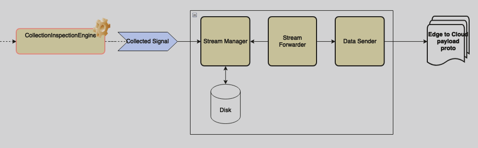
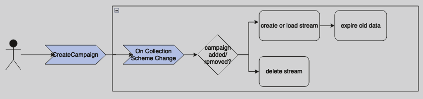
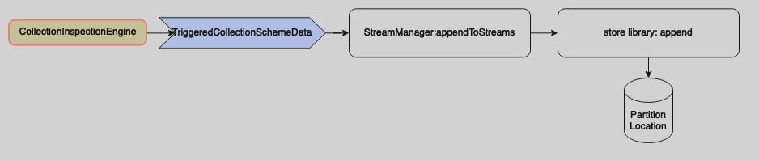
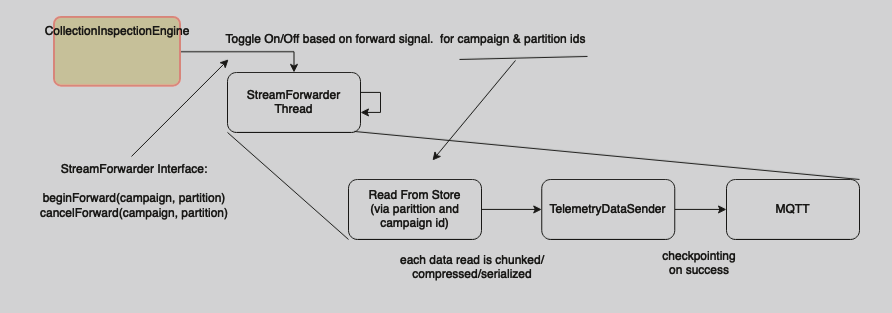

# Store and Forward Dev Guide

<!-- prettier-ignore -->
> [!NOTE]
> This is a "gated" feature of AWS IoT FleetWise for which you will need to request access. See
> [here](https://docs.aws.amazon.com/iot-fleetwise/latest/developerguide/fleetwise-regions.html)
> for more information, or contact the
> [AWS Support Center](https://console.aws.amazon.com/support/home#/).

**Topics**

- [Prerequisites](#prerequisites)
- [Demo](#deploy-edge-agent)
- [Store and Forward High Level Implementation](#store-and-forward-high-level-implementation)
- [IoTJobsDataRequestHandler High Level Implementation](#iotjobsdatarequesthandler-high-level-implementation)

The first half of developer guide illustrates step-by-step instructions on how to run the AWS IoT
FleetWise Store and Forward demo. The second half focus on the architecture of Store and Forward. It
also covers the IoT Jobs data request handler module.

## Prerequisites

- Access to an AWS Account with administrator privileges.
- Your AWS account has access to AWS IoT FleetWise "gated" features. See
  [here](https://docs.aws.amazon.com/iot-fleetwise/latest/developerguide/fleetwise-regions.html) for
  more information, or contact the
  [AWS Support Center](https://console.aws.amazon.com/support/home#/).
- Logged in to the AWS Console in the `us-east-1` region using the account with administrator
  privileges.
  - Note: if you would like to use a different region you will need to change `us-east-1` to your
    desired region in each place that it is mentioned below.
  - Note: AWS IoT FleetWise is currently available in
    [these](https://docs.aws.amazon.com/general/latest/gr/iotfleetwise.html) regions.
- A local Linux or MacOS machine.

## Deploy Edge Agent

Use the following CloudFormation template to deploy pre-built FWE binary to a new AWS EC2 instance.

1. Click here to
   [**Launch CloudFormation Template**](https://us-east-1.console.aws.amazon.com/cloudformation/home?region=us-east-1#/stacks/quickcreate?templateUrl=https%3A%2F%2Faws-iot-fleetwise.s3.us-west-2.amazonaws.com%2Flatest%2Fcfn-templates%2Ffwdemo.yml&stackName=fwdemo).
1. (Optional) You can increase the number of simulated vehicles by updating the `FleetSize`
   parameter. You can also specify the region IoT Things are created in by updating the
   `IoTCoreRegion` parameter.
1. Select the checkbox next to _'I acknowledge that AWS CloudFormation might create IAM resources
   with custom names.'_
1. Choose **Create stack**.
1. Wait until the status of the Stack is 'CREATE_COMPLETE', this will take approximately 10 minutes.

FWE has been deployed to an AWS EC2 Graviton (ARM64) Instance along with credentials that allow it
to connect to AWS IoT Core. CAN data is also being generated on the EC2 instance to simulate
periodic hard-braking events and 'NetworkType' switching.

## Setup Signal Catalog, Vehicle Model, Decoder Manifest, Campaigns, and View Stored and Forwarded Data.

The instructions below will register your AWS account for AWS IoT FleetWise, create a demonstration
signal catalog, vehicle model and decoder manifest, then register the virtual vehicle created in the
previous section.

1. Open the AWS CloudShell: [Launch CloudShell](https://console.aws.amazon.com/cloudshell/home)

1. Copy and paste the following command to clone the latest FWE source code from GitHub.

   ```bash
   git clone https://github.com/aws/aws-iot-fleetwise-edge.git ~/aws-iot-fleetwise-edge
   ```

1. Copy and paste the following commands to install the dependencies of the demo script.

   ```bash
   cd ~/aws-iot-fleetwise-edge/tools/cloud \
   && sudo -H ./install-deps.sh
   ```

   The above command installs the following PIP packages: `wrapt plotly pandas cantools pyarrow`

1. Run the demo script to setup the signal catalog, vehicle model, decoder manifest, and campaigns.

   We will deploy three campaigns:

   1 - campaign-store-only-no-upload.json

   - Stores engine torque data into an 'engine' data partition on the vehicle.
   - Does not forward any data. If only this campaign is used then there will be no data to download
     from the cloud, because the data is only present on the vehicle itself.

   2 - campaign-upload-critical-during-hard-braking.json

   - Stores brake pressure data into a data partition named 'critical'.
   - When brake pressure is above a threshold (and only while that state is maintained), data in the
     'critical' partition will be forwarded.

   3 - campaign-upload-during-wifi.json

   - Stores network type data into a data partition named 'basic'.
   - When the vehicle network type is 1 (aka wifi), data in the 'basic' partition will be forwarded.

   If you increased the fleet size when deploying the edge agent, provide the updated fleet size in
   the `--fleet-size` argument.

   ```bash
   cd ~/aws-iot-fleetwise-edge/tools/cloud \
   && python3 dbc-to-nodes.py hscan.dbc can-nodes.json \
   && python3 dbc-to-decoders.py hscan.dbc can-decoders.json \
   && ./demo.sh \
      --region us-east-1 \
      --vehicle-name fwdemo-snf \
      --node-file can-nodes.json \
      --decoder-file can-decoders.json \
      --network-interface-file network-interface-can.json \
      --campaign-file campaign-store-only-no-upload.json \
      --campaign-file campaign-upload-critical-during-hard-braking.json \
      --campaign-file campaign-upload-during-wifi.json
   ```

   The demo script will save a set of varables about the run to a demo.env file, which can be used
   by other scripts such as request-forward.sh or cleanup.sh.

   When the script completes, you can view the data forwarded by the second and third campaigns in
   Timestream, as well as the demo output file(s). A path to an HTML file is given. _On your local
   machine_, use `scp` to download it, then open it in your web browser:

   ```bash
   scp -i <PATH_TO_PEM> ubuntu@<EC2_IP_ADDRESS>:<PATH_TO_HTML_FILE> .
   ```

   Alternatively, if your AWS account is enrolled with Amazon QuickSight or Amazon Managed Grafana,
   you may use them to browse the data from Amazon Timestream directly.

   As you explore the forwarded data, you can see the brake data from campaign 2 as well as the
   network type signal from campaign 3.

   In order to view the data which was stored on the vehicles, including the first campaign's engine
   data which was not forwarded to the cloud, access the shell on a vehicle and run
   `ls -l /var/aws-iot-fleetwise/fwdemo*/*` to observe the presence and size of the locally stored
   data- or continue on to the next section to manually request data to be forwarded to the cloud.

## Manually Request Campaign Data to be Forwarded using an IoT Job.

This section outlines how to submit a manual data request to forward stored data for a campaign.

In the previous section we created three campaigns, the first of which
(campaign-store-only-no-upload.json) stores data, but does not forward any data. Here, we will
request the data from that campaign to be forwarded.

The request-forward script reads most parameters from the demo.env file created by the demo script.
Run the following to have the script request all data to be forwareded from the first campaign
created by the demo script, and pull the collected data again:

```bash
cd ~/aws-iot-fleetwise-edge/tools/cloud \
&& ./request-forward.sh \
   --region us-east-1
```

While the script runs, it will show you the AWS IoT Jobs CLI commands being used, e.g. `create-job`
and `describe-job`.

There are a number of options you can supply to the request-forward.sh script in order to more
explicilty control its behavior. One of which is the script --end-time argument, which lets you
specify a point in time, where data collected after this point in time will not be forwarded. This
end time will be passed through to the IoT Job document by the script. The script --end-time
argument must be an ISO 8601 UTC formatted time string. e.g. `--end-time 2024-05-25T01:21:23Z`

When the request-forward.sh script completes, you can view the data forwarded by the first campaign
which was requested through IoT Jobs in Timestream, as well as the demo output file(s). A path to an
HTML file is given. _On your local machine_, use `scp` to download it, then open it in your web
browser:

```bash
scp -i <PATH_TO_PEM> ubuntu@<EC2_IP_ADDRESS>:<PATH_TO_HTML_FILE> .
```

Alternatively, if your AWS account is enrolled with Amazon QuickSight or Amazon Managed Grafana, you
may use them to browse the data from Amazon Timestream directly.

As you explore the forwarded data, you can now see the engine data from campaign 1, in addition to
the data from the other campaigns.

## (Optional) Building FWE from source

Alternatively if you would like to build the FWE binary from source, below is the instruction:

Install the dependencies for FWE:

```bash
cd ~/aws-iot-fleetwise-edge &&
sudo -H ./tools/install-deps-native.sh --with-store-and-forward-support --prefix /usr/local &&
sudo ldconfig
```

Compile FWE with enabling store-and-forward feature. Below is example of building FWE natively:

```bash
./tools/build-fwe-native.sh --with-store-and-forward-support
```

Refer to [edge-agent-dev-guide.md](./edge-agent-dev-guide.md) for detailed Edge building and
provision instruction.

## Clean up

1. Run the following to clean up resources created by the `provision.sh` and `demo.sh` scripts:

   ```bash
   cd ~/aws-iot-fleetwise-edge/tools/cloud \
   && ./clean-up.sh
   ```

1. Delete the CloudFormation stack created earlier, which by default is called `fwdemo-snf`:
   https://us-east-1.console.aws.amazon.com/cloudformation/home

## Store and Forward High Level Implementation

The goal of the Store and Forward feature is to persist signal data early, and then send that data
to the cloud when customer-configured conditions are met. 

So the new classes introduced by this feature are StreamManager and StreamForwarder. StreamManager
is responsible for taking signals provided by CollectionInspectionEngine (CIE) and appending them to
a persistent stream. Separately, StreamForwarder is reading from the stream, sending data to the
cloud via MQTT.

### Stream Management

Before signal data can be written to disk, the streams themselves need to be set up. To accomplish
this, StreamManager reacts to changes in CollectionSchemes (campaigns) using a
`StreamManager::onChangeCollectionSchemeList` listener. If new campaigns are detected, streams are
created (and tracked within StreamManager). Deleted campaigns are removed from disk (and are
untracked by StreamManager).

How do we know a campaign is store and forward? We check for the presence of store and forward
configuration, `newCampaignConfig->getStoreAndForwardConfiguration()`, within a CollectionScheme.

Streams are created per campaign and per partition, and are stored on disk within the FWE
persistency directory. A campaign may have multiple partitions. Partitions are locations on disk
(e.g. /path/to/my/data) that hold signal data (signals can only belong to one partition at a time).
So as a basic example: say the customer has two campaigns, each with two partitions. This will
result in four streams being created. 

#### Expiring Old Stream Data

S&F has a weak notion of TTL for stream data. It only promises that data will be removed at some
point after a given instant in time. This is currently accomplished by StreamManager expiring old
data on campaign changes. The rationale is that this will happen 1) on startup, 2) and otherwise
infrequently.

### Storing Signal Data

Every time Collection Inspection Engine (CIE) processes signals, it will have StreamManager write
them to disk (for S&F-enabled campaigns). StreamManager accomplishes this via the Store Library.


StreamManager will:

1. Split the list of signals by partition (remember that signals only belong to one partition at a
   time)
2. Chunk each partition of signals
3. Serialize each chunk (EdgeToCloud payload)
4. (optional) Compress each serialized chunk
5. Finally store the blob in persistent stream

The complexity happens at write time because we need data to be compressed on disk. And with
compression we need all the steps before it. Otherwise, it'd mean we'd need to decompress at read
time.

### Forwarding Signal Data

In its own thread, StreamForwarder will loop over persistent streams, taking each data entry and
sending it as-is to the cloud via MQTT. Remember that forwarding is guarded by a "forward condition"
(which is managed by CIE); StreamForwarder will only read from streams where the forward condition
is active. 

An important detail here is that persistent streams are FIFO queues, essentially. For each
campaign/partition, StreamForwarder has a stream "iterator", which keeps track of the "sequence
number" (aka, id of the next data to read from disk) (stream iterators themselves are persisted on
disk). If StreamForwarder successfully sent a point of data over MQTT, it will "checkpoint" the
iterator, meaning that it moves on to the next data point. So if there's an MQTT failure, for
example, the current iterator position will NOT be checkpointed---meaning, the next attempt by
StreamForwarder will read the same data as the last attempt.

## IoTJobsDataRequestHandler High Level Implementation

The goal of the IoTJobsDataRequestHandler is to handle manual data upload request through an IoT Job
that is created by the customer. To create a manual data upload request, the
IoTJobsDataRequestHandler expects the IoT Job Document to be formatted the following way:

```
{
  "version": "1.0",
  "parameters": {
     "campaignArn": ${aws:iot:parameter:campaignArn},
     "endTime": ${aws:iot:parameter:endTime} // Optional
  }
}
```

To interact with IoT Jobs that target FWE, the IoTJobsDataRequestHandler class subscribes and
publishes to the reserved IoT Jobs MQTT topics through the existing IConnectivityModule class. When
publishing and receiving messages, each topic has its own unique request and response payload
([examples](https://docs.aws.amazon.com/iot/latest/developerguide/jobs-mqtt-api.html)) which is
sanity checked to ensure we only process valid IoT Jobs.

### General IotJobsDataRequestHandler Workflow

When IoTJobsDataRequestHandler is initiated, it sends a
[GetPendingExecutions](https://docs.aws.amazon.com/iot/latest/developerguide/jobs-mqtt-api.html#:~:text=GetPendingJobExecutions)
request to check and see if any jobs on FWE were in the QUEUED or IN_PROGRESS state when FWE last
shutdown. This returns the list of all jobs that are not in a terminal state, for a specified thing.

GetPendingExecutions is not the only way we get notified of new jobs. The AWS IoT Jobs service will
publish a message to to the reserved topic `$aws/things/" + clientId + "/jobs/notify` when a job is
added to or removed from the list of pending job executions for a thing or the first job execution
in the list changes.

After receiving the IoT Job request, we publish to
[DescribeJobExecution](https://docs.aws.amazon.com/iot/latest/developerguide/jobs-mqtt-api.html#mqtt-describejobexecution:~:text=DescribeJobExecution)
to get the job document that accompanies the request's Job ID. When FWE receives the job document,
IoTJobsDataRequestHandler will check to see that the job document contains a valid campaign arn that
is running on FWE, as well as if the IoT Job specifies an optional endTime parameter. Once we have
validated the job document, we will start uploading data from the specified store and forward
campaign until we have upload all of the data in the campaign, or we hit the optional endTime.

Once we hit the end of the data stream or the optional specified end time, we update the IoT Job
execution status in the cloud to SUCCEEDED by sending an
[UpdateJobExecution](https://docs.aws.amazon.com/iot/latest/developerguide/jobs-mqtt-api.html#mqtt-describejobexecution:~:text=a%20JobExecution%20object.-,UpdateJobExecution,-Updates%20the%20status)
message to the reserved Iot Jobs topic. Similarly, we will update the job execution status in the
cloud to either be REJECTED or IN_PROGRESS, depending on if the Job document is valid.

At any point during the IoT Job handling lifecycle, if an IoT Job is cancelled from the cloud, we
will stop forwarding data and update the internal status of the Job to cancelled.

### Connecting IotJobsDataRequestHandler to StreamForwarder

When an IoT Job specifies a valid campaignArn that is running on the FWE device, we signal to
StreamForwarder to start uploading data from the specified campaignArn. In StreamForwarder, we
created a notion of Source which represents what is the source that is calling StreamForwarder to
start uploading data for a campaign: `IOT_JOB` or `CONDITION`. This is important to keep the IoT Job
status in the cloud in sync with the internal IoT Job status on the device. `CONDITION` means that
the collection inspection engine evaluated a campaigns forward condition to be true -- this is how
FWE behaved before the Store and Forward project. `IOT_JOB` was added to discern that FWE is
forwarding data for a campaign that was initiated by a manual data pull request from a customer.
This is necessary since for a campaign that was signaled to forward data by a manual data pull
request, we do not want to stop uploading data until we reach the end of the campaign's data stream
or hit the optional IoT Job endTime, even if this campaign's forwarding condition evaluates to
false.

### Utilizing the IoT Jobs EndTime Parameter

In the IoT Job, the customer can specify an optional EndTime in iso8601 format. If set, this endTime
is passed to StreamForwarder and represent when we should stop forwarding data for a campaign that
was specified by the IoT Job. We compare the endTime to the triggerTime that represents when the
data was collected. If the triggerTime is past the endTime, then we will stop forwarding data and
signal the IoTJobsDataRequestHandler to mark the respective IoT Job as complete in the cloud.

If an endTime is not specified, then we will internally set the endTime to 0 which we use to
represent that StreamForwarder should continue forwarding data for a campaign specified by an IoT
Job until we hit the end of the campaign's data stream or until the job is cancelled by the
customer.

### Handling Multiple Jobs targeting the same Store and Forward campaign

We do support handling multiple IoT Jobs targeting the same S&F campaign. In
IoTJobsDataRequestHandler, we map `mJobToCampaignId` . When StreamForwarder signals to
IoTJobsDataRequestHandler that a job upload is completed for a specific campaign, we will iterate
through `mJobToCampaignId` to get all IoT Job IDs that target the campaign that has completed
forwarding data, and then we will update all of these Jobs to SUCCEEDED in the cloud by publishing
to UpdateJobExecution.
