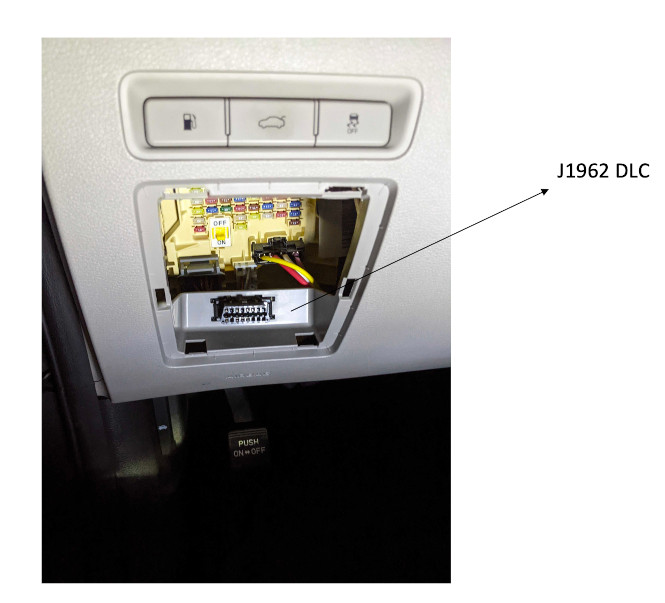
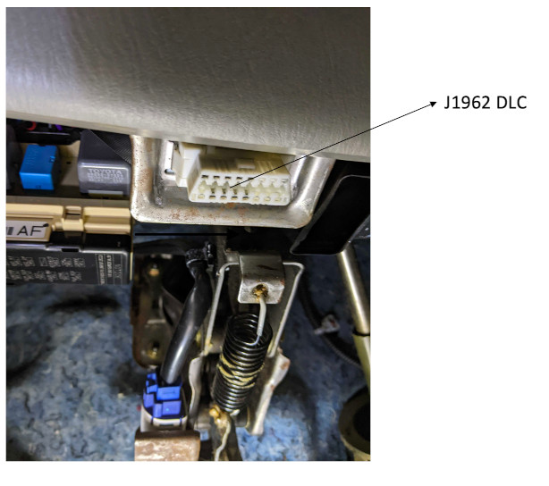

# iWave G26 TCU Tutorial

**Topics**

- [Introduction](#introduction)
- [About this tutorial](#about-this-tutorial)
- [Prerequisites](#prerequisites)
- [Step 1: Set up the iWave Systems G26 TCU](#step-1-set-up-iwave-systems-g26-tcu)
- [Step 2: Launch your development machine](#step-2-launch-your-development-machine)
- [Step 3: Compile Edge Agent](#step-3-compile-edge-agent)
- [Step 4: Provision AWS IoT credentials](#step-4-provision-aws-iot-credentials)
- [Step 5: Deploy Edge Agent](#step-5-deploy-edge-agent)
- [Step 6: Connect the iWave G26 TCU to the vehicle](#step-6-connect-the-tcu-to-the-vehicle)
- [Step 7: Collect OBD Data](#step-7-collect-obd-data)
- [Step 8: Clean up](#step-8-clean-up)

**Copyright (C) Amazon Web Services, Inc. and/or its affiliates. All rights reserved.**

Amazon's trademarks and trade dress may not be used in connection with any product or service that
is not Amazon's, in any manner that is likely to cause confusion among customers, or in any manner
that disparages or discredits Amazon. All other trademarks not owned by Amazon are the property of
their respective owners, who may or may not be affiliated with, connected to, or sponsored by
Amazon.

## Introduction

**AWS IoT FleetWise** provides a set of tools that enable automakers to collect, transform, and
transfer vehicle data to the cloud at scale. With AWS IoT FleetWise you can build virtual
representations of vehicle networks and define data collection rules to transfer only high-value
data from your vehicles to AWS Cloud.

**The Reference Implementation for AWS IoT FleetWise ("FWE")** provides C++ libraries that can be
run with simulated vehicle data on certain supported vehicle hardware or that can help you develop
an Edge Agent to run an application on your vehicle that integrates with AWS IoT FleetWise. You can
use AWS IoT FleetWise pre-configured analytic capabilities to process collected data, gain insights
about vehicle health, and use the service's visual interface to help diagnose and troubleshoot
potential issues with the vehicle.

AWS IoT FleetWise's capability to collect ECU data and store them on cloud databases enables you to
utilize different AWS services, such as Analytics Services, and ML, to develop novel use-cases that
augment and/or supplement your existing vehicle functionality. In particular, AWS IoT FleetWise can
help utilize fleet data (Big Data) to create value. For example, you can develop use cases that
optimize vehicle routing, improve electric vehicle range estimation, and optimize battery life
charging. You can use the data ingested through AWS IoT FleetWise to develop applications for
predictive diagnostics, and for outlier detection with an electric vehicle's battery cells.

You can use the included sample C++ application to learn more about the Reference Implementation,
develop an Edge Agent for your use case and test interactions before integration.

This software is licensed under the
[Apache License, Version 2.0](http://www.apache.org/licenses/LICENSE-2.0).

### Disclaimer

**_The Reference Implementation for AWS IoT FleetWise ("FWE") is intended to help you develop your
Edge Agent for AWS IoT FleetWise and includes sample code that you may reference or modify so your
Edge Agent meets your requirements. As provided in the AWS IoT FleetWise Service Terms, you are
solely responsible for your Edge Agent, including ensuring that your Edge Agent and any updates and
modifications thereto are deployed and maintained safely and securely in any vehicles._**

**_This software code base includes modules that are still in development and are disabled by
default. These modules are not intended for use in a production environment. This includes a Remote
Profiler module that helps sending traces from the device to AWS Cloud Watch. FWE has been checked
for any memory leaks and runtime errors such as type overflows using Valgrind. No issues have been
detected during the load tests._**

**_Note that vehicle data collected through your use of AWS IoT FleetWise is intended for
informational purposes only (including to help you train cloud-based artificial intelligence and
machine learning models), and you may not use AWS IoT FleetWise to control or operate vehicle
functions. You are solely responsible for all liability that may arise in connection with any use
outside of AWS IoT FleetWise's intended purpose and in any manner contrary to applicable vehicle
regulations. Vehicle data collected through your use of AWS IoT FleetWise should be evaluated for
accuracy as appropriate for your use case, including for purposes of meeting any compliance
obligations you may have under applicable vehicle safety regulations (such as safety monitoring and
reporting obligations). Such evaluation should include collecting and reviewing information through
other industry standard means and sources (such as reports from drivers of vehicles). You and your
End Users are solely responsible for all decisions made, advice given, actions taken, and failures
to take action based on your use of AWS IoT FleetWise._**

## About this tutorial

Follow the steps in this tutorial to set up and configure the iWave G26 TCU device hardware to work
with your Edge Agent compiled from the FWE source code. You can then connect the device to a vehicle
so that it collects vehicle J1979 OBD-II data and transfers it to the AWS IoT FleetWise service. To
additionally also collected GPS data more steps described [here](./iwave-gps-setup.md) are required.
They require the steps below to be executed first.

**Estimated Time**: 60 minutes

## Prerequisites

- A [G26 TCU from iWave Systems](https://www.iwavesystems.com/product/telematics-control-unit/)
  device
- Access to an AWS account with administrator permissions
- To be signed in to the AWS Management Console with an account in your chosen Region
  - **Note:** AWS IoT FleetWise is currently available in US East (N. Virginia) and Europe
    (Frankfurt).
- A SIM card
- A local Linux or MacOS machine

## Step 1: Set up iWave Systems G26 TCU

### To set up iWave Systems G26 TCU

1. Unpack and set up the iWave G26 TCU. For instructions on setting up the iWave G26 TCU, see
   _Section 2_ of the
   [Telematics Control Unit Product User Manual](https://www.iwavesystems.com/wp-content/uploads/2021/07/Telematics-Solution-User-Manual_iW-PRGET-UM-01-R3.0-REL1.4.pdf).
1. Install the SIM card in the device and connect the device to the power supply. The device boots
   up.
1. Join the device's Wi-Fi hotspot from your local machine by using the SSID and password. For more
   information, see _Section 3.5_ of the
   [Telematics Control Unit Product User Manual](https://www.iwavesystems.com/wp-content/uploads/2021/07/Telematics-Solution-User-Manual_iW-PRGET-UM-01-R3.0-REL1.4.pdf).
   If the device has a problem connecting, wait another minute and try again. For security reasons,
   we recommend you change this password in `/etc/hostapd.conf` - search for `wpa_passphrase`.
1. On your local machine, to find the IP address that is used for the Wi-Fi interface, run
   `ifconfig`. The TCU device has the same IP address except the last digit is `1`. For example, if
   the IP address of your local machine is `192.168.43.20`, the IP address of the TCU is
   `192.168.43.1`.
1. On your local machine, connect to the TCU through SSH. The default password is in _Section 3.5_
   of the
   [Telematics Control Unit Product User Manual](https://www.iwavesystems.com/wp-content/uploads/2021/07/Telematics-Solution-User-Manual_iW-PRGET-UM-01-R3.0-REL1.4.pdf).
   For security reasons, we recommend you change this password by running the `passwd` command:

   ```bash
   ssh root@<TCU_IP_ADDRESS>
   ```

### To set up CAN

1. Confirm the TCU firmware has the required Linux kernel module by running the following command:

   ```bash
   lsmod | grep can_isotp
   ```

   A line starting with `can_isotp` is returned. If nothing is returned, contact iWave Systems
   [technical support](https://www.iwavesystems.com/contact-us/) and ask for an updated firmware
   image that contains the `can-isotp` kernel module.

1. To open the CAN interfaces at startup, first create the script `/usr/bin/setup-socketcan.sh` with
   the following content:

   ```bash
   #!/bin/sh
   ip link set up can0 txqueuelen 1000 type can bitrate 500000 restart-ms 100
   ip link set up can1 txqueuelen 1000 type can bitrate 500000 restart-ms 100
   ```

1. To make the script executable, run the following command:

   ```bash
   chmod +x /usr/bin/setup-socketcan.sh.
   ```

1. To run the script at startup, create the file `/lib/systemd/system/setup-socketcan.service` with
   the following content:

   ```ini
   [Unit]
   Description=Setup SocketCAN interfaces
   After=network.target
   [Service]
   Type=oneshot
   RemainAfterExit=yes
   ExecStart=/usr/bin/setup-socketcan.sh
   [Install]
   WantedBy=multi-user.target
   ```

1. To start and enable the service, run the following:

   ```bash
   systemctl start setup-socketcan
   systemctl enable setup-socketcan
   ```

### To set up the modem

Setting up the 4G LTE modem inside the G26 TCU is dependent on your SIM card service provider.

1. Edit the file `/etc/ppp/chat/gprs`, replacing the content with the following template:

   ```
   TIMEOUT 35
   ECHO ON
   ABORT '\nBUSY\r'
   ABORT '\nERROR\r'
   ABORT '\nNO ANSWER\r'
   ABORT '\nNO CARRIER\r'
   ABORT '\nNO DIALTONE\r'
   ABORT '\nRINGING\r\n\r\nRINGING\r'
   '' \rAT

   # If your SIM requires a PIN, uncomment and change 0000 to your PIN:
   #OK AT+CPIN=0000

   OK 'ATQ0 V1 E1 S0=0 &C1 &D2'

   # Replace <APN> with the APN for your service provider:
   OK AT+CGDCONT=1,"IP","<APN>"

   # If dialing fails, try the alternate command below by commenting out the first command and
   # uncommenting the second:
   OK ATD*99***1#
   #OK ATD*99#

   CONNECT ''
   ```

   Edit the file as follows:

   1. Configure the access point name (APN) setting for your service provider:
      1. For Verizon in the US, replace `<APN>` with `vzwinternet`.
      1. For ALDI Talk in Germany, replace `<APN>` with `internet.eplus.de`.
      1. Some other service providers allow the default APN to be used. To try this, replace the
         entire line with `OK AT+CGDCONT=1,"IP"`.
   1. If your SIM card has a PIN number, remove the comment character `#` from the line containing
      `OK AT+CPIN=0000` and change `0000` to your PIN number.
   1. If dialing fails, try the alternate command as described in the template.

1. Edit the file `/etc/ppp/peers/gprs_4g`, replacing the content with the following template:

   ```
   file /etc/ppp/options-mobile

   # If your service provider uses authentication for the APN, uncomment the following lines and
   # replace <APN_USERNAME> and <APN_PASSWORD> with the required authentication values:
   #user "<APN_USERNAME>"
   #password "<APN_PASSWORD>"

   connect "/usr/sbin/chat -v -t15 -f /etc/ppp/chat/gprs"
   ```

   If your service provider uses authentication for the APN, remove the comment character `#` from
   the `user` and `password` lines, and replace `<APN_USERNAME>` and `<APN_PASSWORD>` with your
   authentication settings.

   For ALDI Talk in Germany, replace `<APN_USERNAME>` with `eplus` and `<APN_PASSWORD>` with `gprs`.

1. To turn on the modem and connect it to the mobile network, create the script
   `/usr/bin/start_lte.sh` and add the following content:

   ```bash
   #!/bin/sh
   echo 1 > /proc/sys/net/ipv4/ip_forward
   #12v register
   echo 137 > /sys/class/gpio/export
   #Battery Status
   echo 118 > /sys/class/gpio/export
   #Battery Charge Enable
   echo 120 > /sys/class/gpio/export
   #LED
   echo 73 > /sys/class/gpio/export
   #Battery Power Good
   echo 64 > /sys/class/gpio/export
   #Modem
   echo 90 > /sys/class/gpio/export
   echo 78 > /sys/class/gpio/export
   echo 88 > /sys/class/gpio/export
   echo out > /sys/class/gpio/gpio137/direction
   echo out > /sys/class/gpio/gpio120/direction
   echo out > /sys/class/gpio/gpio73/direction
   echo in > /sys/class/gpio/gpio118/direction
   echo in > /sys/class/gpio/gpio64/direction
   echo out > /sys/class/gpio/gpio90/direction
   echo out > /sys/class/gpio/gpio78/direction
   echo out > /sys/class/gpio/gpio88/direction
   sleep 1
   echo 0 > /sys/class/gpio/gpio137/value
   echo 1 > /sys/class/gpio/gpio90/value
   echo 1 > /sys/class/gpio/gpio78/value
   sleep 1
   echo 0 > /sys/class/gpio/gpio88/value
   sleep 1
   echo 1 > /sys/class/gpio/gpio88/value
   sleep 1
   echo 0 > /sys/class/gpio/gpio88/value
   sleep 1
   insmod /iwtest/kernel-module/udc-core.ko
   insmod /iwtest/kernel-module/libcomposite.ko
   insmod /iwtest/kernel-module/ci_hdrc.ko
   insmod /iwtest/kernel-module/usbmisc_imx.ko
   insmod /iwtest/kernel-module/ci_hdrc_imx.ko
   insmod /iwtest/kernel-module/u_serial.ko
   sleep 20
   /usr/sbin/pppd call gprs_4g nodetach
   ```

   To make the script executable, run `chmod +x /usr/bin/start_lte.sh`.

   Run the `/usr/bin/start_lte.sh` script. A red LED on the TCU board lights up. After 30 seconds,
   if connection to the internet is successful, you see the following in the output:

   ```
   Script /usr/sbin/chat -v -t15 -f /etc/ppp/chat/gprs finished (pid XXX), status = 0x0
   Serial connection established.
   ...
   Script /etc/ppp/ip-up started (pid XXX)
   Script /etc/ppp/ip-up finished (pid XXX), status = 0x0
   ```

1. Confirm the internet connection is working by opening another SSH connection to the TCU and
   running `ping amazon.com`. If the connection is working, press CTRL+C to stop the script in the
   first terminal.

   If you have trouble connecting to the internet, try taking out the SIM card and checking that it
   works in a smartphone. Otherwise, contact iWave Systems
   [technical support](https://www.iwavesystems.com/contact-us/) for help.

1. To connect to the internet at startup, create the file `/lib/systemd/system/lte.service` with the
   following contents:

   ```ini
   [Unit]
   Description=LTE Service
   Before=network.target
   [Service]
   ExecStart=/usr/bin/start_lte.sh
   [Install]
   WantedBy=multi-user.target
   ```

1. To start and enable the service, run the following command:

   ```bash
   systemctl enable lte
   systemctl start lte
   ```

## Step 2: Launch your development machine

These steps require an Ubuntu 20.04 development machine with 10 GB free disk space. If necessary,
you can use a local Intel x86_64 (amd64) machine. We recommended using the following instructions to
launch an AWS EC2 Graviton (arm64) instance. For more information about Amazon EC2 pricing, see
[Amazon EC2 On-Demand Pricing](https://aws.amazon.com/ec2/pricing/on-demand/).

1. Sign in to your [AWS account](https://aws.amazon.com/console/).
1. Open the
   [**Launch CloudFormation Template**](https://us-east-1.console.aws.amazon.com/cloudformation/home?region=us-east-1#/stacks/quickcreate?templateUrl=https%3A%2F%2Faws-iot-fleetwise.s3.us-west-2.amazonaws.com%2Flatest%2Fcfn-templates%2Ffwdev.yml&stackName=fwdev&param_Ec2VolumeSize=20).
1. Enter the **Name** of an existing SSH key pair in your account from
   [here](https://us-east-1.console.aws.amazon.com/ec2/v2/home?region=us-east-1#KeyPairs:).
   - Don't include the file suffix `.pem`.
   - If you don't have an SSH key pair,
     [create one](https://docs.aws.amazon.com/AWSEC2/latest/UserGuide/create-key-pairs.html) and
     download the corresponding `.pem` file. Be sure to update the file permissions:
     `chmod 400 <PATH_TO_PEM>`
1. Select **I acknowledge that AWS CloudFormation might create IAM resources with custom names.**
1. Choose **Create stack**. Wait until the status of the Stack is **CREATE_COMPLETE**. This can take
   up to five minutes.
1. Choose the **Outputs** tab, copy the EC2 IP address, and connect from your local machine through
   SSH to the development machine.

   ```bash
   ssh -i <PATH_TO_PEM> ubuntu@<EC2_IP_ADDRESS>
   ```

## Step 3: Compile Edge Agent

Next, compile FWE for the ARM 32-bit architecture of the i.MX6 processor present in the G26 TCU
device.

1. On your development machine, clone the latest FWE source code from GitHub by running the
   following:

   ```bash
   git clone https://github.com/aws/aws-iot-fleetwise-edge.git ~/aws-iot-fleetwise-edge \
   && cd ~/aws-iot-fleetwise-edge
   ```

1. Review, modify and supplement [the FWE source code](../../src/) to ensure it meets your use case
   and requirements.

1. Install the dependencies for FWE. The command below installs the following Ubuntu packages for
   cross-compiling FWE for ARM 32-bit:

   `libssl-dev libboost-system-dev libboost-log-dev libboost-thread-dev build-essential cmake unzip git wget curl zlib1g-dev libcurl4-openssl-dev libsnappy-dev default-jre libasio-dev`.

   Additionally, it installs the following: `jsoncpp protobuf aws-sdk-cpp`.

   ```bash
   sudo -H ./tools/install-deps-cross-armhf.sh
   ```

1. To compile your Edge Agent, run the following command:

   ```bash
   ./tools/build-fwe-cross-armhf.sh
   ```

## Step 4: Provision AWS IoT credentials

On the development machine, create an IoT thing and provision its credentials by running the
following command. Your Edge Agent binary and its configuration files are packaged into a ZIP file
that is ready for deployment to the TCU.

```bash
mkdir -p ~/aws-iot-fleetwise-deploy \
&& cd ~/aws-iot-fleetwise-deploy \
&& cp -r ~/aws-iot-fleetwise-edge/tools . \
&& mkdir -p build \
&& cp ~/aws-iot-fleetwise-edge/build/aws-iot-fleetwise-edge build \
&& mkdir -p config \
&& cd config \
&& ../tools/provision.sh \
   --vehicle-name fwdemo-g26 \
   --certificate-pem-outfile certificate.pem \
   --private-key-outfile private-key.key \
   --endpoint-url-outfile endpoint.txt \
   --vehicle-name-outfile vehicle-name.txt \
&& ../tools/configure-fwe.sh \
   --input-config-file ~/aws-iot-fleetwise-edge/configuration/static-config.json \
   --output-config-file config-0.json \
   --log-color Yes \
   --vehicle-name `cat vehicle-name.txt` \
   --endpoint-url `cat endpoint.txt` \
   --can-bus0 can0 \
&& cd .. \
&& zip -r aws-iot-fleetwise-deploy.zip .
```

## Step 5: Deploy Edge Agent

1. On your local machine, copy the deployment ZIP file from the machine with Amazon EC2 to your
   local machine by running the following command:

   ```bash
   scp -i <PATH_TO_PEM> ubuntu@<EC2_IP_ADDRESS>:aws-iot-fleetwise-deploy/aws-iot-fleetwise-deploy.zip .
   ```

1. On your local machine, copy the deployment ZIP file from your local machine to the TCU by running
   the following command:

   ```bash
   scp aws-iot-fleetwise-deploy.zip root@<TCU_IP_ADDRESS>:
   ```

1. As described in step 5 of [setting up the TCU](#step-1-set-up-iwave-systems-g26-tcu), connect
   through SSH to the TCU. On the TCU, install your Edge Agent as a service by running the following
   command:

   ```bash
   mkdir -p ~/aws-iot-fleetwise-deploy \
   && cd ~/aws-iot-fleetwise-deploy \
   && unzip -o ~/aws-iot-fleetwise-deploy.zip \
   && mkdir -p /etc/aws-iot-fleetwise \
   && cp config/* /etc/aws-iot-fleetwise \
   && ./tools/install-fwe.sh
   ```

1. On the TCU, view and follow your Edge Agent log (press CTRL+C to exit) by running the following
   command:

   ```bash
   journalctl -fu fwe@0 --output=cat
   ```

   The following line appears, confirming your Edge Agent successfully connected to AWS IoT Core:

   ```
   [INFO ] [AwsIotConnectivityModule.cpp:161] [connect()] [Connection completed successfully]
   ```

## Step 6: Connect the TCU to the vehicle

1. Connect the On-Board Diagnostic (OBD) connector for the TCU to the OBD port on your vehicle. The
   OBD port can often be found under the dashboard on the driver's side of the car. For example
   locations of the OBD port, see the following photos.

**Note**

- If you can't find the OBD port on your vehicle, try searching [YouTube](https://www.youtube.com/)
  for your vehicle make, model, and OBD port location.




2. After the OBD is connected, start the engine.

## Step 7: Collect OBD data

1. Run the following _on the development machine_ to install the dependencies of the demo script:

   ```bash
   cd ~/aws-iot-fleetwise-edge/tools/cloud \
   && sudo -H ./install-deps.sh
   ```

   The above command installs the following Ubuntu packages: `python3 python3-pip`. It then installs
   the following PIP packages: `wrapt plotly pandas cantools fastparquet`

1. Deploy a heartbeat campaign that periodically collects OBD data by running the following
   commands:

   ```bash
   ./demo.sh --vehicle-name fwdemo-g26 --campaign-file campaign-obd-heartbeat.json
   ```

   The demo script:

   1. Registers your AWS account with AWS IoT FleetWise, if not already registered.
   1. Creates an Amazon Timestream database and table.
   1. Creates IAM role and policy required for the service to write data to Amazon Timestream.
   1. Creates a signal catalog, firstly based on `obd-nodes.json` to add standard OBD signals, and
      secondly based on the DBC file `hscan.dbc` to add CAN signals in a flat signal list.
   1. Creates a model manifest that references the signal catalog with all of the OBD and DBC
      signals.
   1. Activates the model manifest.
   1. Creates a decoder manifest linked to the model manifest using `obd-decoders.json` for decoding
      OBD signals from the network interfaces defined in `network-interfaces.json`.
   1. Imports the CAN signal decoding information from `hscan.dbc` to the decoder manifest.
   1. Updates the decoder manifest to set the status as `ACTIVE`.
   1. Creates a vehicle with a name equal to `fwdemo-g26`, the same as the name passed to
      `provision.sh`.
   1. Creates a fleet.
   1. Associates the vehicle with the fleet.
   1. Creates a campaign from `campaign-obd-heartbeat.json` that contains a time-based collection
      scheme that collects OBD data and targets the campaign at the fleet.
   1. Approves the campaign.
   1. Waits until the campaign status is `HEALTHY`, which means the campaign has been deployed to
      the fleet.
   1. Waits 30 seconds and then downloads the collected data from Amazon Timestream.
   1. Saves the data to an HTML file.

   This script will not delete Amazon Timestream resources.

1. When the script completes, a path to an HTML file is given. _On your local machine_, use `scp` to
   download it, then open it in your web browser:

   ```bash
   scp -i <PATH_TO_PEM> ubuntu@<EC2_IP_ADDRESS>:<PATH_TO_HTML_FILE> .
   ```

1. To explore the collected data, you can click and drag to zoom in.

   Alternatively, if your AWS account is enrolled with Amazon QuickSight or Amazon Managed Grafana,
   you may use them to browse the data from Amazon Timestream directly.

**Note:**

- After the vehicle is turned off, the iWave device will stay on for certain period before it goes
  to sleep. The duration depends on when the ECUs stop sending CAN messages, which varies across
  different vehicle models. For this reason, if you're not going to turn on the vehicle for an
  extended period (like a week), unplug the iWave device from the J1962 DCL port to avoid depleting
  the battery.

## Step 8: Clean up

Run the following to clean up resources created by the `provision.sh` and `demo.sh` scripts.
**Note:** The Amazon Timestream resources are not deleted.

```bash
cd ~/aws-iot-fleetwise-edge/tools/cloud \
&& clean-up.sh \
&& ../provision.sh \
   --vehicle-name fwdemo-g26 \
   --region us-east-1 \
   --only-clean-up
```
